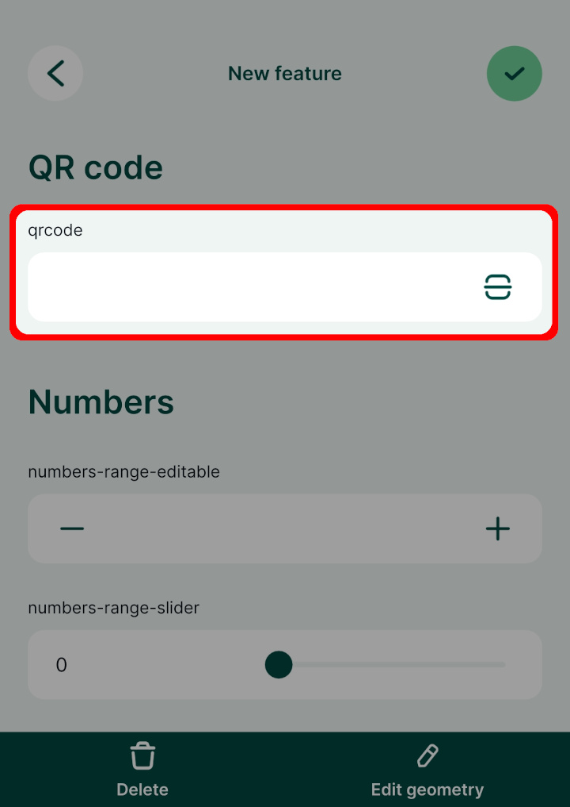

# QR code

You can scan QR codes with your mobile device to fill in a field in the form. The field data type should match the desired input, so if you want to scan say a link, you need a field with `Text (string)` data type.

|
 Widget 
 |Preview in the <MobileAppNameShort />|
|:---:|:---:|
QR code or barcode scanner  |  |

:::tip Example project available
A QR code field is used in this public project: <MerginMapsProject id="documentation/form-widgets" />. Download or clone it to see this setup.
:::

Prefer a video? Here is a short tutorial about scanning QR codes:

<YouTube id="HptECoMY8ow" />
 
## QR code setup

To set up the field for QR code scanning, the field name or the field alias has to contain the word `qrcode`. The text is not case sensitive, it can be in combination of lower or upper case letters.

In the <MobileAppNameShort />, there will be a QR code icon next to the field. Tap on it to scan the QR code using your camera and the content (a number, text, link, etc.) will be filled in automatically to your field.

