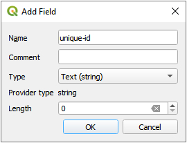
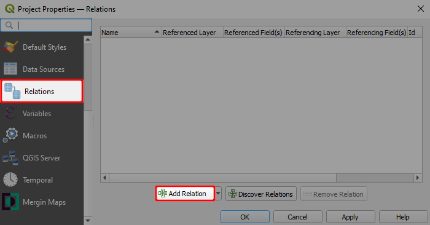
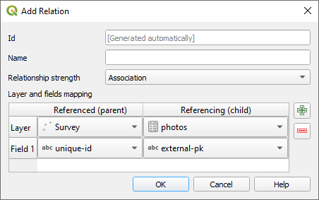
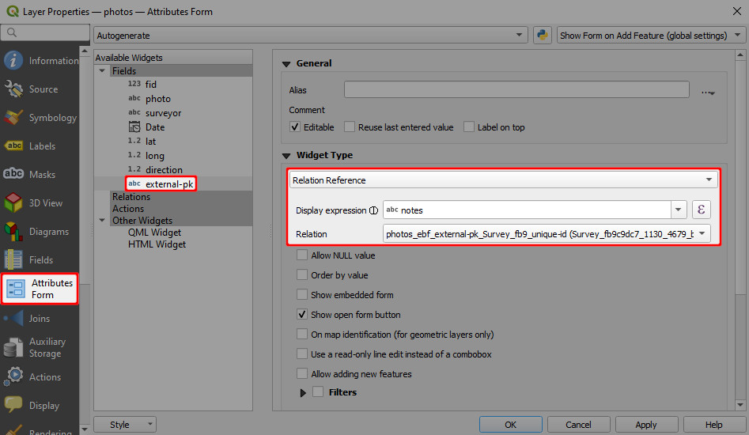
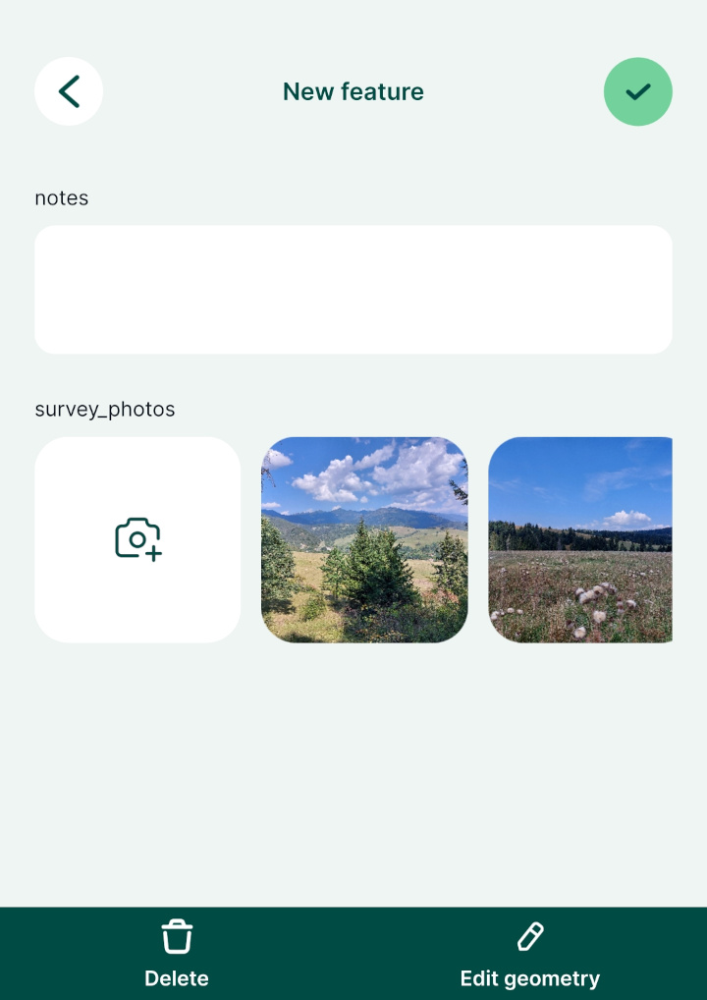
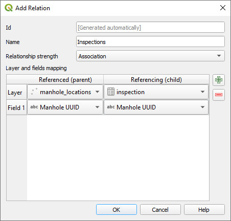
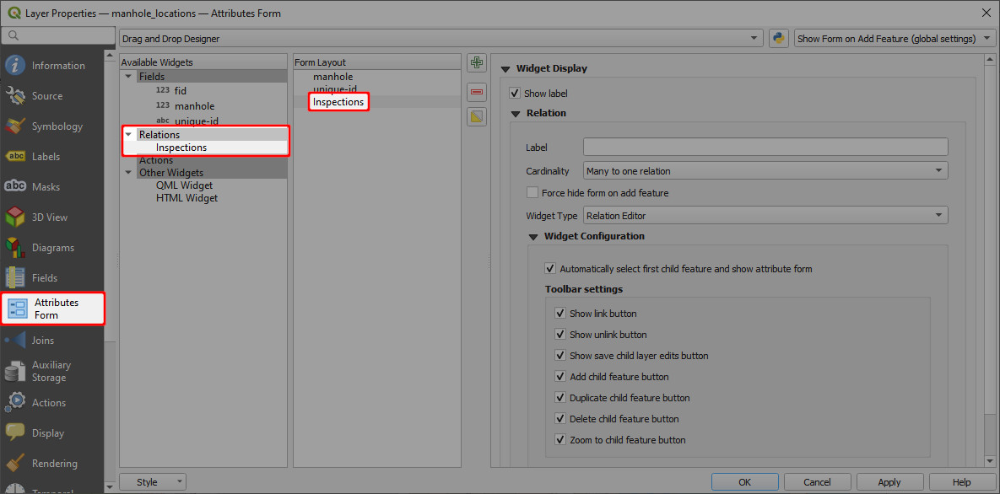
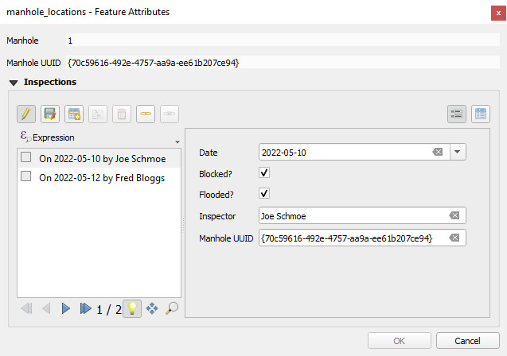
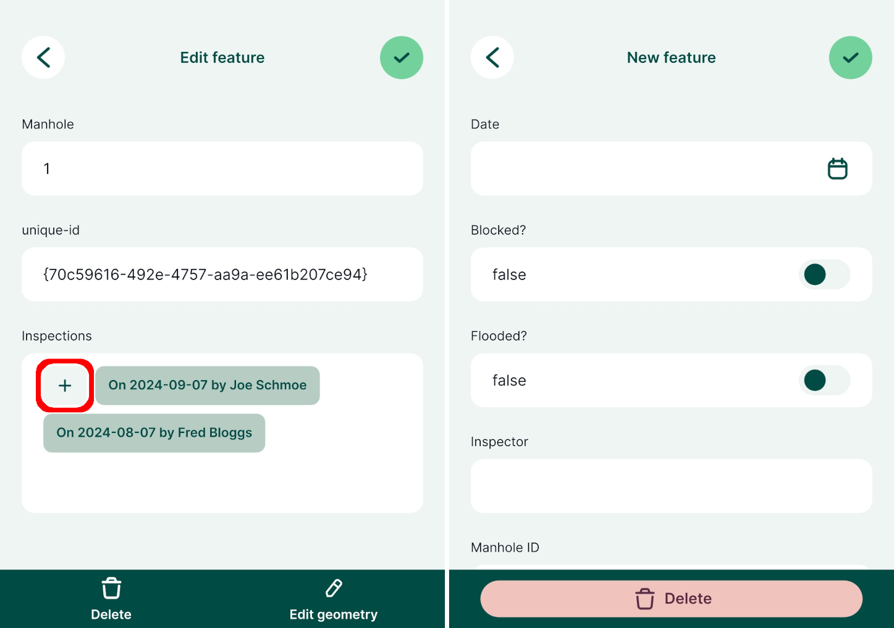

# Relations 

## How to Attach Multiple Photos to Features

TODO:
- gallery / how to avoid gallery

In some situations, it might be useful to take more than one picture of a feature during the field survey. Attaching multiple photos to one feature is a 1-N relation. You can read more about 1-N relations and how they can be used in <MainPlatformNameLink /> in [How to link multiple records to one feature](../one-to-n-relations/).

<YouTube id="NCa_Nb_CYno" />

:::tip Example project available
To see this setup in practice, you can download the following project: 
<MerginMapsProject id="documentation/forms_multiple_photos" />.
:::

To link multiple photos to a single feature, we need a **unique field** to link following tables:
- Survey layer containing spatial information
- A non-spatial table containing path to the photos (see [how to setup simple photo forms](../photos/))

:::danger WARNING
**Do not use the FID field to link these tables**. FIDs can be changed during synchronisation, which can result in having photos linked to the incorrect feature. You can learn more about synchronisation in [Behind Data Synchronisation](../../manage/synchronisation/). 
:::

To set 1:N relation between these tables correctly:
1. Create a new text field in the survey layer, here: `unique-id`
   
2. Use the `uuid()` as the **default value** for this field in **Layer Properties**. This function assigns a unique identifier to every created feature, even when different surveyors create features simultaneously.
   
3. Create a new text field in the non-spatial table (here: `photos`) that will be used to store the UUID of features from the survey layer (the foreign key), here: `external-pk`.

Now we need to configure a [1-N relation](../one-to-n-relations/):
4. From the main menu, select **Project** > **Properties ...**
5. In the **Relations** tab, select **Add Relation**
   

6. Define the parent and child layer and the fields to link these layers. Here:
   - **Name** is the name of the relation, can be left blank
   - **Referenced (parent)** is the spatial layer `Survey`
   - **Field 1** of the **Referenced (parent)** is the field `unique-id` that contains the UUID 
   - **Referencing (child)** is the non-spatial layer `photos`
   - **Field 1** of the **Referencing (child)** layer is the `external-pk` that contains the foreign key to link photos with surveyed features.
   

7. Navigate to the **Attributes Form** tab in the **Properties** of the `photos` layer. Set the **Widget Type** of the foreign key `external-pk` to **Relation Reference**:
   

The <MobileAppNameShort /> detects the type of 1-N relation and displays the image viewer for the relations. 

# How to Link Multiple Records to One Feature (1-N Relations)
[[toc]]

:::tip Example project available
You can clone these projects to take a closer look on 1-N relations:
   - Assigning multiple inspections to a single feature: <MerginMapsProject id="documentation/forms_one-to-many-relations" />
   - Adding multiple photos to a single feature: <MerginMapsProject id="documentation/forms_multiple_photos" />
:::

It is often the case that you have a set of spatial features and you want to record their status every now and then. For example, there is a GIS layer representing the manholes and the surveyors carry out regular inspections of the manholes using <MainPlatformNameLink />. Instead of duplicating the manhole layer and recording each inspection as a new feature, inspections can be recorded in a non-spatial table that is linked to the spatial layer. This way, multiple records can be linked to one feature.

The image below shows the manhole locations and a form with listed inspections in <MobileAppName />.

The manhole point layer has the following attribute table: 

| fid | Manhole | Manhole UUID |
|:---:|:---:|:---:|
| 1 | 1 | `{70c59616-492e-4757-aa9a-ee61b207ce94}` |
| 2 | 2 | `{be01b98f-3585-49d4-be74-4cf3530a2989}` |
| 3 | 3 | `{03178264-0070-45c8-a981-b2474627d7e0}` |

This layer contains only information about the manholes. `Manhole UUID` values are generated using [`uuid()` function as a default value](../attach-multiple-photos-to-features/) when a feature is created. This ensures that these values are **unique** even when multiple surveyors capture new features at the same time. This field will be used to link inspections and manholes.

:::danger Using UUID
**Why UUID?** FID can be changed during [synchronisation](../../manage/synchronisation/). As a result, records can end up being linked to wrong features. 

On the other hand, <QGISHelp ver="latest" link="user_manual/expressions/functions_list.html#uuid" text="UUID" /> (Universally Unique Identifier) is generated to be unique and will not be changed when synced. Therefore, we recommend always using UUID to link layers.
:::

Inspections are recorded in a separate [non-spatial table](../non-spatial-data) with attribute table such as:

| Inspection Date | Blocked? | Flooded? | Inspector  | Manhole UUID |
|:---:|:---:|:---:|:---:|:---:|
| 10/05/2022 |  | | <NoSpellcheck id="Joe Schmoe" /> | `{70c59616-492e-4757-aa9a-ee61b207ce94}` |
| 10/05/2022 |  | :heavy_check_mark: | <NoSpellcheck id="John Doe" /> | `{03178264-0070-45c8-a981-b2474627d7e0}` |
| 12/05/2022 | :heavy_check_mark:  |   | <NoSpellcheck id="Fred Bloggs" /> | `{70c59616-492e-4757-aa9a-ee61b207ce94}` |
| 14/05/2022 | :heavy_check_mark: | :heavy_check_mark:  | <NoSpellcheck id="Joe Schmoe" /> | `{be01b98f-3585-49d4-be74-4cf3530a2989}` |

In this table, all information about the inspections are recorded. `Manhole UUID` is filled in automatically based on a 1-N relation that we will set up in QGIS.

The same principle can be used when you want to capture [multiple photos for a single feature](../attach-multiple-photos-to-features/).

## How to set up 1-N relations in QGIS project
You can follow this example by cloning <MerginMapsProject id="documentation/forms_one-to-many-relations" />.

:::tip
Make sure that your survey layer has a **unique UUID** field to create the link correctly. You will find detailed steps how to set it up in [How to Attach Multiple Photos to Features](../attach-multiple-photos-to-features/)
:::

To configure 1-N relations in QGIS:
1. From the main menu, select **Projects** > **Properties ...**
2. In the **Relations** tab, select  **Add Relation**
   
3. A new window will appear, where we can define the parent and child layers and the fields to link the two layers:
   - **Name** is the name of the relation, e.g. `Inspection`
   - **Referenced (parent)** is the spatial layer `manhole_locations`
   - **Field 1** of the **Referenced (parent)** is the field `Manhole UUID` that contains the **unique** UUID 
   - **Referencing (child)** is the non-spatial layer `inspections`
   - **Field 1** of the **Referencing (child)** layer is the `Manhole UUID`, which acts as a foreign key to link inspections to spatial features

   

4. Right-click on the survey layer, select **Properties** and go to the **Attributes** form tab.
5. Drag and drop the **Inspections** relation to the **Form Layout**.
   

Now you can add multiple inspections for each manhole location. The inspections records will be stored in the `inspections` table.

When you open the form for an existing record in the `manhole_locations` point layer, it will display existing inspection records and you can also add, delete or edit the records:

In the <MobileAppNameShort />, the form will display all linked inspection records. Tapping the **+** button opens the inspection form and a new inspection record can be added.

