# Relations
[[toc]]

There are cases when multiple records from one layer (or table) relate to one feature from another layer, forming one to many (1-N) relation. For instance, there may be multiple photos of one feature, multiple inspections of the same feature or multiple parts, or one feature consisting of multiple polygons with different properties.

<QGISHelp ver="latest" link="/user_manual/working_with_vector/joins_relations.html" text="See QGIS Documentation" /> to learn more about connecting and editing data across layers.

|
 Widget 
 |Preview in the <MobileAppNameShort />|
|:---:|:---:|
| [Relation](../one-to-n-relations/)   | 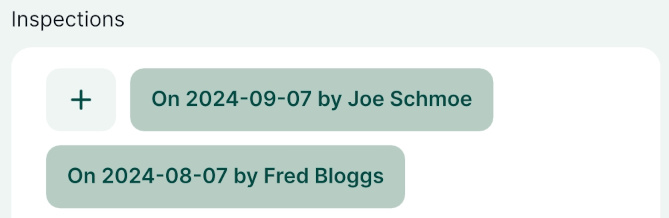  |
| [Relation reference](#referencing-child-layer-attributes-form)   | 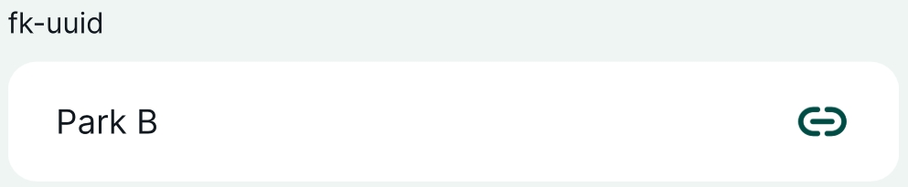  |
|[Relation - Gallery ](../photos/#how-to-attach-multiple-photos-to-features) | 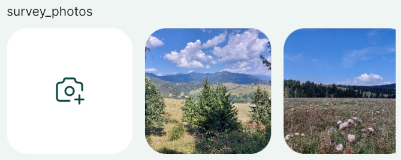 |

:::tip Example projects and guides available
You can take a closer look at 1-N relations:
- Public project <MerginMapsProject id="documentation/forms-relations" /> contains the setup described on this page as well as sample data
- [How to Link Multiple Records to One Feature](../one-to-n-relations/) explains how to add multiple **records** to a single feature. See also our public project: <MerginMapsProject id="documentation/forms_one-to-many-relations" />
- [How to Attach Multiple Photos to Features ](../photos/#how-to-attach-multiple-photos-to-features) shows how to add multiple **photos** to a single feature. See also our public project: <MerginMapsProject id="documentation/forms_multiple_photos" />
:::

As an example, we will use two spatial layers: **parks** and **amenities**. One park can have multiple amenities, such as benches, picnic tables, fireplaces or water fountains. Every amenity feature can be located in one park only. Thus, the relation between these layers is one to many (1-*N*): 1 park to *N* amenities. 

This means that **parks** are the referenced (parent) layer and **amenities** are the referencing (child) layer. They will be related based on the *primary keys* of parks and corresponding *foreign keys* of the amenities layer, linking amenities to a specific park.

::: danger Unique primary keys (UUIDs)
*Primary keys* are unique IDs. While all layers have a default ID field when created (`fid`, `id`), these IDs can be changed during synchronisation, e.g. when multiple surveyors capture new features at the same time (see [Behind data synchronisation](../../manage/synchronisation/#behind-data-synchronisation) for detailed explanation). As a result, child features could end up being linked to a wrong parent feature.

Therefore, **we strongly recommend creating a new field for primary keys and using UUIDs generated by `uuid()` function when a feature is created [as described below](#generating-unique-ids-uuid)**. UUID (Universally Unique Identifier) ensures that the primary keys are unique even after synchronisation and that the correct features are linked.
:::

One to many (1-N) relation needs to be set up in your <MainPlatformName /> project in QGIS as follows:
1. [Create unique UUID field](#generating-unique-ids-uuid) for your referenced (parent) layer
2. Create a field for storing foreign keys in your referencing (child) layer
3. Define the relation in [Project Properties](#_1-n-relation-setup-in-qgis)
4. [Configure Attributes forms](#attributes-forms-for-1-n-relations) of both layers as needed

## Generating unique IDs (UUID)

:::tip UUID as unique primary keys
<QGISHelp ver="latest" link="user_manual/expressions/functions_list.html#uuid" text="UUID" /> (Universally Unique Identifier) is generated to be unique and will not be changed when synced. Therefore, **we strongly recommend using UUID to link layers**.
:::

To create a field for storing unique UUIDs:

1. Add a new field with `Text (string)` data type, here: `uuid`
   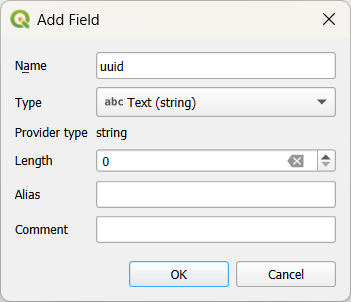
   
2. Use the `uuid()` as the [**default value**](../default-values/) for this field in **Layer Properties**. 

   This function assigns a unique identifier to every created feature, even when different surveyors create features simultaneously.
   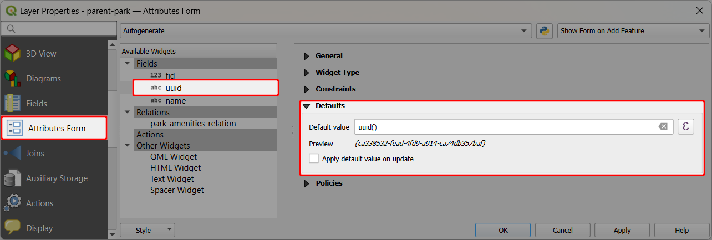
   
   **Do not use** the *apply default value on update* option. The generated UUID should not be changed.

::: tip Field for foreign keys
To set up 1-N relation between two layers, the referencing (child) layer needs to have a field for storing foreign keys. 

This field needs to have the same data type as the primary key: `Text (string)`. Here we will use `fk-uuid`.
:::

## 1-N relation setup in QGIS
Now let's look at the 1-N relation setup in QGIS:
1. From the main menu, select **Projects** > **Properties ...**
   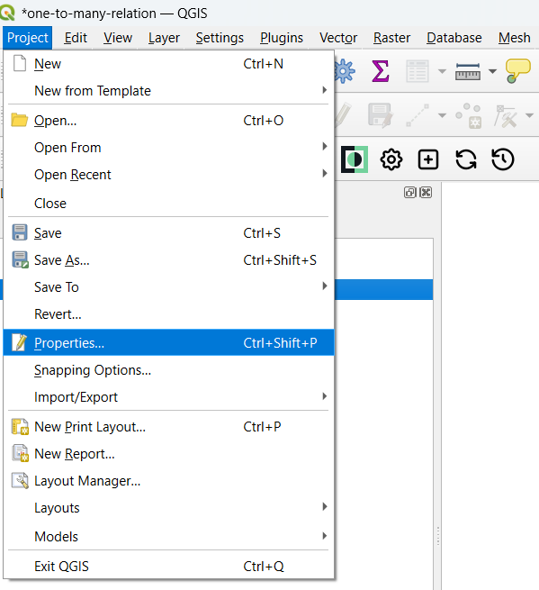

2. In the **Relations** tab, click on the  **Add Relation** button
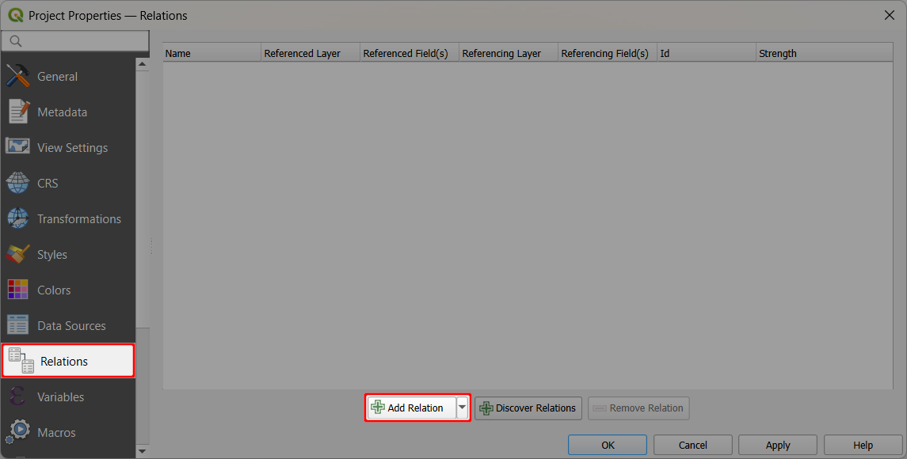

3. Specify the relation:
   - **Id** is generated automatically
   - **Name** is the name of the relation, here `park-amenities-relation`
   - **Referenced (parent)** is the parks layer, here:`parent-park`
   - **Field 1** of the **Referenced (parent)** is the field `uuid` that contains the **unique** UUID created as described [here](#generating-unique-ids-uuid)
   - **Referencing (child)** is the amenities layer, here: `child-amenities`
   - **Field 1** of the **Referencing (child)** layer is the `fk-uuid`, which acts as a foreign key to link amenities to parks

   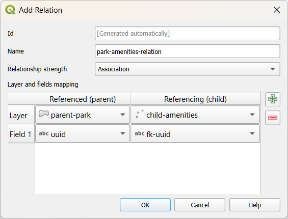

4. Confirm the setup by clicking **OK**

The one to many relation between **parks** and **amenities** is now set in QGIS. Next we can configure the attributes forms for both layers.

## Attributes forms configuration for 1-N relations
Attributes form for both linked layers can be set up as needed, depending on the preferred data collection method for the referencing (child) layer:
- Child features can be added through the form of the [referenced (parent) layer](#referenced-parent-layer-attributes-form), meaning you can use the attributes form of the **parks** layer to add/edit/remove **amenities**.
- Child features can be added through the form the [referencing (child) layer](#referencing-child-layer-attributes-form). A new feature can be added to the **amenities** layer and the link to the corresponding **park** feature is set manually in the attributes form.

Both options work both in QGIS and in the [<MobileAppNameShort />](#relation-widgets-in-mergin-maps-mobile-app).

### Referenced (parent) layer attributes form
Explore the attributes form of the referenced (parent) layer **parks**:
1. Navigate to the **Attributes** form tab in **Layer Properties**
2. Notice the `park-amenities-relation` was automatically added to the list of available widgets as **Relations**

   If you use [Drag and Drop Designer](../form-layout/#qgis-drag-and-drop-designer), you can add or remove the relation widget from the form manually.

   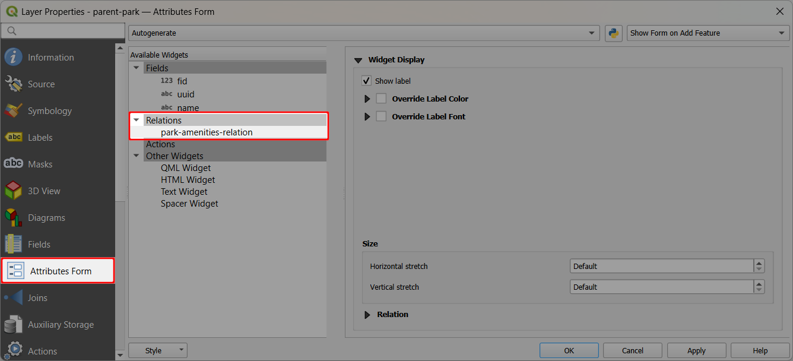

In QGIS, the attributes form looks like this:

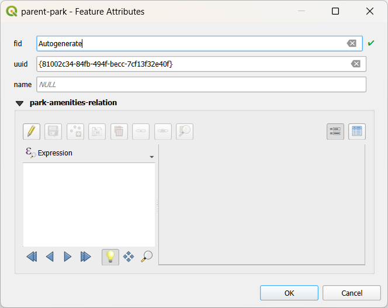

Note the editable `park-amenities-relation` with the option to add new (child) features to the **amenities** layer directly from the **parks** form.

### Referencing (child) layer attributes form
The referencing (child) layer **amenities** can also have the relation added to the attributes form.

1. Navigate to the **Attributes** form tab in **Layer Properties**
2. Select the foreign key field (here: `fk-uuid`) in the list of fields.

   Choose **Relation Reference** as **Widget Type**:
   - **Display expression** sets the display name of referenced layer (here: `name`)
   - **Relation** offers all available relations defined in the project (here: `park-amenities-relation`)

   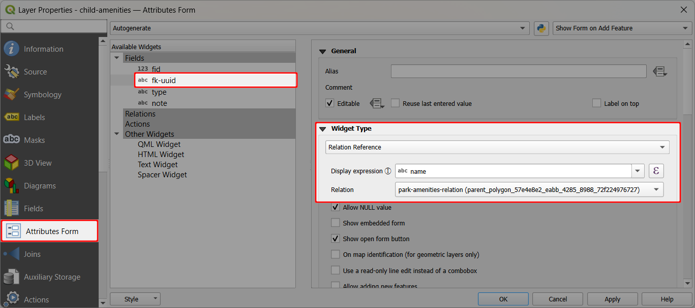

In QGIS, the attributes form of the referencing (child) **amenities** layer looks like this. The foreign key field `fk-uuid` offers a drop-down menu with the list of features from the referenced (parent) layer **parks**.

In this case, the link between the amenity feature and the park can be set (or edited) manually.

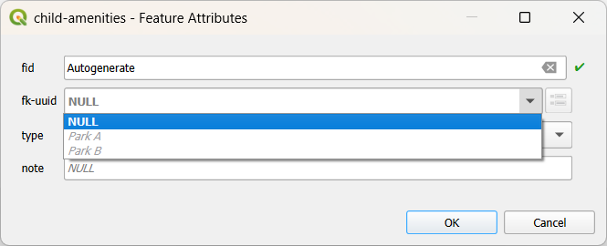

## Relation widgets in Mergin Maps mobile app
Now let's look how these relation widgets look like in the <MobileAppNameShort />. 

:::tip Example project available
[Clone the public project](../../manage/create-project/#clone-a-public-project) <MerginMapsProject id="documentation/forms-relations" /> to see the setup and sample data on your mobile device.
:::

The referenced (parent) features have the [relation widget](#referenced-parent-layer-attributes-form) in the attributes form. It displays all linked child features in a row. Here, **parks** feature `Park B` already contains a link to a `bench` from the **amenities** layer.

A new child feature can be added by tapping the **+** button:

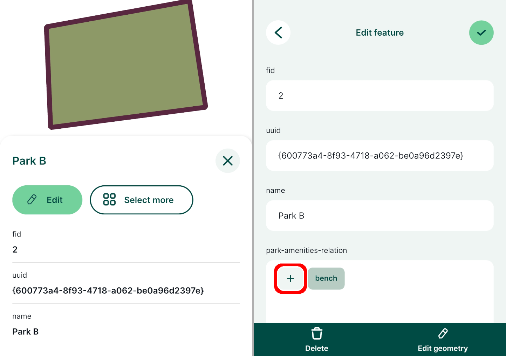

- If the referencing (child) layer is spatial layer, you will be able to record geometry. Here **amenities** are captured as points. Note that it is not possible to change the [active layer](../../field/mobile-features/#adding-features).
- Attribute values can be filled in in the form. Note that the relation reference (foreign key `fk-uuid`) is filled in automatically based on the parent feature (here `Park B`).
- Save the changes. The relation widget now displays one more entry (here: `picnic table`).

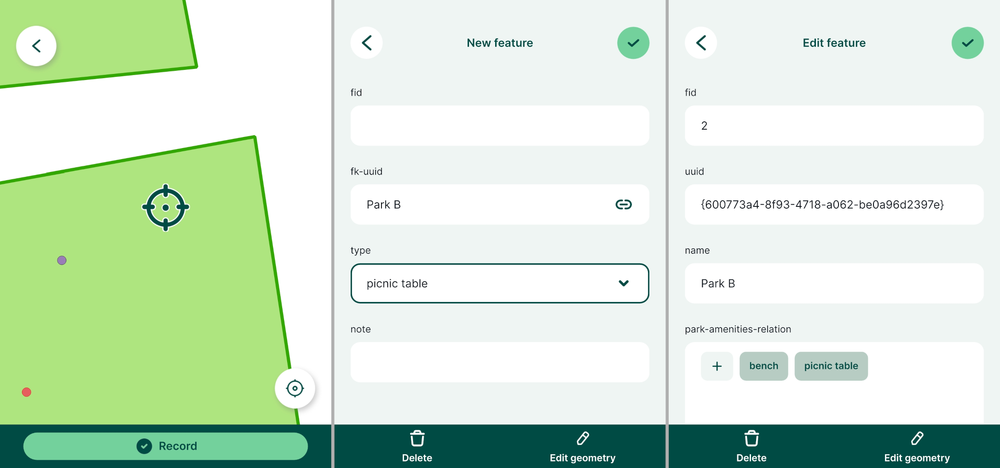

You can also add a new feature to the referencing (child) layer directly:
- Tap the **Add** button and capture the geometry
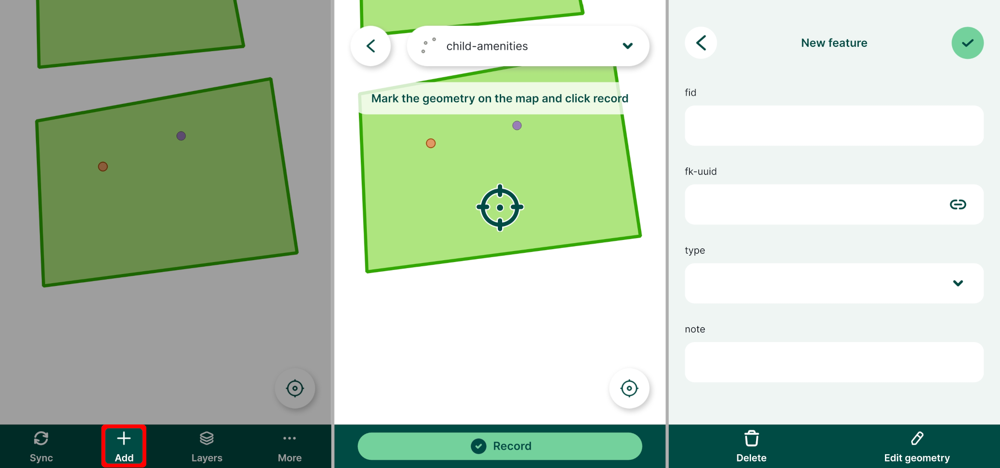

- Fill in the Attributes form. Note that the relation reference (foreign key, here `fk-uuid`) needs to be entered manually, by choosing a feature from the referenced (parent) layer.
- Save the changes. Open the attributes form of the parent feature and see that the added amenity features is displayed in the relation reference widget.

As you can see, there are two ways how to add child features to a parent feature.

