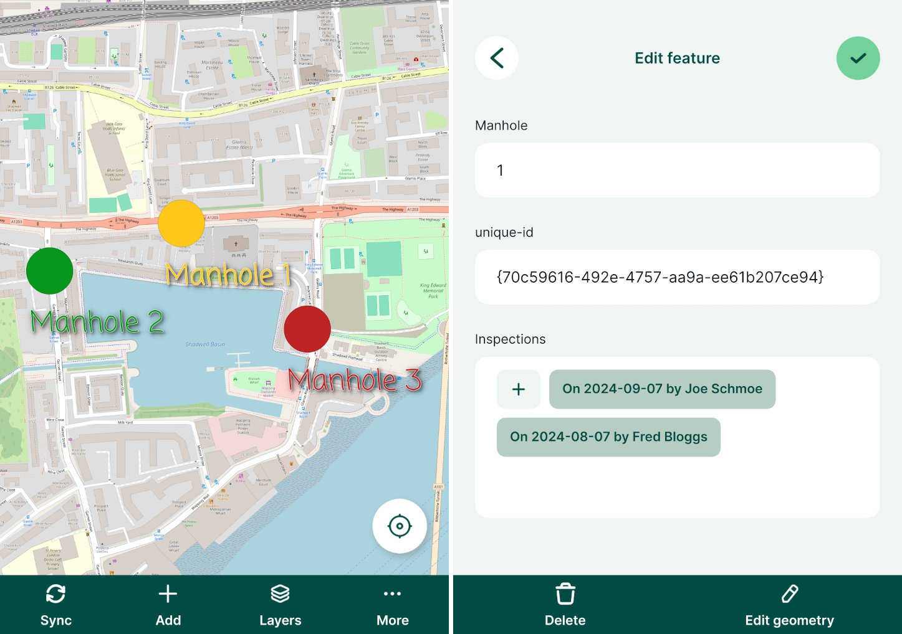

# Relations 

:::tip Example project available
You can clone these projects to take a closer look at 1-N relations:
- Adding multiple **records** to a single feature: <MerginMapsProject id="documentation/forms_one-to-many-relations" />
- Adding multiple **photos** to a single feature: <MerginMapsProject id="documentation/forms_multiple_photos" />
:::

It is often the case that you have a set of spatial features and you want to record their status every now and then. For example, there is a GIS layer representing the manholes and the surveyors carry out regular inspections of the manholes using <MainPlatformNameLink />. Instead of duplicating the manhole layer and recording each inspection as a new feature, inspections can be recorded in a non-spatial table that is linked to the spatial layer. This way, multiple records can be linked to one feature.

The image below shows the manhole locations and a form with listed inspections in <MobileAppName />.

The manhole point layer has the following attribute table: 

| fid | Manhole | Manhole UUID |
|:---:|:---:|:---:|
| 1 | 1 | `{70c59616-492e-4757-aa9a-ee61b207ce94}` |
| 2 | 2 | `{be01b98f-3585-49d4-be74-4cf3530a2989}` |
| 3 | 3 | `{03178264-0070-45c8-a981-b2474627d7e0}` |

This layer contains only information about the manholes. `Manhole UUID` values are generated using [`uuid()` function as a default value](../attach-multiple-photos-to-features/) when a feature is created. This ensures that these values are **unique** even when multiple surveyors capture new features at the same time. This field will be used to link inspections and manholes.

:::danger Using UUID
**Why UUID?** FID can be changed during [synchronisation](../../manage/synchronisation/). As a result, records can end up being linked to wrong features. 

On the other hand, <QGISHelp ver="latest" link="user_manual/expressions/functions_list.html#uuid" text="UUID" /> (Universally Unique Identifier) is generated to be unique and will not be changed when synced. Therefore, we recommend always using UUID to link layers.
:::

Inspections are recorded in a separate [non-spatial table](../non-spatial-data) with attribute table such as:

| Inspection Date | Blocked? | Flooded? | Inspector  | Manhole UUID |
|:---:|:---:|:---:|:---:|:---:|
| 10/05/2022 |  | | <NoSpellcheck id="Joe Schmoe" /> | `{70c59616-492e-4757-aa9a-ee61b207ce94}` |
| 10/05/2022 |  | :heavy_check_mark: | <NoSpellcheck id="John Doe" /> | `{03178264-0070-45c8-a981-b2474627d7e0}` |
| 12/05/2022 | :heavy_check_mark:  |   | <NoSpellcheck id="Fred Bloggs" /> | `{70c59616-492e-4757-aa9a-ee61b207ce94}` |
| 14/05/2022 | :heavy_check_mark: | :heavy_check_mark:  | <NoSpellcheck id="Joe Schmoe" /> | `{be01b98f-3585-49d4-be74-4cf3530a2989}` |

In this table, all information about the inspections are recorded. `Manhole UUID` is filled in automatically based on a 1-N relation that we will set up in QGIS.

The same principle can be used when you want to capture [multiple photos for a single feature](../attach-multiple-photos-to-features/).

