# Setting Up Form Widgets

[[toc]]

Capturing field data often requires filling some attributes in the form to record the properties of surveyed points, lines or polygons. Forms can simplify the data entry and even ensure to some extent that the correct information is filled in.

## Widget gallery

<MobileAppName /> supports a number of edit widget types for forms such as drop-down options, slider, date and time, checkbox, or photos. 

Forms can be configured using <QGISHelp ver="3.22" link="user_manual/working_with_vector/vector_properties.html#edit-widgets" text="QGIS widget types" /> .

|QGIS widget  | Description  |
Preview in <MobileAppName /> 
 |Example project   |
|:---:|:---:|:---:|:---:|
|Text Edit  |[Text](#multiline-text)   | 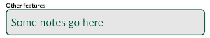 | <MerginMapsProjectShort id="documentation/test_forms" />|
|QR & barcode scanner  |[Camera to scan QR and barcode](#qr-code-reader)   | 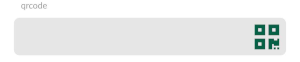 | <MerginMapsProjectShort id="documentation/test_qrcode" /> |
|Range   |[Numeric field](#number)   |   | <MerginMapsProjectShort id="documentation/form_setup" /> |
|Range   |[Slider](#slider)   | 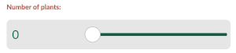  | <MerginMapsProjectShort id="documentation/form_setup" /> |
|Date&Time   |[Calendar with time](#datetime)  |   | <MerginMapsProjectShort id="documentation/form_setup" /> |
|Attachment   |[Photos from device's camera or gallery](./settingup_forms_photo.md) |   |<MerginMapsProjectShort id="documentation/form_setup" /> |
|Checkbox   |[Checkbox](#checkbox)   |   |<MerginMapsProjectShort id="documentation/form_setup" /> |
|Value Map   |[Drop-down menu with predefined values](#valuemap) |   |<MerginMapsProjectShort id="documentation/form_setup" /> |
|Value Relation   |[Drop-down menu with values from another table](#value-relation) |   | <MerginMapsProjectShort id="documentation/test_forms" /> |

::: tip
You can follow the examples in this section by cloning the following projects:
  - <MerginMapsProject id="documentation/test_forms" />
  - <MerginMapsProject id="documentation/form_setup" />
  - <MerginMapsProject id="documentation/form_cascade" />
  - <MerginMapsProject id="documentation/test_qrcode" />
  - <MerginMapsProject id="documentation/forms_one-to-many-relations" />  
  - <MerginMapsProject id="documentation/forms_multiple_photos" />
:::

In addition to the edit widgets, extra configuration can be done to the fields and form layout to make the data collection easier and more consistent. For example: setting a default value, conditional visibility and constraint enforcement.

## Multiline text

:::tip
Clone <MerginMapsProject id="documentation/test_forms" /> to follow this example!
:::

Adding or editing text is the most common method for inserting information within the forms.

In QGIS, the default widget for most types of fields is the **Text Edit**. In addition to a single line text, you can change the widget to accept multiple lines within a single field.
1. Right-click on a layer, select **Properties** and go to the **Attributes form** tab.
2. In the list of **Available Widgets** select the field you want to work with. 
3. In the **Widget Display** tab:
   - Ensure that **Text Edit** is selected
   - Check the **Multiline** option
4. **Apply** the changes. Don't forget to save and sync your project!

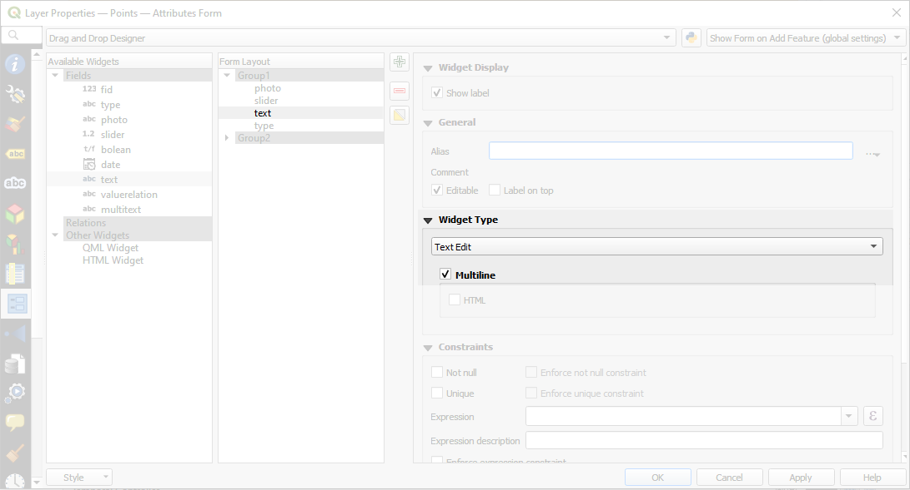

In <MobileAppName />, the **multiline text edit widget** will look like this:
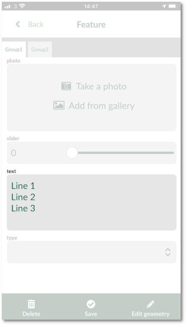

## QR code
:::tip
Clone <MerginMapsProject id="documentation/test_qrcode" /> to follow this example!
:::

To be able to scan QR codes using your camera, the field name or the field alias has to contain the word **qrcode** (the text is not case sensitive and it can be in combination of lower or upper case letters). 

In <MobileAppName />, there will be a QR code icon next to the field. Click on the QR code icon to read the QR code using your camera - the text (e.g. a link) will be filled in automatically.

## Numeric fields

:::tip
Clone <MerginMapsProject id="documentation/form_setup" /> to follow this example!
:::

Numeric fields can be handled by the **Range** widget, which allows two options:
- **Editable** to enter a number manually
- **Slider**

### Range
To set up the **editable range widget**:

1. Right-click on a layer, select **Properties** and go to the **Attributes form** tab.
2. In the list of **Available Widgets** select the numeric field you want to work with. 
3. In the **Widget Display** tab select **Range** from the drop-down menu.
4. **Apply** the changes. Don't forget to save and sync your project!

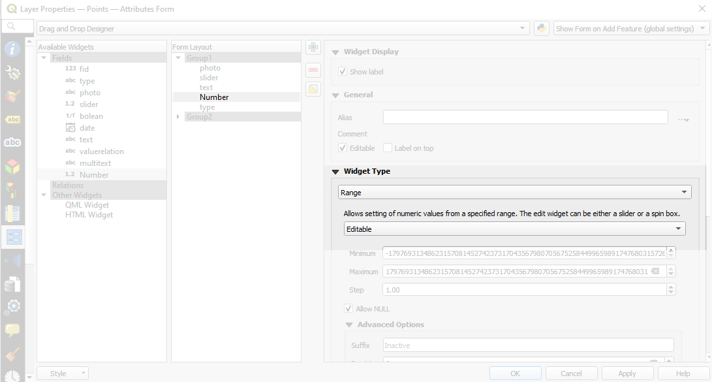

In <MobileAppName />, the **editable range widget** will look like the `number` field here:

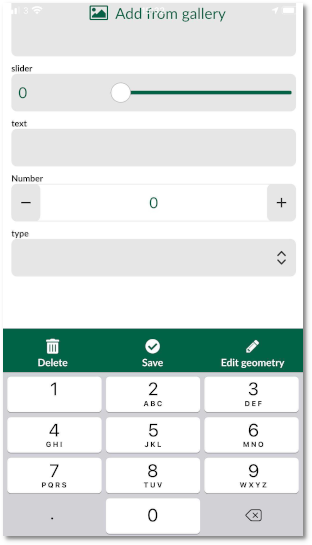

### Slider

When setting up a slider, ensure your field type is integer.

1. Right-click on a layer, select **Properties** and go to the **Attributes form** tab.
2. In the list of **Available Widgets** select the numeric field you want to work with.
3. In the **Widget Display** tab:
   - select **Range** from the drop-down menu
   - set the edit widget to **Slider**
   - set the **Minimum**, **Maximum** and **Step** values of the slider
4. **Apply** the changes. Don't forget to save and sync your project!

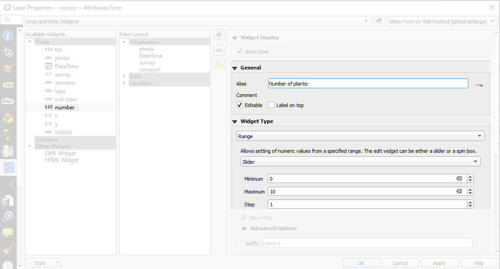

In <MobileAppName />, the **slider** will look like the `Number of plants` field. It can be filled in by moving the slider:

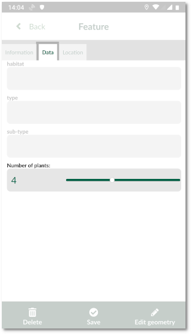

## Date and time

:::tip
Clone <MerginMapsProject id="documentation/form_setup" /> to follow this example!
:::

If you want to record time and date when you capture the feature, you need to make sure you have a field with **Date** or **Date and Time** type present in your survey layer.

1. Right-click on a layer, select **Properties** and go to the **Attributes form** tab.
2. In the list of **Available Widgets** select the date field you want to work with.
3. In the **Widget Display** tab:
   - select **Date/Time** from the drop-down menu
   - in **Widget Display** tab, check the **Calendar popup** option
4. If you want to automatically insert the date (or date and time) when the feature is created, type **now()** as a default value in the **Defaults** tab.
5. **Apply** the changes. Don't forget to save and sync your project!

In <MobileAppName />, the date can be edited using a calendar pop up. If you use **now()** as the default value, the current date and time will be automatically filled in.

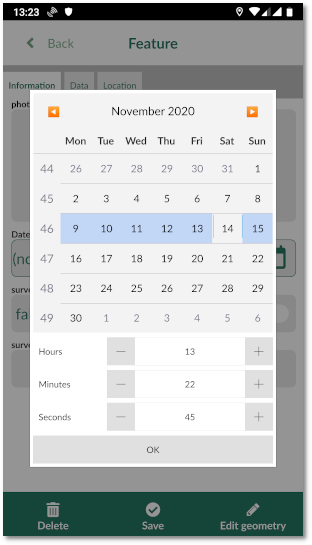

## Checkbox

:::tip
Clone <MerginMapsProject id="documentation/form_setup" /> to follow this example!
:::

Checkbox field becomes handy when you want to set up a Yes/No, True/False or On/Off in your field. Some file formats, such as GeoPackage support **Boolean** data type. If you have a field set as **Boolean**, QGIS automatically assigns the checkbox for widget type.

1. Right-click on a layer, select **Properties** and go to the **Attributes form** tab.
2. In the list of **Available Widgets** select the field you want to work with.
3. In the **Widget Display** tab, select **Checkbox** from the drop-down menu.
4. **Apply** the changes. Don't forget to save and sync your project!

In <MobileAppName />, the status of the checkbox field can be easilly toggled on/off.

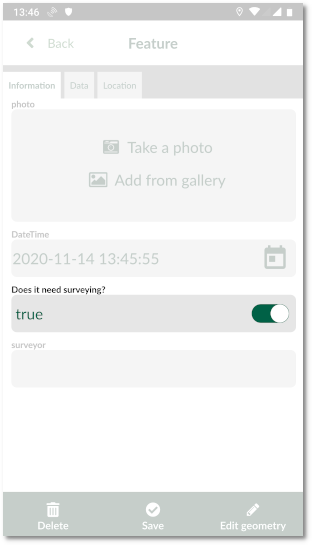

## Select value from a drop-down menu

To present the options as a drop-down menu in the form, you can use the **Value Map** or **Value Relation** widget in QGIS.

### Value Map

:::tip
Clone <MerginMapsProject id="documentation/form_setup" /> to follow this example!
:::

1. Right-click on a layer, select **Properties** and go to the **Attributes form** tab.
2. In the list of **Available Widgets** select the field you want to work with.
3. In the **Widget Display** tab:
   - select **Value Map** from the drop-down menu
   - for **Value** and **Description** type what you want to include in the drop-down menu (here we use: In-door, Woodland, Farmland, Grassland, Marine, Peatlands and Other).
4. **Apply** the changes. Don't forget to save and sync your project!

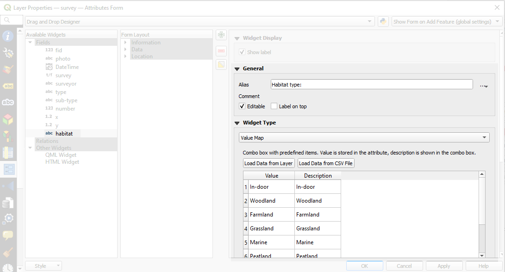

Now you can select the value from a drop-down menu in <MobileAppName />!

<!--add screenshot -->

### Value relation

:::tip
Clone <MerginMapsProject id="documentation/test_forms" /> to follow this example!
:::

The **Value Relation** widget is similar to the [Value Map](#valuemap) tool, but the values for the drop-down menu come from another table (e.g. a CSV or another GeoPackage table).

The advantage of having this widget:
  - Editing the values in the field: for example, if you have missed a value in your list for the drop-down menu, you can edit the table in Input and add the value. See [Working with non-spatial tables](./working_with_nonspatial_data.md) section for more information.
  - Searching the values: when you have a large list of values, it will become cumbersome to find the right value. With this widget, you will be able to search for values in the list.
  - Selecting multiple values.

To set up **Value Relation** in QGIS:

1. Right-click on a layer, select **Properties** and go to the **Attributes form** tab.
2. In the list of **Available Widgets** select the field you want to work with.
3. In the **Widget Display** tab:
   - select **Value Relation** from the drop-down menu
   - select the **Layer** that contains the values
   - **Key column** is the field that contains the values
   - **Value column** is the field that contains the alias (description) of the value
   - if you want to be able to select multiple values, check the **Allow multiple selections** option
4. **Apply** the changes. Don't forget to save and sync your project!

When you open the field with **Value Relation** in <MobileAppName />, you will be able to select values from the list.

<!-- update screenshots -->
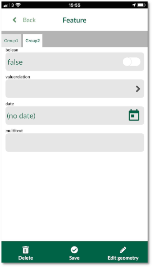
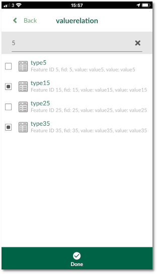
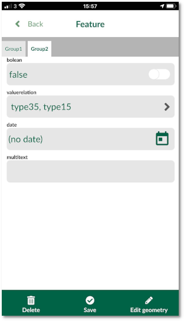

## Attachments, cascade form, 1-N relations,...
There is much more you can do to set up your forms efficiently, such as:
- capture [photos](./settingup_forms_photo/) as attachments
- create advanced forms with drill-down menu by setting up a [cascade form](./settingup_forms_settings/#advanced-value-relation-with-drill-down-forms)
- using 1-N relations to [link multiple records to one feature](./one-to-n-relations/) or to [attach multiple photos to one feature](./attach-multiple-photos-to-features/) 

:::tip
Learn more about the form layout in [Advanced Form Configuration](./settingup_forms_settings/).
:::
