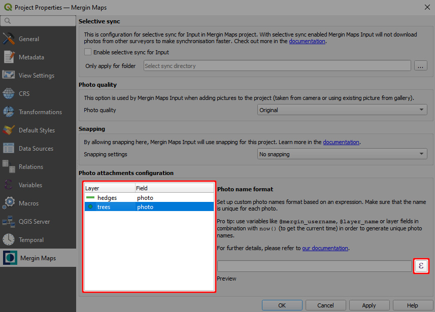
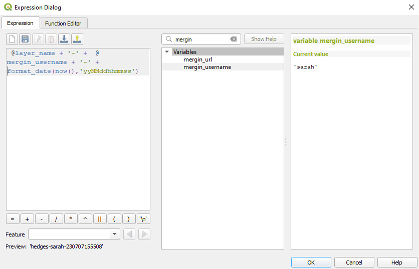
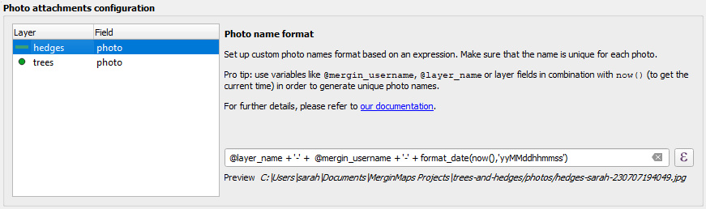
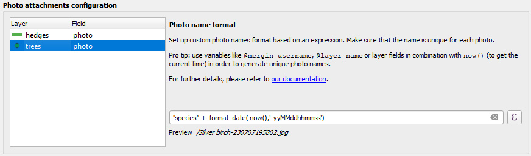

# Capturing Photos

When surveying, you might want to take a photo from your camera or attach an existing photo from the device gallery to your survey feature.

Here, you will find the overview of the basic functionality related to capturing photos, such as:
[[toc]]

:::tip
Do you need to attach multiple pictures to one feature? [How to attach multiple photos to features](./attach-multiple-photos-to-features/) will guide you through the setup.
:::

## Attachment widget in QGIS

:::tip
Clone <MerginMapsProject id="documentation/form_setup" /> to follow this example!
:::

To set up a photo widget:
1. Right-click on a layer, select **Properties** and go to the **Attributes form** tab.
2. In the list of **Available Widgets** select the text field you want to work with.
3. In the **Widget Display** tab:
   - From the drop-down menu, select **Attachment**
   - **Default path** defines where images will be saved. If it is not defined, the project home folder will be used.
   - Store the path as **Relative to project path** or **Relative to default path** depending on how you want to store the paths.
4. **Apply** the changes. Don't forget to save and sync your project!

Here is an overview of paths that will be stored in various settings of the attachment widget. `path/to/project` represents the project home folder, where the project file is located. 

|        Default path       	|  Store path as 	|                Value               	|
|:-------------------------:	|:------------:	|:----------------------------------:	|
|             -             	| Absolute Path	|     `<path/to/project>/image.jpg`    	|
|             -             	| Relative to project path |              `image.jpg`             	|
|             -             	| Relative to default path |              `image.jpg`             	|
|      `@project_folder`      	| Absolute Path |     `<path/to/project>/image.jpg`    	|
|      `@project_folder`      	| Relative to project path |              `image.jpg`             	|
|      `@project_folder`      	| Relative to default path |              `image.jpg`             	|
| `@project_home + '/photos'` 	| Absolute Path | `<path/to/project>/photos/image.jpg` 	|
| `@project_home + '/photos'` 	| Relative to project path |          `/photos/image.jpg`         	|
| `@project_home + '/photos'` 	| Relative to default path |               `image.jpg`             	|

## How to set up a custom folder for storing photos
It can be useful to set up a custom folder for photos, e.g. if you want to use [selective synchronisation](../manage/selective_sync/) or if you simply want to have your data organised.

To set up a custom folder:
1. Create a subfolder in the project folder (here: `photos`)
2. Open your project in QGIS
3. Open the **Properties** of the survey layer and navigate to the **Attributes form** tab. 
   Select the field, where photos are stored (here: `photo`) and make sure that the widget type is set to **Attachment**:
   
5. Now we need to change the **Default path** to the folder we have created. Click on the *Data defined override* icon and choose **Edit...**
   

6. In **Expression String Builder** enter the expression `@project_folder + '/photos'` (replace `photos` by the name of your folder). Click **OK**.
   

7. The **Default path** now refers to the custom folder.
   

8. **Apply the changes**. Don't forget to save and sync your project!

## Customising photo name format with expressions
<SinceBadge type="Plugin" version="2023.2.0" /> <SinceBadge type="App" version="v2.2.0" />

Names of the photos that are captured in the field using <MobileAppName /> can be customised. The name format can be set in QGIS with <QGISPluginName />. 

To use this option, make sure that the [Attachment Widget](#attachment-widget-in-qgis) of the fields you use for taking pictures is set up correctly and that the **Integrated Document Viewer** has the **Type** set to *Image*.

To set up customised names of photos:
1. Open your <MainPlatformNameLink /> project in QGIS and navigate to **Project Properties**
   

2. In the **Mergin Maps** tab, you can see the list of layers and their fields with correctly configured photo attachments.

   Select a layer from the list and click on the **Expression builder** icon.
   
 
3. In the **Expression Dialog** window, enter the expression that should be use as the photo's name. Please, keep in mind [basic recommendations](#best-practice-for-photo-name-expressions) to make sure the naming works as intended.

   Here we use a combination of the layer's name, <MainPlatformName /> username and current timestamp (other examples ale listed [below](#examples-of-photo-names-expressions)): 
   ` @layer_name + '-' +  @mergin_username + '-' + format_date(now(),'yyMMddhhmmss')`
   
   Example result is displayed in the **Preview**: `hedges-sarah-230707194052`.
   
   
   
   Click **OK** to confirm the expression.

4. Set up the photo name format for other fields and layers. 

   The **Preview** in **Mergin Maps** tab includes the [custom folder for photos](#how-to-set-up-a-custom-folder-for-storing-photos), if you have set it up. Otherwise you will see only the sample name of a photo.
  
     
   

### Best practice for photo name expressions
:white_check_mark: Each photo should have a **unique** name. 

Therefore, we recommend using combinations of variables that will ensure that there would not be multiple photos with the same name, such as the current time `now()`, <MainPlatformName /> username `@mergin_username`, layer name `@layer_name` or a field value

:white_check_mark: When using a field value in the expression, make sure that it is a field that will be filled out during the survey, e.g. by using the [**Not null** constraint](./settingup_forms_settings/#constraints). If it's empty, the expression won't work!

:white_check_mark: If you want to use a [numeric field](./settingup_forms/#numbers) in your expression, you need to convert it to a string first using the `to_string()` function

:white_check_mark: The file extension (`.jpg`) is added automatically.

Keep in mind that:
:no_entry_sign: The expression is evaluated with the **current** field values. The name of the photo will stay the same even if you change the value of the field later.

:no_entry_sign: The setup needs to be saved and synchronised. Only photos that are taken after synchronisation will have the name defined by the expressions. Existing photos will keep their original names.
   
   
### Examples of photo names expressions

  ` @layer_name + '-' +  @mergin_username + '-' + format_date(now(),'yyMMddhhmmss')`

## Resizing pictures automatically
Photos that are captured during the field survey or uploaded using <MobileAppName /> can be automatically resized, e.g. to save up storage space. The quality of the photos can be set up in the [Mergin Maps project properties](../gis/features/#photo-quality) using <QGISPluginName />.

## Photos in Mergin Maps Input
Using the photo widget in <MobileAppName />, you will have two options:
- **Take a photo** to use your camera app for taking a photos 
- **Add from gallery** to attach an existing photo from your device.

## Displaying photos in QGIS
Photos taken using <MobileAppName /> during the survey can be displayed in the feature's form in QGIS.

1. In QGIS, double click on a survey layer to open **Layer Properties**
2. In the **Attributes Form** tab, select the field that contains the path to the photo.

   Scroll to the **Integrated Document Viewer** in the panel on the right. Set the **Type** to *Image*.
   

3. **Apply** the changes and click **OK**.

Now when you click on a feature that contains a photo, it will be displayed in the form.

