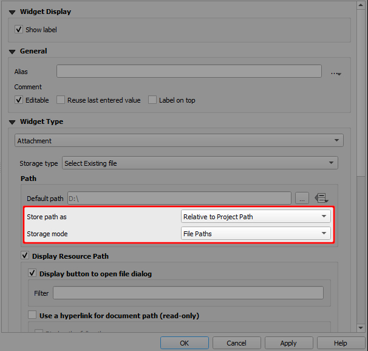
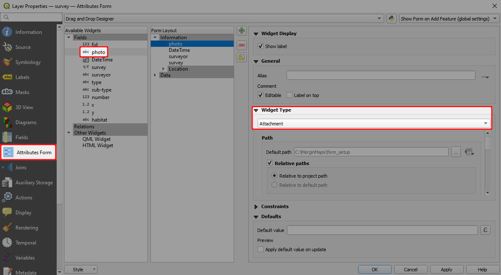
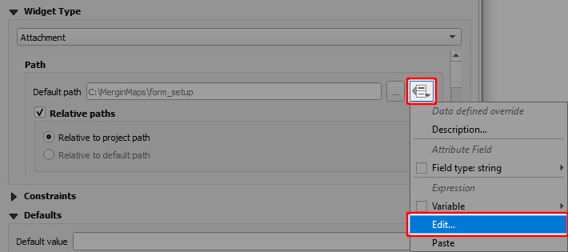
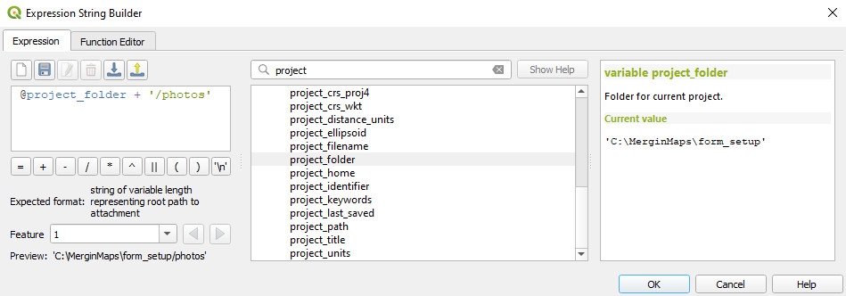
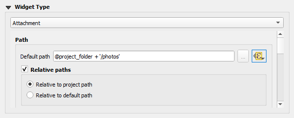
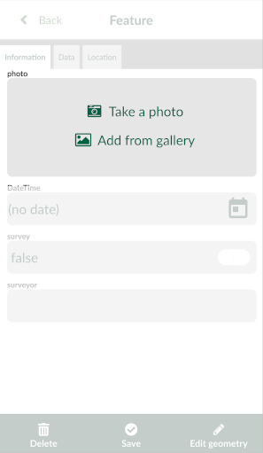
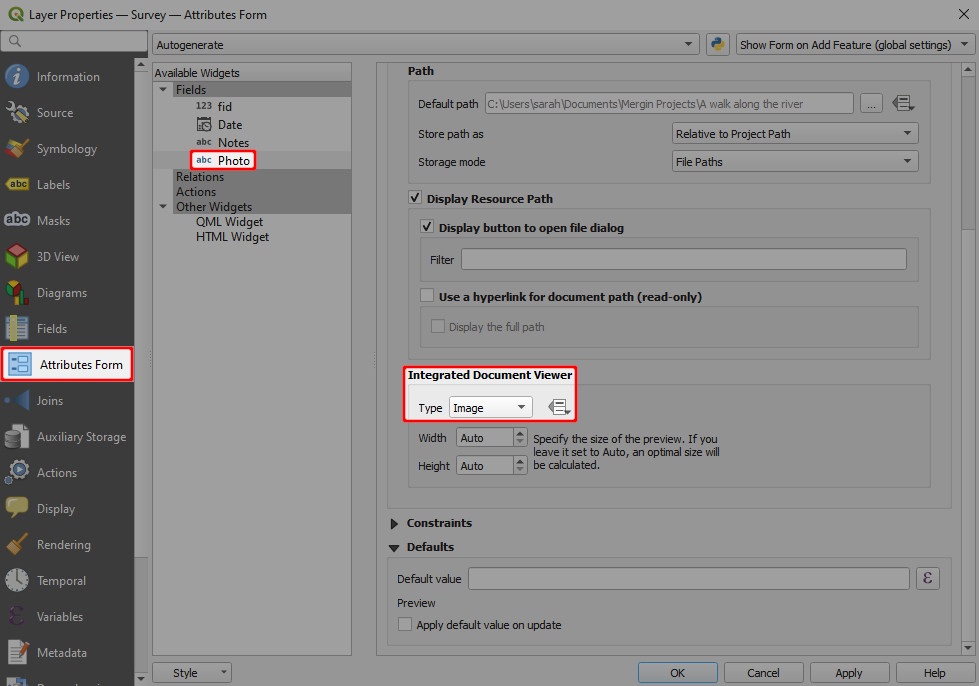
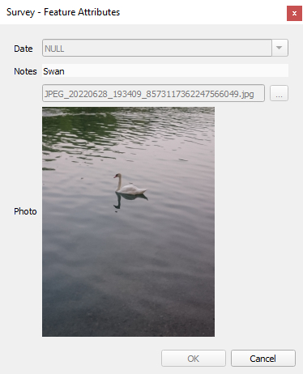

# Capturing Photos

When surveying, you might want to take a photo from your camera or attach an existing photo from the device gallery to your survey feature.

Here, you will find the overview of the basic functionality related to capturing photos, such as:
[[toc]]

:::tip
Do you need to attach multiple pictures to one feature? [How to attach multiple photos to features](./attach-multiple-photos-to-features/) will guide you through the setup.
:::

::: warning
Keep in mind that synchronising photos during the field survey can use up a lot of mobile data - depending on the amount of pictures taken and their size.

To reduce the data usage, you may consider using [selective synchronisation](../manage/selective_sync/), [resizing pictures automatically](#resizing-pictures-automatically) or following the [offline field survey workflow](../field/offline-use/#offline-field-survey-workflow). 
:::

## Attachment widget in QGIS

:::tip
Clone <MerginMapsProject id="documentation/form_setup" /> to follow this example!
:::

To set up a photo widget:
1. Right-click on a layer, select **Properties** and go to the **Attributes form** tab.
2. In the list of **Available Widgets** select the text field you want to work with.
3. In the **Widget Display** tab:
   - From the drop-down menu, select **Attachment**
   - **Default path** defines where images will be saved. If it is not defined, the project home folder will be used.
   - Store the path as **Relative to project path** or **Relative to default path** depending on how you want to store the paths.
4. **Apply** the changes. Don't forget to save and sync your project!

Here is an overview of paths that will be stored in various settings of the attachment widget. `path/to/project` represents the project home folder, where the project file is located. 

|        Default path       	|  Store path as 	|                Value               	|
|:-------------------------:	|:------------:	|:----------------------------------:	|
|             -             	| Absolute Path	|     `<path/to/project>/image.jpg`    	|
|             -             	| Relative to project path |              `image.jpg`             	|
|             -             	| Relative to default path |              `image.jpg`             	|
|      `@project_folder`      	| Absolute Path |     `<path/to/project>/image.jpg`    	|
|      `@project_folder`      	| Relative to project path |              `image.jpg`             	|
|      `@project_folder`      	| Relative to default path |              `image.jpg`             	|
| `@project_home + '/photos'` 	| Absolute Path | `<path/to/project>/photos/image.jpg` 	|
| `@project_home + '/photos'` 	| Relative to project path |          `/photos/image.jpg`         	|
| `@project_home + '/photos'` 	| Relative to default path |               `image.jpg`             	|

## How to set up a custom folder for storing photos
It can be useful to set up a custom folder for photos, e.g. if you want to use [selective synchronisation](../manage/selective_sync/) or if you simply want to have your data organised.

To set up a custom folder:
1. Create a subfolder in the project folder (here: `photos`)
2. Open your project in QGIS
3. Open the **Properties** of the survey layer and navigate to the **Attributes form** tab. 
   Select the field, where photos are stored (here: `photo`) and make sure that the widget type is set to **Attachment**:
   
5. Now we need to change the **Default path** to the folder we have created. Click on the *Data defined override* icon and choose **Edit...**
   

6. In **Expression String Builder** enter the expression `@project_folder + '/photos'` (replace `photos` by the name of your folder). Click **OK**.
   

7. The **Default path** now refers to the custom folder.
   

8. **Apply the changes**. Don't forget to save and sync your project!

## Resizing pictures automatically
Photos that are captured during the field survey or uploaded using <MobileAppName /> can be automatically resized, e.g. to save up storage space. The quality of the photos can be set up in the [<MainPlatformName /> project properties](../gis/features/#photo-quality) using <QGISPluginName />.

## Customising photo name format with expressions
Photos taken in the field using <MobileAppName /> can be automatically renamed. This can be useful when browsing pictures in your <MainPlatformNameLink /> project and keeping them organised.

::: tip
[How to Set Photo Names Format](../gis/photo-names/) will guide you through the setup and provide examples of expressions that can be used to name your photos.
:::

## Photos in Mergin Maps mobile app
Using the photo widget in <MobileAppName />, you will have two options:
- **Take a photo** to use your camera app for taking a photos 
- **Add from gallery** to attach an existing photo from your device.

## Displaying photos in QGIS
Photos taken using <MobileAppName /> during the survey can be displayed in the feature's form in QGIS.

1. In QGIS, double click on a survey layer to open **Layer Properties**
2. In the **Attributes Form** tab, select the field that contains the path to the photo.

   Scroll to the **Integrated Document Viewer** in the panel on the right. Set the **Type** to *Image*.
   

3. **Apply** the changes and click **OK**.

Now when you click on a feature that contains a photo, it will be displayed in the form.

