# Advanced Form Configuration
[[toc]]

In addition to the [edit widgets](./settingup_forms.md), extra configuration can be done to the fields and form layout to make the data collection easier and more consistent.

## Form layout
If your form contains more than a handful of fields, it becomes difficult to navigate and enter or view the data. Therefore it can be helpful to arrange fields in tabs and groups in the form. 

:::tip
Clone <MerginMapsProject id="documentation/form_setup" /> to follow this example!
:::

### Tabs and groups

To set the form layout, we are going to use the **Drag-n-Drop** designer.
1. Right-click on **survey** layer and select **Properties**
2. In the **Attributes form** tab, select **Drag and Drop Designer**
3. In **Form Layout**, we can create tabs and groups to arrange fields in the form. **Fields** can be moved from the left column to form layout. Only fields that are in the **Form layout** will appear in the form.

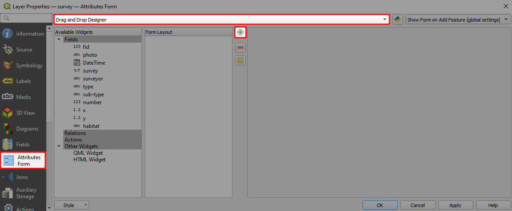

Here, we created two tabs, *Information* and *Data*, and a group *Location* inside the *Information* tab.

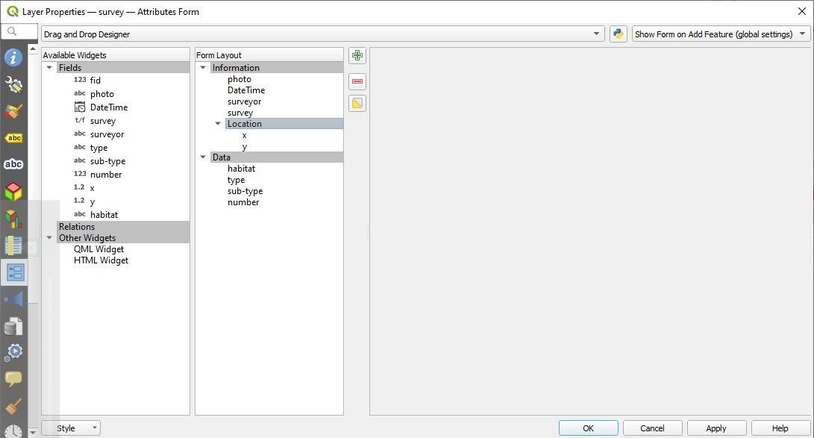

The form with tabs and groups and conditional visibility will appear in QGIS like this:
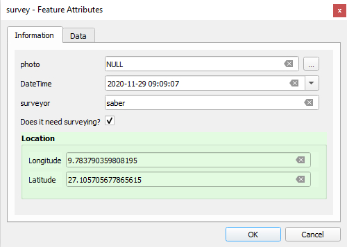

And this is how the same form looks like in <MobileAppName />:
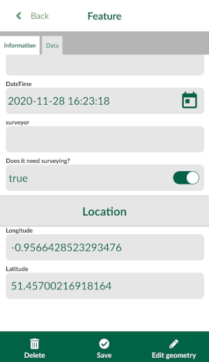

### Show and hide fields depending on a field value
We can set the visibility of **Location** tab depending on the value of the **survey** field:
  - If **survey** is set to **False**, the **Location** tab will not appear in the form,
  - If **survey** is set to **True**, the **Location** tab will show up in the form.

1. Select the **Location** tab in the **Form Layout** column
2. Check the **Control Visibility by Expression** option
3. Type the following expression in the box below: `"survey" IS TRUE`
4. Background colour can be set in the **Style** tab.
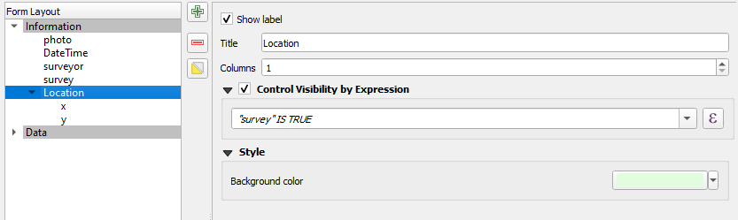

## Default values
Default values can be used to automatically record, e.g, the name of the surveyor, date and time of the survey, latitude and longitude of the feature, or to have frequently used values filled in advance.

:::tip
Clone <MerginMapsProject id="documentation/form_setup" /> to follow this example!
:::

The default value can be a text, number or a QGIS expression. Here we are going to set the default values for **x** and **y** field to be longitude and latitude.

1. Right-click on **survey** layer and select **Properties**
2. In the **Attributes form** tab, select the **x** field in the **Available Widgets** column on the left
3. In the **Widget Display**, set the **Alias** to *Longitude*
4. In **Defaults** tab, define the **Default value** as:
   `x( transform( $geometry, 'EPSG:3857', 'EPSG:4326'))`
   Note that the expression transforms the point from EPSG:3857 (map and layer coordinate reference system) to EPSG:4326.
5. Check the **Apply default value on update**

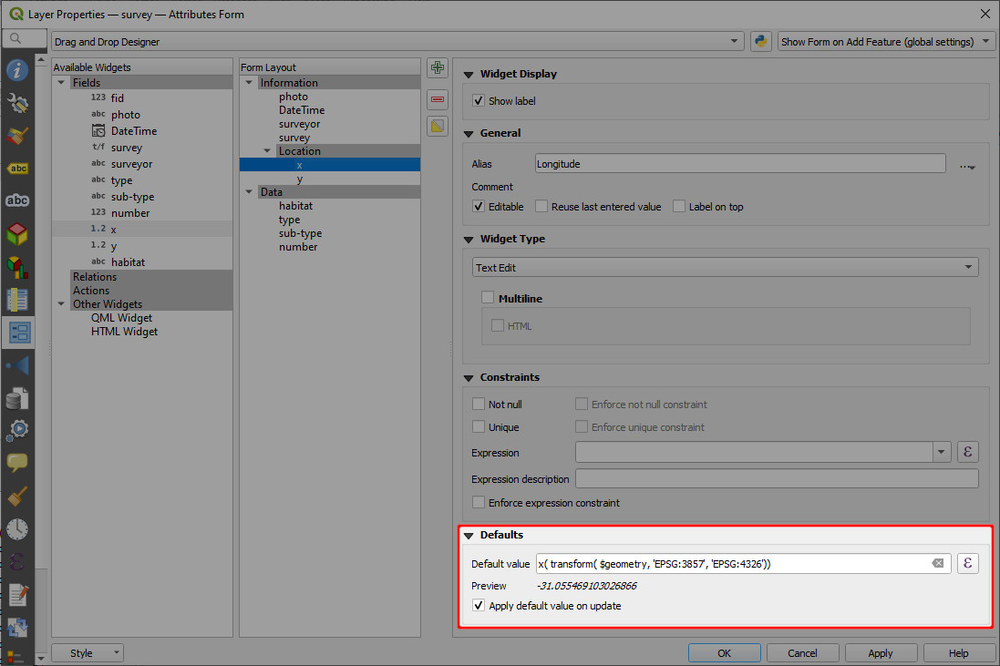

Repeat the same steps for **y** field and setting the **Alias** to *Latitude* and the default value to
`y( transform( $geometry, 'EPSG:3857', 'EPSG:4326'))`

Don't forget to save and synchronise your project!

When you survey a new point in <MobileAppName />, you will see the values are automatically filled in:

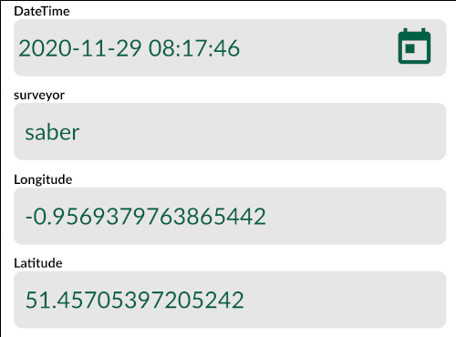

## Constraints
When collecting data, you may want to apply constraints to certain field(s) to avoid mistakes when the values are filled in in the field.

:::tip
Clone <MerginMapsProject id="documentation/form_setup" /> to follow this example!
:::

Here, we will set up a constraint to the **number** field that represents the number of plants.

1. Right-click on **survey** layer and select **Properties**
2. In the **Attributes form** tab, select the **number** field in the **Available Widgets** column on the left
3. In the **Widget Display**, define the **Constraints**:
   - check the **Not null** and **Enforce not null constraints**
   - **Expression** type `"number" >= 1` and check the **Enforce expression constraint** option

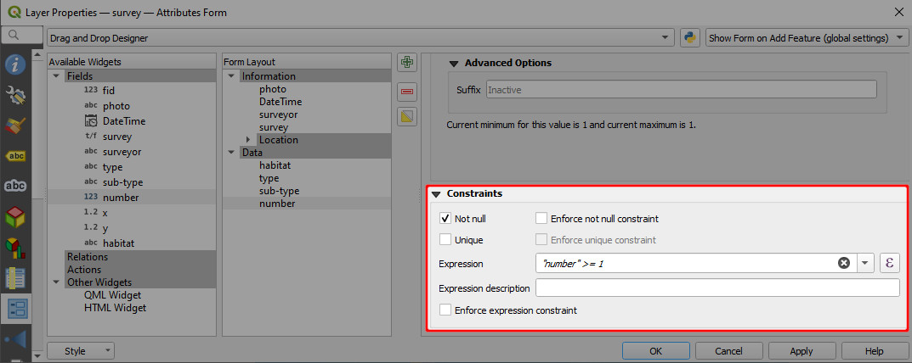

When surveying new features in <MobileAppName />, this field will have to be filled in using a value higher than or equal to 1. Otherwise, you will get a warning.
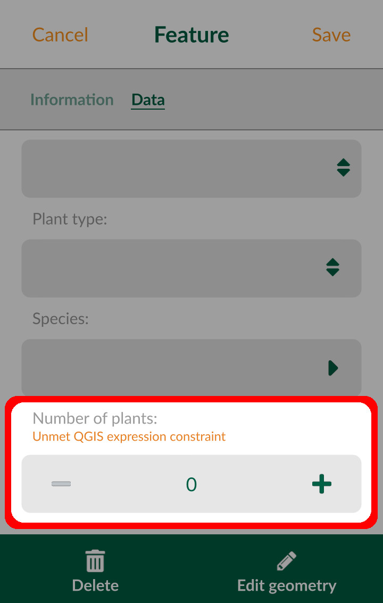

## Drill-down forms
Cascade or drill-down forms enable to list values in a field depending on a value selected in another field.

:::tip
Clone <MerginMapsProject id="documentation/form_cascade" /> to follow this example!
:::

In this project, we will work with the point layer named **car**. The survey tab in the form contains information about cars, such as **Car-Type**, **Car-Manufacturer**, or **Car-Model**. These attributes refer to non-spatial tables using [value relations](./settingup_forms/#value-relation). 
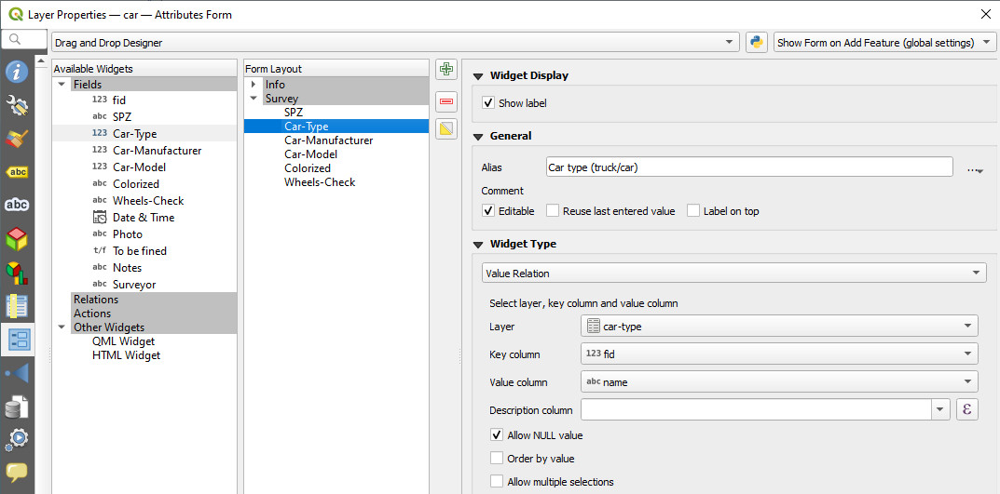

To make the survey easier, we will set the drill-down form so that the values in the drop-down menus are filtered based on the previously selected values. For example, if **Car type (truck/car): Trucks** is selected, the **Car-Manufacturer** field will offer only truck manufacturers *DAF Trucks*, *Scania*, *MAN*. Likewise, the next drop-down menu for **Car-Model** will change accordingly based on the **Car-Manufacturer** selection, showing only relevant car models.

To set the drill-down form:
1. Right-click on the **car** layer and select **Properties**. 
2. Navigate to the **Attributes form** tab. We will set the value relations for the **Car-Type**, **Car-manufacturer**, **Car-model** fields, which are located in the Survey tab of the form.
3. The **Car-Type** field refers to the **car-type** table. The key column is the `fid` and the value column is the `name` field:
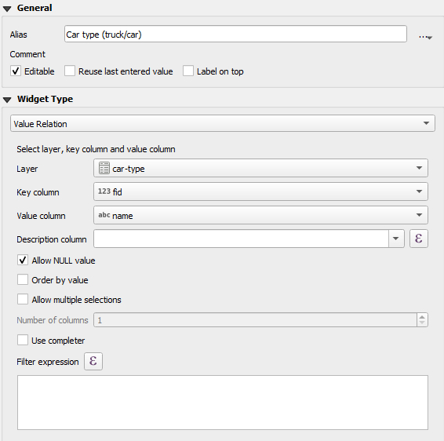

   The **car-type** table is structured as follows:
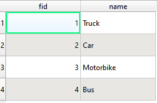

   When entering data into this field, the user can choose from these four `name` values. 
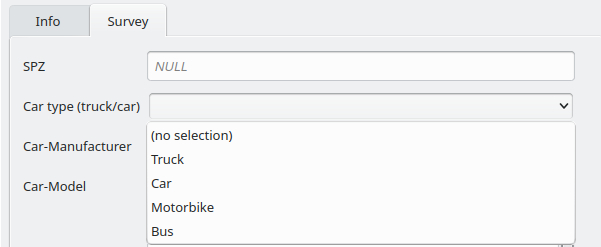

4. The **Car-manufacturer** field refers to the **car-manufacturer** table. This table contains the fields `fid`, `name`, and `type`.
   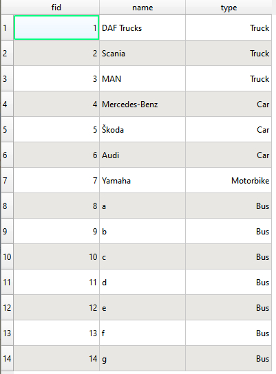

   - Set the `fid` field as the key column and `name` as the value column. 
   - Use the `type` field to define which values will be shown in the form based on the selected **Car-type** by entering this **Filter expression**: 
   `"type" = current_value('Car-Type')`

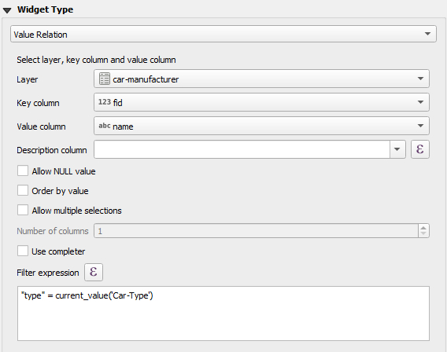

   Now, the form will offer only options, where the **Type** field of the **car-manufacturer** table matches the current value of the **Car-type**. When entering data, we will get a drill-down form: since *Truck* is selected as the **Car type**, only three manufacturers are available in the **Car-Manufacturer** field.

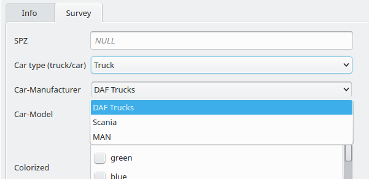

5. **Car-model** works similarly. It refers to the **car-model** table, limiting options based on the **Car-manufacturer** field.
   - Set the `fid` field as the key column and `name` as the value column. 
   - Use the `manufacturer` field to filter the values using this **Filter expression**:
   `"manufacturer" = current_value('Car-Manufacturer')`

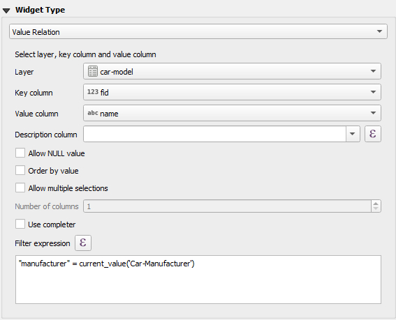

When doing the survey <MobileAppName />, you will see that after selecting **Car-type: Car**, the **Manufacturer** field will only offer **Mercedes-Benz**, **Skoda** and **Audi**. After selecting **Audi**, the **Car-Model** field will only offer the appropriate car models.

