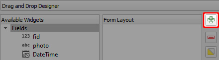

# Tabs and groups
Using [QGIS Drag and Drop designer](../form-layout/#qgis-drag-and-drop-designer), fields can be arranged into groups and tabs.

:::tip Example project available
To see an example of tabs and groups, you can clone <MerginMapsProject id="documentation/form_setup" />. 
:::

1. Click on the **+** button to add new group or a tab to the form layout
   
2. Choose the container type, add a label, and if needed, the number of columns.

   A group can be placed within a tab or another group.
   
   
   
3. Drag and drop fields to tabs or groups as needed.

Here we have two tabs, *Data* and *Changelog*. The *Data* tab contains two groups: *roads* and *paths*.

The form with tabs and groups will appear in QGIS like this:

And this is how the same form looks like in the <MobileAppNameShort />:

