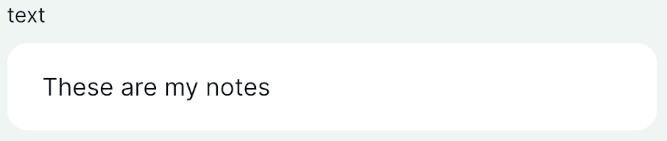
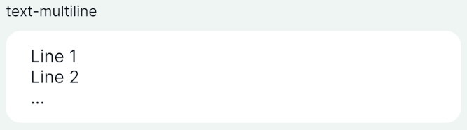
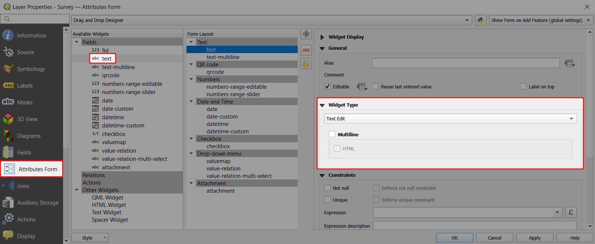
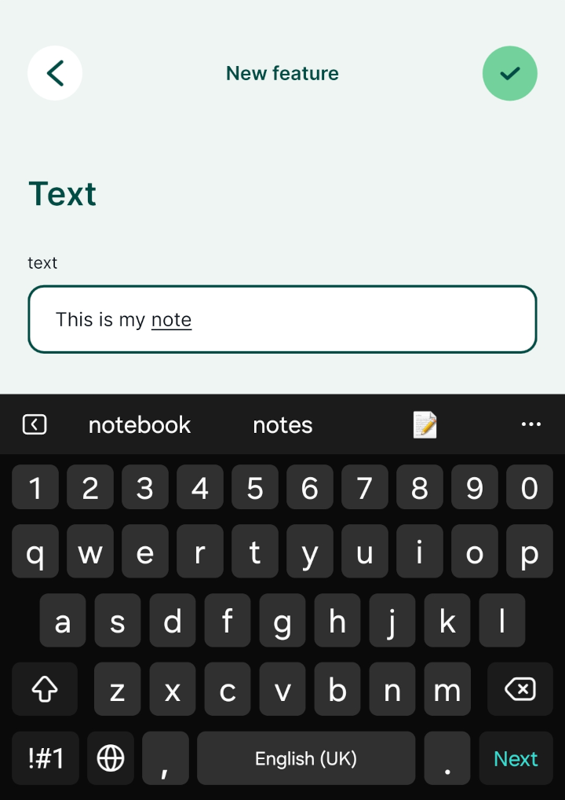
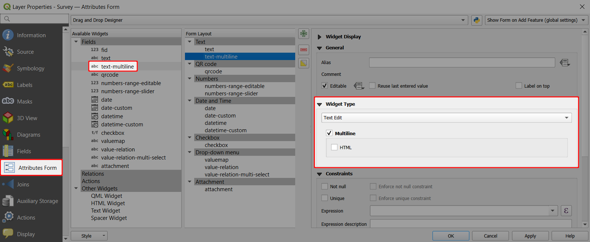
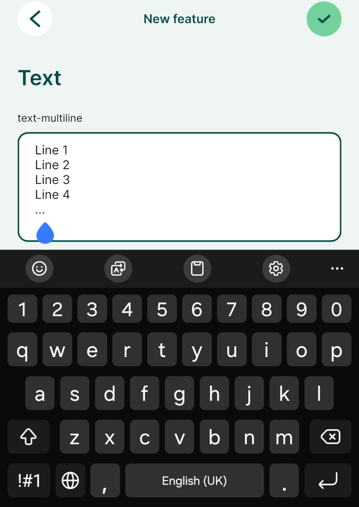
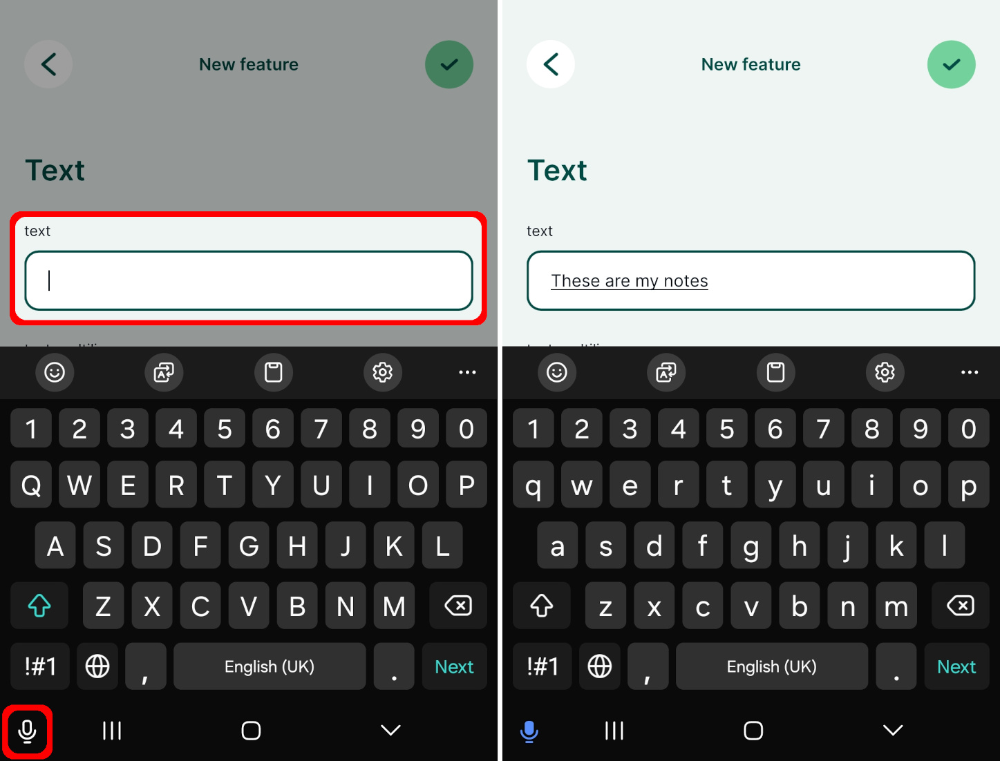

# Text

Adding or editing text is the most common method for inserting information within the forms. The **Text Edit** widget can be used for single-line or [multiline](#multiline-text) text inputs for fields with `Text (string)` or `varchar` data types.

|
 Widget 
 |Preview in the <MobileAppNameShort />|
|:---:|:---:|
|[Text](#text-widget)   |  |
|[Multiline Text](#multiline-text)   |  |

:::tip Example project available
Both single-line and multiline text options are used in this public project: <MerginMapsProject id="documentation/form-widgets" />. Download or clone it to see this setup.
:::

Prefer a video? Here is a short tutorial about text widgets:
<YouTube id="0Y5GKyjmfqo" />

## Text widget
The **Text Edit** widget is set by default for fields with text data type. For simple text input, you do not need to change it.

In the <MobileAppNameShort />, the basic text field looks like this:

## Multiline text

The **Text Edit** widget offers the option to store multiple lines within a single field.
1. Right-click on a layer, select **Properties** and go to the **Attributes form** tab.
2. In the list of **Available Widgets** select the field you want to work with (here: `text-multiline`)
3. In the **Widget Type** tab:
   - Ensure that **Text Edit** is selected
   - Check the **Multiline** option :heavy_check_mark:
4. **Apply** the changes. Don't forget to save and sync your project!

In the <MobileAppNameShort />, the **multiline text edit widget** looks like this:

::: tip
Both QGIS and <MobileAppName /> support the use of HTML text fields. When setting up the [multiline](#multiline-text) text widget, check also the **HTML** option :heavy_check_mark:. 

HTML text fields can be used to include clickable links to, e.g., [open a link in a browser](../external-link/) or [open a navigation app](../link-to-navigation/) directly from the form in the <MobileAppNameShort />.  
:::

## Voice input

In the <MobileAppNameShort />, the text can be entered manually or using voice-to-text (if your mobile device supports this feature).

