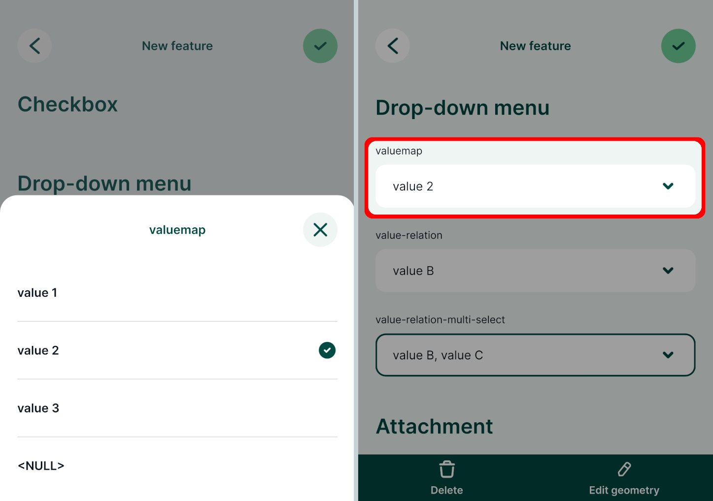
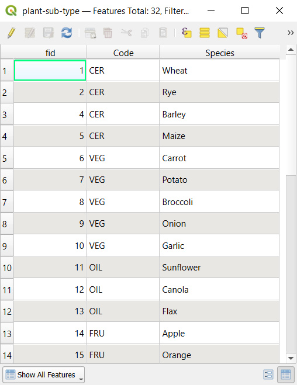

# Select value from a drop-down menu
[[toc]]

Selecting values from a drop-down menu is faster then typing them in manually and it also ensures that there are no typos or spelling variations. To present the options as a drop-down menu in the form, you can use the [Value Map](#value-map) or [Value Relation](#value-relation) widgets in QGIS.

There are some benefits of using the Value Relation widget, such as:
- Option to select multiple values from the list (in this case, the field needs to be of `text` data type).
- The layer that contains values can be edited in the field. For example, if you have missed a value in your list for the drop-down menu, you can edit the table in the <MobileAppNameShort />, add the value and use it during your survey. See [Working with non-spatial tables](../non-spatial-data/) for more details.
- Searching the values: if you have a large list of values, it will become cumbersome to find the right value. With Value Relation widget, you have the option to search for values in the list in the <MobileAppNameShort />.

## Value Map

Value map widget is used to select a value from a drop-down menu. Values are defined in the widget. They cannot be changed or added from the <MobileAppNameShort /> and only one value can be selected. 

If you want to use multiple selections in a field or need to add new values during the survey, check out the [Value Relation](#value-relation) widget.

:::tip Example project available
This public project <MerginMapsProject id="documentation/form-widgets" /> contains a Value Map field. Download or clone it to see the setup.
:::

1. Right-click on a layer, select **Properties** and go to the **Attributes form** tab.
2. In the list of **Available Widgets** select the field you want to work with (here: `valuemap`)
3. In the **Widget Type** tab, select the **Value Map** option from the drop-down menu and fill in the table below. 
   **Value** is what will be stored in the field (these can be coded values or shortened names, here we use `1`, `2`, `3`). **Description** is what will be displayed in the form and in the attributes table (here: `value 1`, `value 2`, `value 3`).
4. **Apply** the changes. Don't forget to save and sync your project!

Now you can select the value from a drop-down menu in the <MobileAppNameShort />:

## Value Relation

:::tip Example project available
This public project <MerginMapsProject id="documentation/form-widgets" /> contains a Value Relation setup. Download or clone it to explore it in more detail.
:::

The **Value Relation** widget is similar to the [Value Map](#value-map) widget, but the values for the drop-down menu come from another layer (usually a non-spatial table). 

To have the option to safely add new values when working collaboratively, the value table should have a unique field with UUID values. This field should use the `uuid()` function as a [default value](../attach-multiple-photos-to-features/), so that every new entry has its UUID.

To set up **Value Relation** in QGIS:

1. Right-click on a layer, select **Properties** and go to the **Attributes form** tab.
2. In the list of **Available Widgets** select the field you want to work with (here: `value-relation-multi-select`)
3. In the **Widget Type** tab, select **Value Relation** from the drop-down menu and set it up as follows:
   - Select the **Layer** that contains the values (here: `value-relation-table`)
   - **Key column** is the field that contains the values (here: `uuid`)
   - **Value column** is the field that contains the alias (description) of the value (here: `value`)
   - Check the **Allow multiple selections** option :heavy_check_mark: if you want to have the option to select multiple values
4. **Apply** the changes. Don't forget to save and sync your project!

:::danger Using UUID as key field
**Why UUID?** FID can be changed during [synchronisation](../../manage/synchronisation/). If multiple surveyors add new entries to the value table, features can end up with wrong values. 

On the other hand, <QGISHelp ver="latest" link="user_manual/expressions/functions_list.html#uuid" text="UUID" /> (Universally Unique Identifier) is guaranteed to be unique and will not be changed when synced. Therefore, we recommend using UUID if you want to add new values during the survey.
:::

When you open the field with **Value Relation** in the <MobileAppNameShort />, you will be able to select values from the list.

## Drill-down forms
Drill-down or cascade forms enable to list values in a field depending on a value selected in another field.

:::tip Example project available
Clone <MerginMapsProject id="documentation/form_setup" /> to explore drill-down forms.
:::

Here, we have a layer named `landuse` that has fields such as *Land use*, *Type*, *Plant type*. Values that can be filled in these fields depend on the previous choices: if we select `Farmland` as the *Land use*, the *Type* field drop-down menu offers options such as `Cereals`, `Oil plants` or `Vegetables`. Subsequently, the *Plant type* field has only options that are relevant for the selected type of land use.

At first, let us explore the structure of value tables that are used to set up drill-down forms. In the example project, *Land use* field uses `plant-habitat` value table that has following fields:

The *Type* field refers to the `plant-type` value table. In this table, there is a field `habitat-code` that refers to a specific `code` value from the `plant-habitat` table. 
For instance, the `FAR` habitat code (standing for *Farmland*) is used as the `habitat-code` for *Cereals, Vegetables, Oil plants* as these are applicable farmland types.

Similarly, the *Plant type* field uses the `plant-sub-type` value table that contains a `Code` field that refers to specific types from the `plant-type` table.
For instance, the `CER` type code is applied for *Wheat, Rye, Barley, Maize*, meaning these types of plants belong to the *Cereals* category.

To set up drill-down forms:
1. Right-click on a survey layer, select **Properties** and go to the **Attributes form** tab
2. The `habitat` field aliased as *Land use* is set up using the **Value relation** widget. Values are defined in the `plant-habitat` table:
   - **Key column** is the field that contains the values (here: `code`)
   - **Value column** is the field that contains the alias (description) of the value (here: `desc`)

   

3. The `type` field (aliased as *Type*) uses the **Value relation** widget with values from the `plant-type` table:
   - **Key column** is the field that contains the values (here: `Code`)
   - **Value column** is the field that contains the alias (description) of the value (here: `Description`)
   - **Filter expression**: `"habitat-code"= current_value('habitat')` is used to limit the options in the drop-down menu to values where the `habitat-code` of the value is the same as the current value of the `habitat` field.
    

4. Likewise, the `subtype` field (aliased as *Plant type*) uses the **Value relation** widget with values defined in the `plant-sub-type` table:
   - **Key column** is the field that contains the values (here: `id`)
   - **Value column** is the field that contains the alias (description) of the value (here: `Species`)
   - **Filter expression**: `"Code" = current_value('type')`
    

And this is how the drill-down form looks in the <MobileAppNameShort />. After selecting *Land use: Farmland*, the *Type* field only offers values `Cereals`, `Oil plants` or `Vegetables`. After selecting `Cereals`, the *Plant type* offers only relevant options such as `Wheat`, `Rye` or `Barley`.

