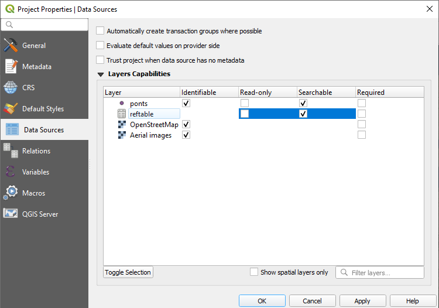

# Working with Non-spatial Tables

Non-spatial tables are often a key part of a survey project. The tables can be used either on their own to add new data or alternatively as a link to a spatial layer (e.g. value relation).

We recommend using GeoPackage to save your non-spatial table. With this format, you can collaboratively edit the data and track changes.

# QGIS project configuration

Ensure you have enabled editing and searching of your non-spatial table in QGIS <QGISHelp ver="3.10" link="user_manual/introduction/qgis_configuration.html?highlight=properties#data-sources-properties" text="QGIS project" />:

# Browse, search and edit non-spatial data in Mergin Maps Input

To browse, search or edit a non-spatial table, first you need to [open the attribute table](../gis/search_data/#searching-for-values-in-mergin-maps-input).

To add a new record, select **Add Feature**. This will open a form to fill. By pressing **Save**, the new record will be added and Input will take you back to the attribute of your table.

Similar to the vector layer attribute table, you can [search](../gis/search_data.md) your data.

Selecting an individual record, Input will open the form related to the feature.

