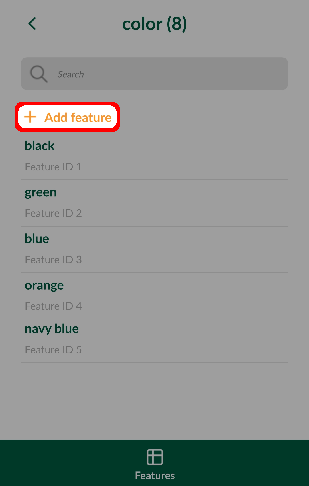

# Working with Non-spatial Tables
[[toc]]

Non-spatial tables are often a key part of a survey project. The tables can be used either on their own to add new data or linked to a spatial layer, e.g. when linking multiple [photos](./attach-multiple-photos-to-features/) or [records](./one-to-n-relations/) to one feature.

We recommend using **GeoPackage** format to save your non-spatial table. With this format, you can collaboratively edit the data and track changes.

## QGIS project configuration
Ensure you have [enabled editing and browsing](../gis/search_data/) of your non-spatial table in **Project Properties** in QGIS.

## Browse, search and edit non-spatial data in Mergin Maps Input
Non-spatial tables can be browsed, searched and edited in **Layers** in the **More** tab.

Choose the non-spatial layer from the list in **Layers**. Tap it to open the attributes table. Here, you can browse and [search](../gis/search_data.md) your data.

To add a new record, select **Add Feature** and fill in the form.

Selecting an individual record will open the form related to the feature.

