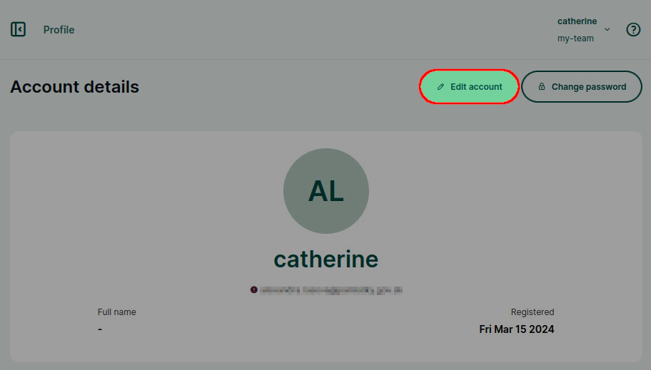
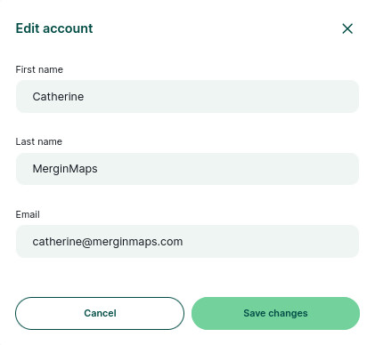
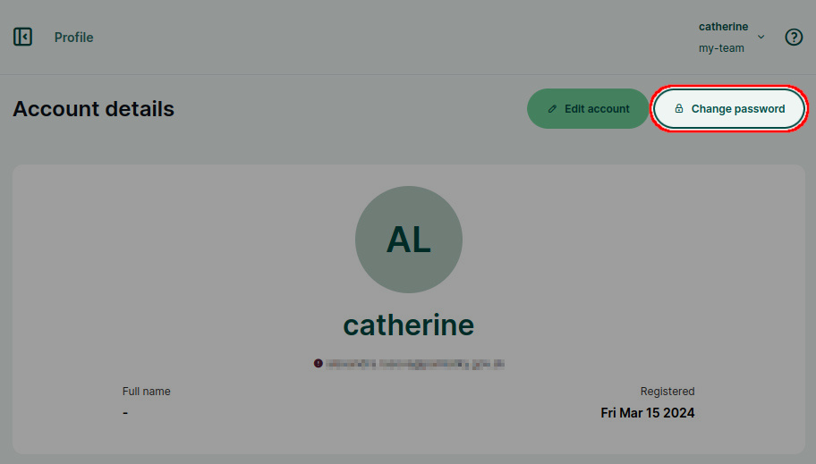
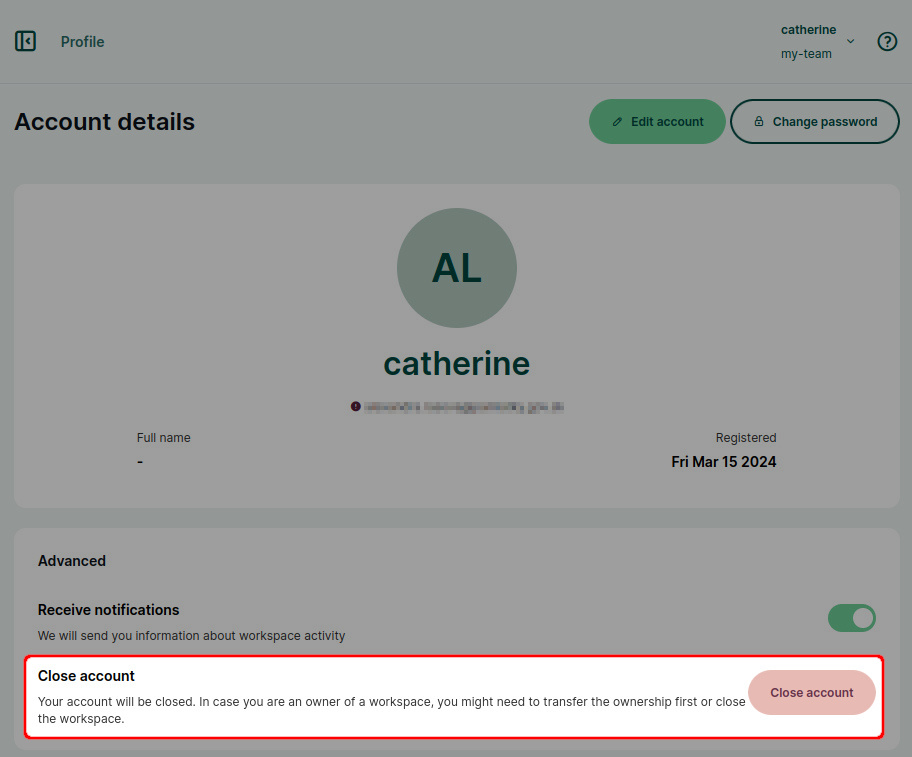
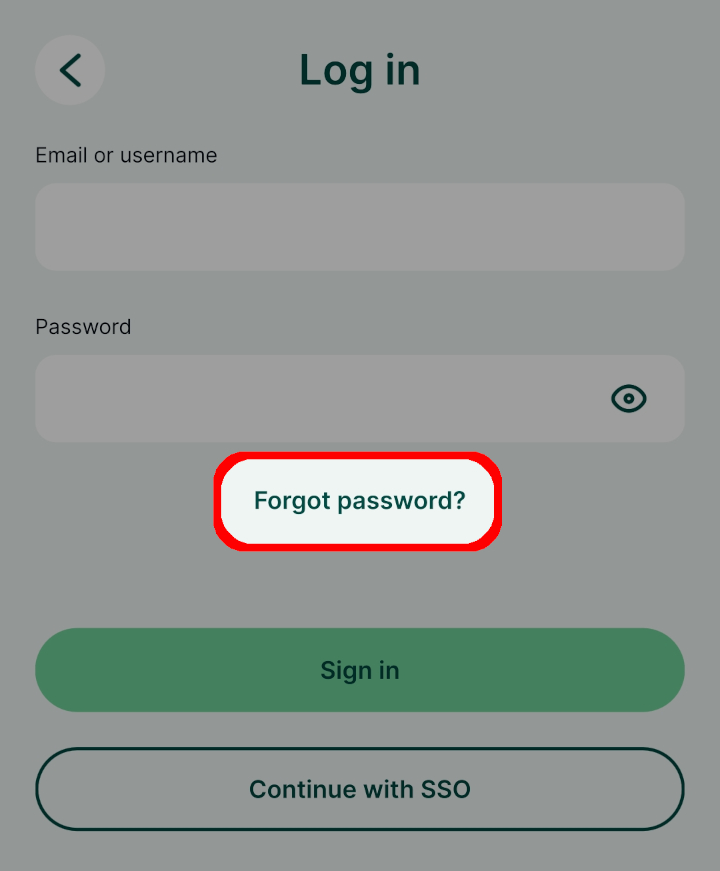

# User Account
[[toc]]

When [signing up to <MainPlatformName />](../../setup/sign-up-to-mergin-maps/), you have set the username, email and password that are associated with your account. 

The [email](#changing-email-and-account-details) and [password](#changing-password) can be changed anytime through the <DashboardShortLink />.

It is not possible to change the username. If you wish to use a different username, follow [these steps](#changing-mergin-maps-username).

## Changing email and account details

1. Log in to <AppDomainNameLink />. 

   In the upper right corner of the screen, click on your username and go to **Your profile**.  
   
   
2. Click on the **Edit account** button.
   

3. Here you can change your email and add or change your first name and last name. 
   

### Changing password

1. Log in to <AppDomainNameLink />. 

   In the upper right corner of the screen, click on your username and go to **Your profile**.   
   
   
2. Click on the **Change password** button and set a new password.
   

## Changing Mergin Maps username

The username cannot be changed. If you need to use a different username, you will have to create a new account.

**If you are a contributor to a workspace, but do not own a workspace:**
1. Create a new <MainPlatformName /> account with the username of your choice
2. Make a list of workspaces/projects you have access to with your original account
3. Notify the *admins* or *owners* of the relevant workspaces about this change.
   They will have to [share the workspace or projects](../project-advanced/#share-projects-and-manage-user-access) with your new account.
4. Now your original account can be [deleted](#deleting-mergin-maps-account)

**If you own a workspace:**
1. Create a new <MainPlatformName /> account with the username of your choice
2. [Transfer the ownership](../permissions/#how-to-transfer-ownership-of-a-workspace) of your workspace(s) to the new account and, if needed, [update the billing information](../subscriptions/#billing-information-and-payment-method)
3. Now you can [delete](#deleting-mergin-maps-account) the original account

::: tip Re-using email
The same email cannot be used for multiple accounts. If you want to reuse the same email that you have used in your original account, you will have to [close](#deleting-mergin-maps-account) it and wait until it is deleted. Deleted accounts are kept on <MainPlatformName /> servers for 5 days before they are deleted permanently.

To speed up the process, you can contact <MerginMapsEmail id="support" /> and ask them to delete your account so you can use the same email immediately.
:::

## Deleting Mergin Maps account
Your <MainPlatformNameLink /> account can be deleted in the <DashboardShortLink />.

Before closing the account, **make sure to** [**close your workspaces**](../../manage/workspaces/#how-to-delete-a-workspace). 

1. Log in to <AppDomainNameLink />. In the upper right corner of the screen, click on your username and go to **Your profile**.
   
   
2. Click on the **Close account** button.
   

You will be prompted to confirm the closing of your account by typing the account name. 

After you close the account, it is kept on <MainPlatformNameLink /> servers for 5 days before it is deleted permanently. During this period, it can be restored if you contact <MerginMapsEmail id="support" />.

## Forgotten password
If you forget your password, you can easily reset it. 

You can find the **Forgot password?** option on the <DashboardShortLink /> or the <MobileAppNameShort /> log in page. Email with password reset link will be sent to your email address.

::: tip
Check your spam folder if the email with password reset link does not appear in your inbox after a few minutes. 

If that's not the case, please contact <MerginMapsEmail id="support" /> to resolve this issue.
:::
   
