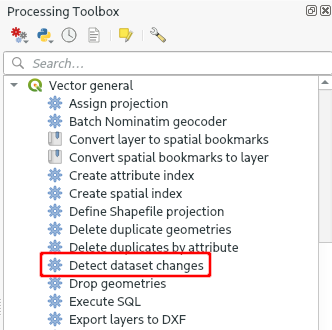

# How to Avoid and Resolve Conflict Files
[[toc]]

Conflict files can appear in your project when Mergin could not synchronise changes automatically and they indicate there may be some issues that you should be fixed. Conflicts can be caused, for instance, by multiple surveyors editing the same feature or by synchronising projects with different database schema. You can read more about this topic in [Synchronisation and Conflicts](./synchronisation.md).

## How to avoid conflict files
Here are some best practice tips to avoid conflict files:
- **Always use GeoPackage for survey layers**. If you use other formats, such as ESRI shapefile, Mergin is not able to detect changes from other users and overwrites them. Overwritten files are stored in a conflict file.
- **Add some extra field attributes** when creating a survey layer with different types (e.g. a couple of texts, int, real, date/time) and hide them in the form design. These can serve as a backup: if you need extra fields later in the survey, just alias these extra fields and add them to form. 
- If you do not need a field, **remove it from the form**. You don't need to delete it from the table.
- **Instead of renaming a field, change its alias**.
- **Add new layers to your project as separate GeoPackages**. Do not add a new table to your existing GeoPackage that contains a survey layer. Just to be safe, it is better to have one GeoPackage for each of your survey layers.
- use **GeoTIFF** format for your raster files or store them in a separate GeoPackage database

## How to resolve conflicts
Conflict files

### Resolving conflict files manually
If you can identify missing features visually, e.g. by finding out where the survey took place, you can copy and paste these feature to the survey layer. Make sure the values have been transferred over correctly!

### Resolving conflict files semi-automatically
Change the schema of the table in the conflict file to match the new schema and run *Detect dataset changes* algorithm from the Processing toolbox. You then need to go though the result and ensure the changes detected are the ones you expect for both attribute values and geometry.

