# How to Create a New Project
[[toc]]

There are several methods of creating a new <MainPlatformName /> project:
- [<MobileAppName /> ](./index.md#create-a-project-in-mergin-maps-input) offers the quickest (albeit limited) way of creating a <MainPlatformName /> project.
- If you want to take full advantage of <MainPlatformName />, use [QGIS](./index.md#create-a-project-in-qgis) to prepare new projects.
- You can also use [cloudmergin.com](./index.md#create-a-project-through-cloudmergin-com), especially if your project files are already fully prepared and only need uploading.

If you want to make a copy of your projects or the ones shared with you, you can clone them in [QGIS](./index.md#clone-an-existing-project-in-qgis) or [cloudmergin.com](./index.md#clone-an-existing-project-through-cloudmergin-com).

## Create a project in Mergin Maps Input

   ::: tip
   [Capturing Your First Field Data](../../tutorials/capturing-first-data/index.md) tutorial will show you how to create a new project and capture field data in <MobileAppName />.
   :::

1. Open <MobileAppName /> on your mobile device
2. Go to the *Home* tab of the *Projects* screen and press *Create project*:

   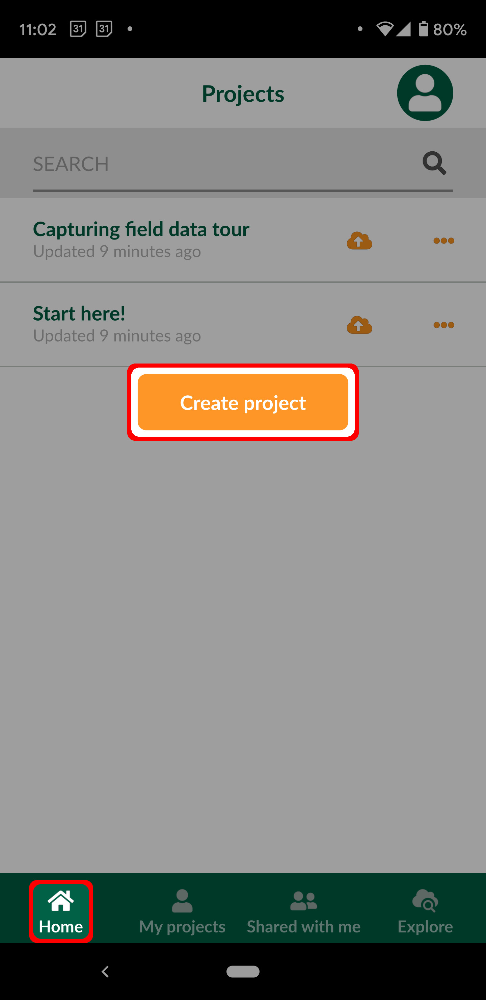

3. Give the project a name 

   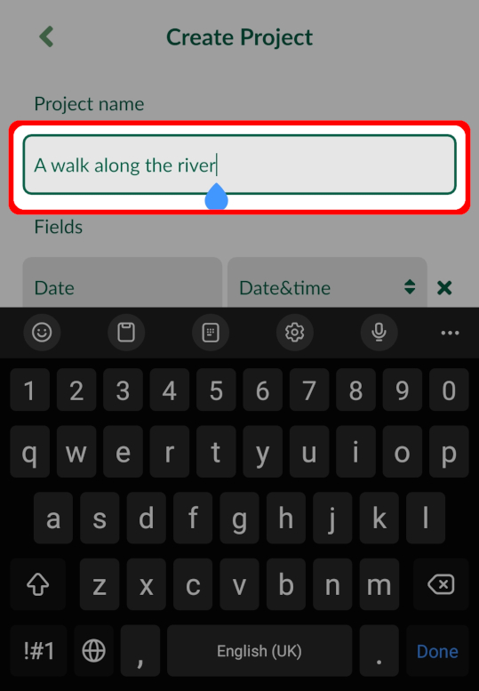

4. Press *Create project*:

   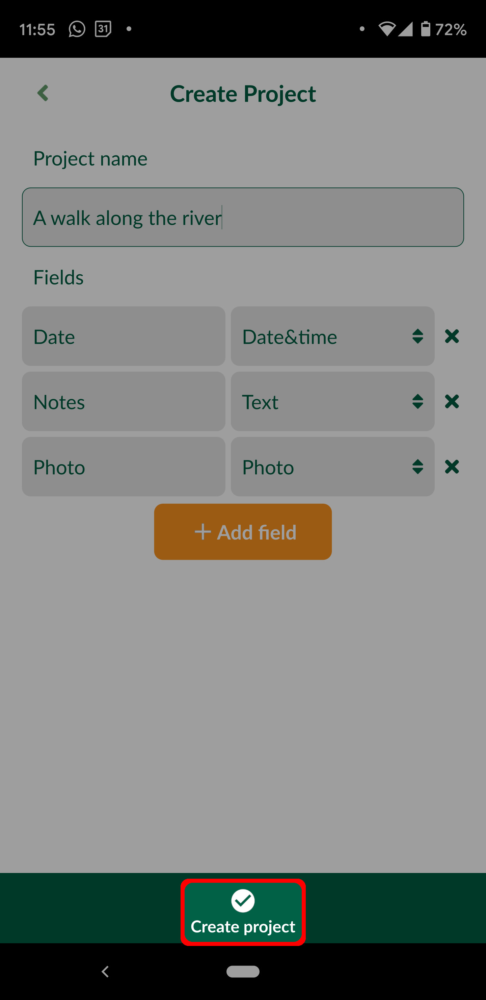
   
   ::: tip
   You may need to minimise the on-screen keyboard to access the *Create project* button.
   :::

Your new project should now be visible on the *Home* tab of the *Projects* screen:

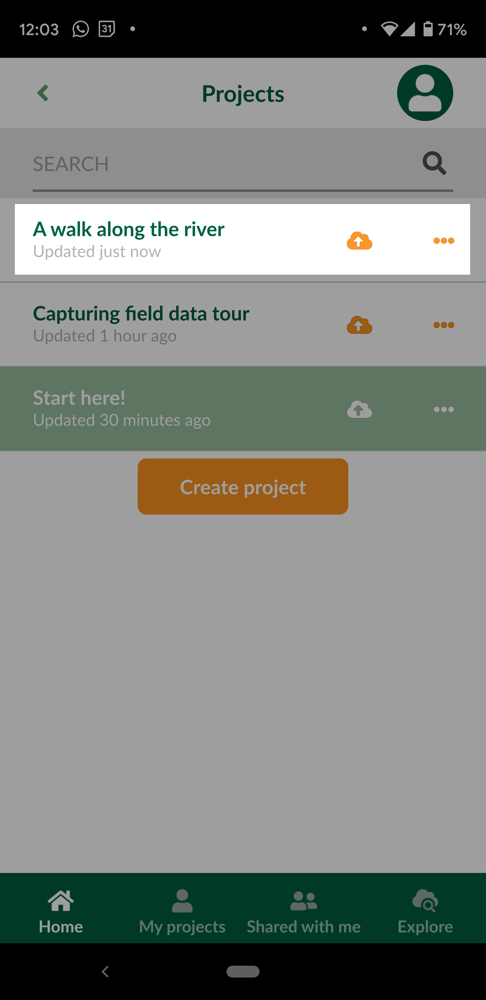

## Create a project in QGIS

   ::: tip
   [Creating a Project in QGIS](../../tutorials/creating-a-project-in-qgis/index.md) tutorial will show you how to create a new project in QGIS, add layers, configure attributes forms and save changes to <MainPlatformName />. 
   :::

To work with <MainPlatformName /> projects in QGIS, you will need to [install the <QGISPluginName />](../../setup/install-mergin-maps-plugin-for-qgis/index.md).

1. Open a blank or an existing project in QGIS.

2. Click on **Create Mergin Project** from the toolbar.

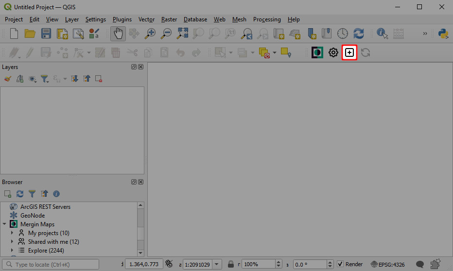

3. There are three options available (the last two options are available only if you have an existing project open):

   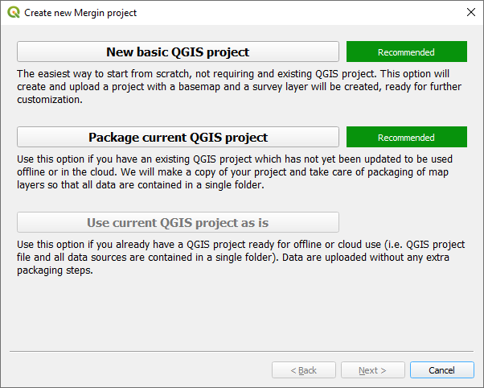

   - **New basic QGIS project**. If you are new to QGIS, this is a good starting point. The new basic QGIS project will contain a survey layer (a point layer) and a background map (OpenStreetMap).

   - **Package current QGIS project**. This option will create a copy of your project and all the files in a single folder. There are three options for handling layers: package, keep as is (the layer will be referenced as is in the new project) or ignore (the layer will not be included in the new project). 
     By default, the web services (e.g. WMTS, XYZ tiles, vector tile layers) will be referenced as they are, raster layers will be copied as they are, and vector layers will be all written to GeoPackage format (each vector in one GeoPackage database).

     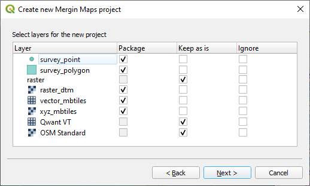

   - **Use current QGIS project as is**. This is for cases when you have already a stand-alone folder with your project packaged.

4. Name the project and select a path where your project folder and associated files will be generated:

   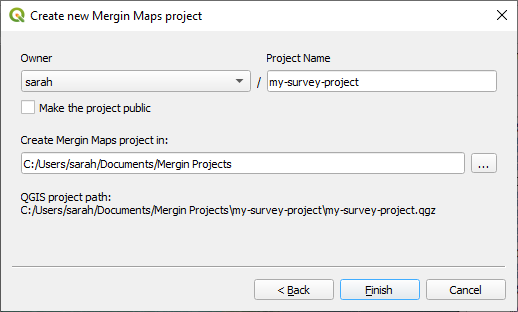

The new <MainPlatformName /> project will be created locally on your computer and also on the Mergin server.

### Clone an existing project in QGIS

Using <QGISPluginName />, you can make a copy of one of your existing projects or the ones shared with you. 

1. Right-click on the project in the **Browser panel > Mergin** and select **Clone**.

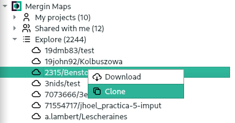

2. Select the **Owner** from the drop-down menu and type your new **Project Name**.

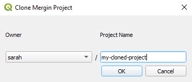

## Create a project through cloudmergin.com

1. Navigate to <MainDomainNameLink /> and sign in.

2. To create a new project, click on **Create** in the **Projects** section:

   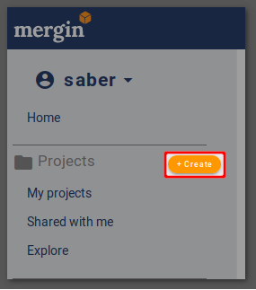

3. Give the project a **name**
   - in **Template project**, you can select a template from the list
   - **Project owner** is you (your username) or your organisation
   - the project is private by default, you can use the checkbox to make it **Public**

   

   After creating a new project, you will be directed to the project page. 

4. Add files to your project:
   - Click on **Drag & drop here to click and select file(s) to upload**
   - Select files or folders to upload
   - Once the files and folders are selected, press **Update**

   

### Clone an existing project through cloudmergin.com

You can also make a copy of an existing project or a project that is shared with you:

1. Open the project link in your web browser
2. From the top right of the panel, select **Clone**
   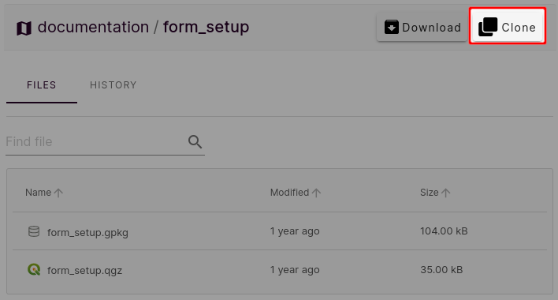
3. In the new window, you can change the project name and select the owner