# How to Create a New Project
[[toc]]

There are several methods of creating a new <MainPlatformName /> project:
- If you want to take full advantage of <MainPlatformNameLink />, use [QGIS](#create-a-project-in-qgis) to prepare new projects.
- [<MobileAppName /> ](#create-a-project-in-mergin-maps-mobile-app) offers the quickest (albeit limited) way of creating a <MainPlatformName /> project.
- You can also use <DashboardLink />, especially if your project files are already fully prepared and only need uploading.

If you want to make a copy of your projects or the ones shared with you, you can clone them in [QGIS](#clone-an-existing-project-in-qgis) or the [dashboard](#clone-an-existing-project-through-mergin-maps-dashboard).

:::warning
When creating a project, keep in mind that its name cannot be changed later.
:::

## Create a project in QGIS
::: tip
[Creating a Project in QGIS](../../tutorials/creating-a-project-in-qgis/) tutorial will show you how to create a new project in QGIS, add layers, configure attributes forms and save changes to <MainPlatformNameLink />. 
:::

To work with <MainPlatformName /> projects in QGIS, you will need to [install the <QGISPluginName />](../../setup/install-mergin-maps-plugin-for-qgis/) first.

1. Open a blank or an existing project in QGIS.

2. Click on **Create Mergin Maps Project** from the toolbar.
   

3. There are three options available (the last two options are available only if you have an existing project open):
   

   - **New basic QGIS project**. If you are new to QGIS, this is a good starting point. The new basic QGIS project will contain a survey layer (a point layer) and a background map (OpenStreetMap).

   - **Package current QGIS project**. This option will create a copy of your project and all the files in a single folder. There are three options for handling layers: package, keep as is (the layer will be referenced as is in the new project) or ignore (the layer will not be included in the new project). For more details, see [<MainPlatformName /> project](../project/#packaging-qgis-project).
     

   - **Use current QGIS project as is**. This is for cases when you already have a stand-alone folder with your project packaged.

4. Change the workspace (if needed), name the project and select a path where your project folder and associated files will be generated.

   Keep in mind that the project name cannot be changed later.
   
   
   :::danger WARNING
   Your project should be saved on a local drive. Using shared network drives and cloud storage (such as OneDrive or Google Drive) is **not supported**.
   :::

The new <MainPlatformName /> project will be created locally on your computer and also on the <MainPlatformNameLink /> server. 

### Clone an existing project in QGIS
Using <QGISPluginName />, you can make a copy of projects you have access to.

1. Navigate to **Mergin Maps** in the **Browser panel**.

2. Find the project you want to clone. Right-click on it and select **Clone**.

   You might need to [switch to another workspace](../workspaces/#switch-workspaces-in-qgis) to locate the project.
   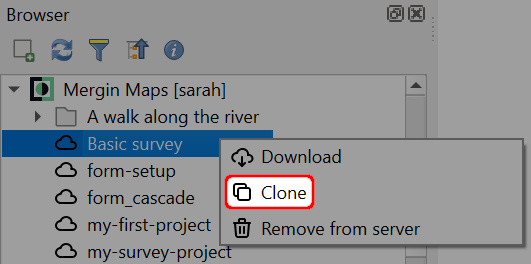

3. Select the **workspace** from the drop-down menu and enter your new **Project Name**. Click **OK**.
   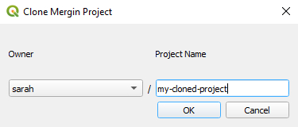

The project will be saved in the selected workspace.

## Create a project in Mergin Maps mobile app
::: tip
[Capturing Your First Field Data](../../tutorials/capturing-first-data/) tutorial will show you how to create a new project and capture field data in <MobileAppName />.
:::

1. Open the <MobileAppNameShort /> on your mobile device

2. Navigate to the **Home** tab and tap **Create project**
   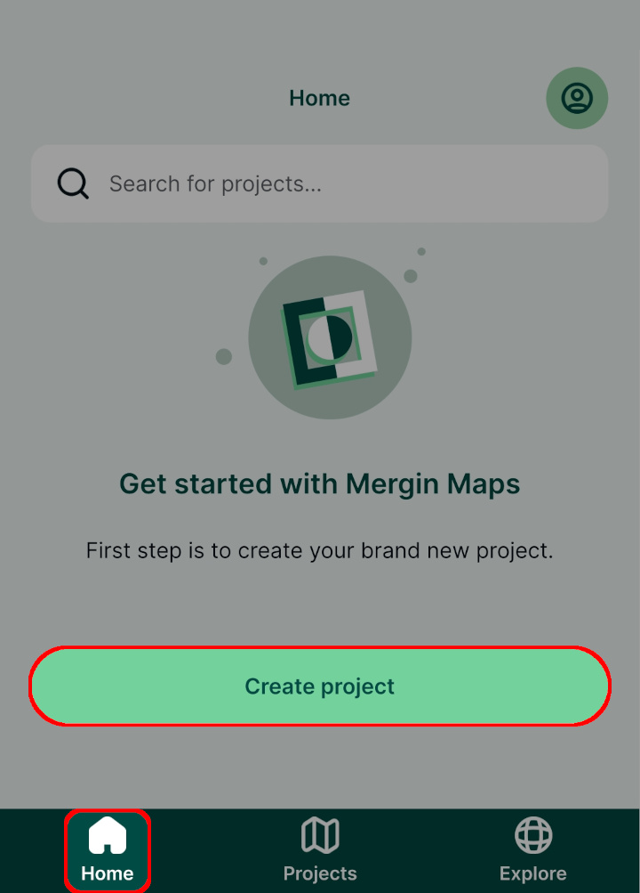

3. Give the project a name. Keep in mind that the name cannot be changed later.

   Press **Create project**.
   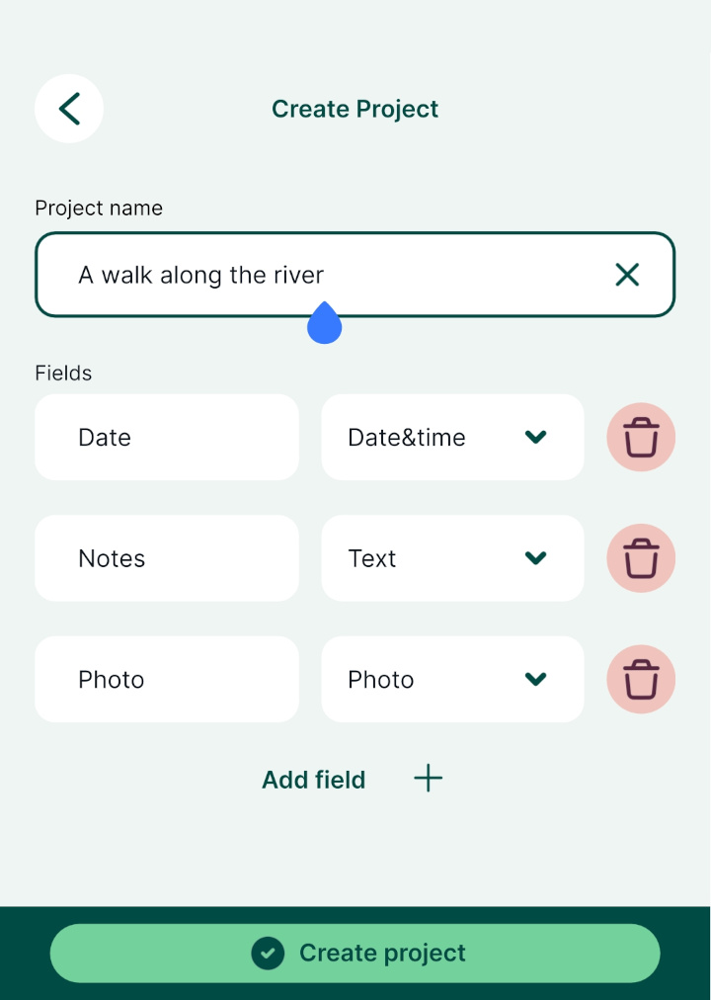

4. Your new project will be created locally on your mobile device
   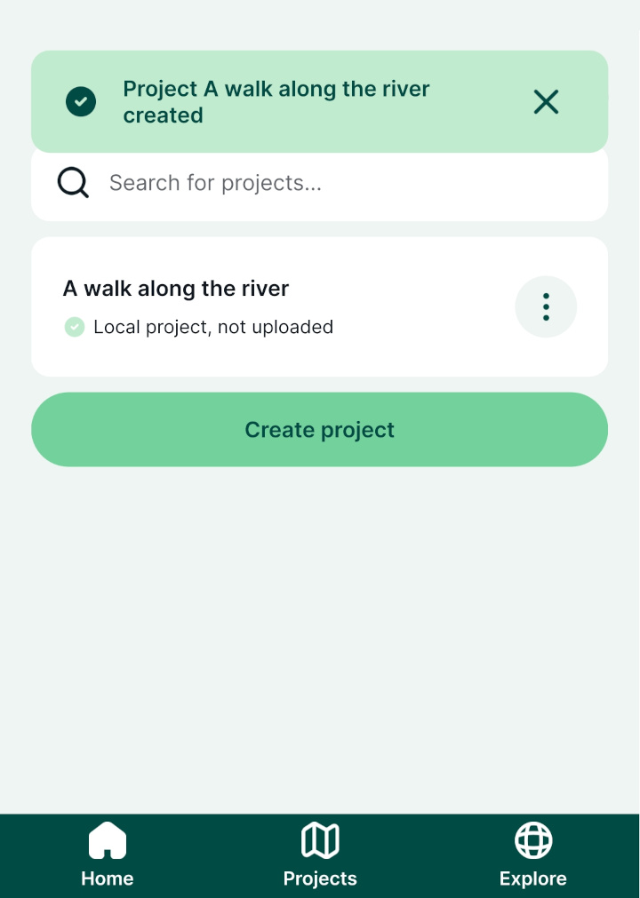
   
5. To save it to the <MainPlatformNameLink /> server, tap the **Upload** option
   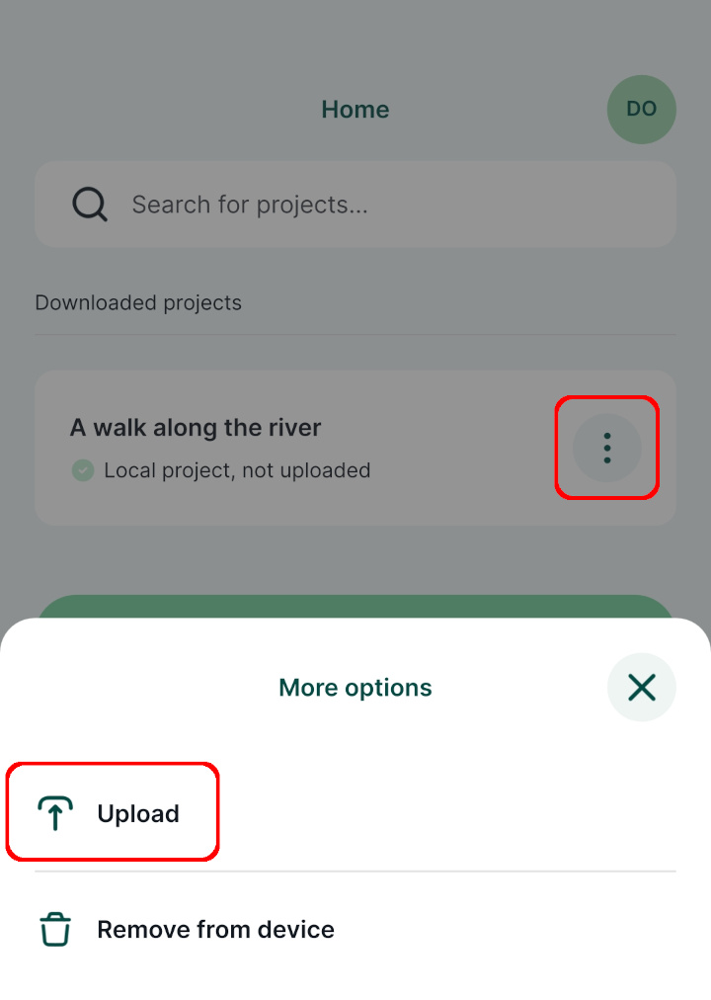

6. The project is now uploaded to your current workspace and can be shared across devices or with other users
   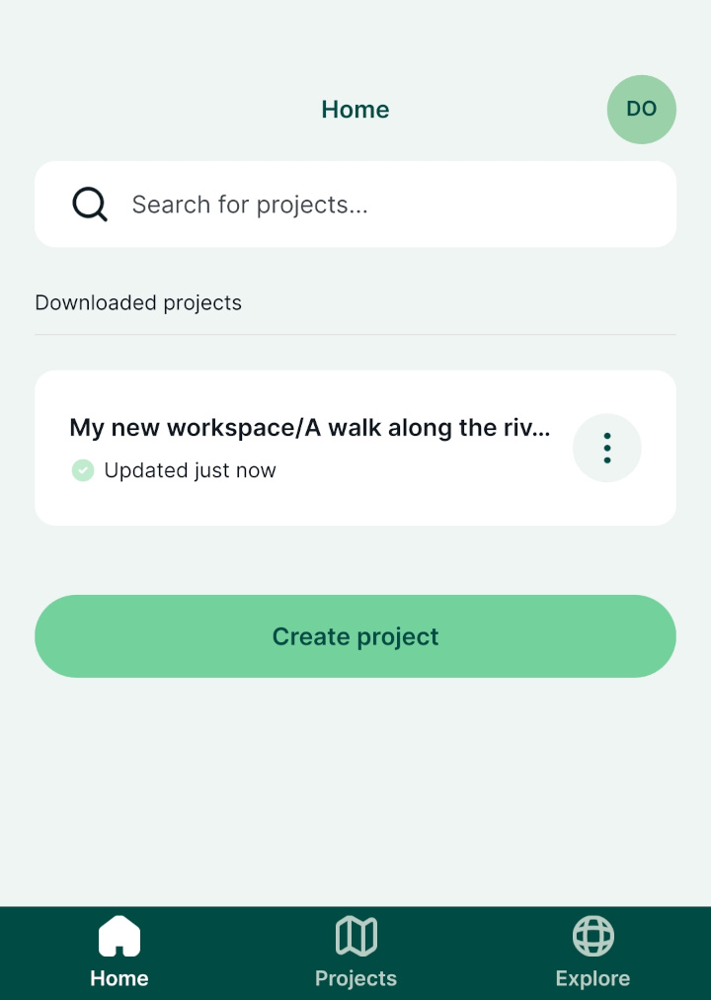

## Create a project through Mergin Maps dashboard
:::warning
The preferred way of creating a project is to use the <QGISPluginNameShort />. This option is for advanced users.
:::

1. Navigate to <AppDomainNameLink /> and sign in.

2. In the **Projects** tab, click on **Create project**
   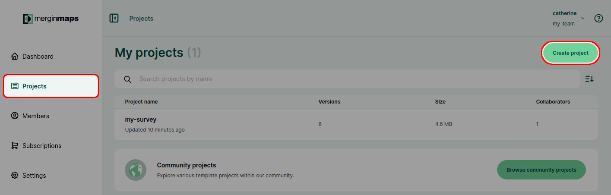

3. Enter a **Project name** and click **Create project**
   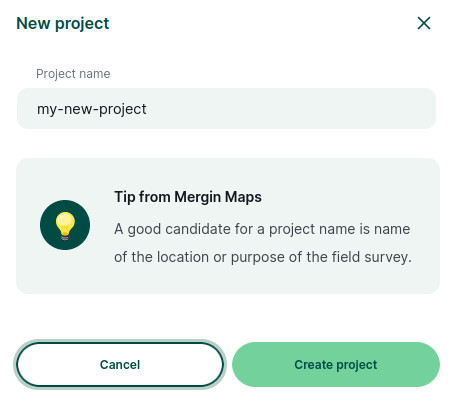

4. Now you will be directed to the project overview.

   Files can be uploaded using the <QGISPluginNameShort /> or by **Drag and drop**.
   
   If you are uploading files manually through the <DashboardShortLink />, do not forget to synchronise the changes by clicking **Update changes** in the **Data Sync**.
   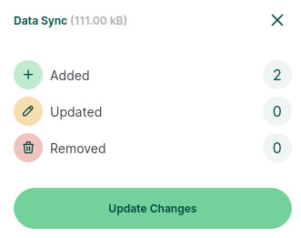

### Clone an existing project through Mergin Maps dashboard
Projects you have access to and [public projects](../permissions/#public-and-private-projects) can be cloned. By cloning a project, you will create your own copy of this project. This way, you can use public projects as templates for your own work or easily create backups.

#### Clone a project from your workspace
1. In the **Projects** tab, find the project you want to clone, open it and click on **Clone**.

   If needed, [switch to another workspace](../workspaces/#switch-workspaces-in-qgis) to locate the project.
   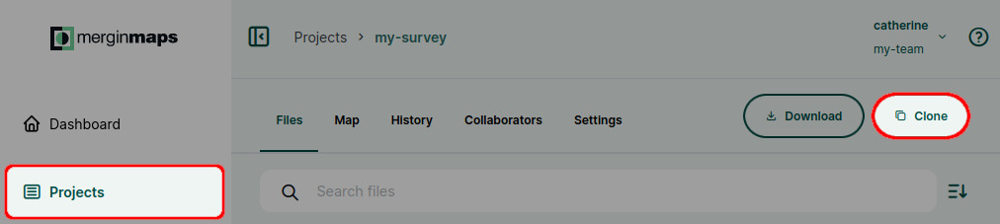

2. Enter the name of the cloned project. If needed, change the target workspace.

   The cloned project will be saved to the workspace you have specified.
  
   Confirm by clicking **Clone project**.
   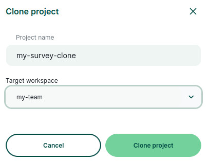

#### Clone a public project
You can also make a copy of a public project. 

1. In the **Projects** tab, click on the **Browse community projects** button
   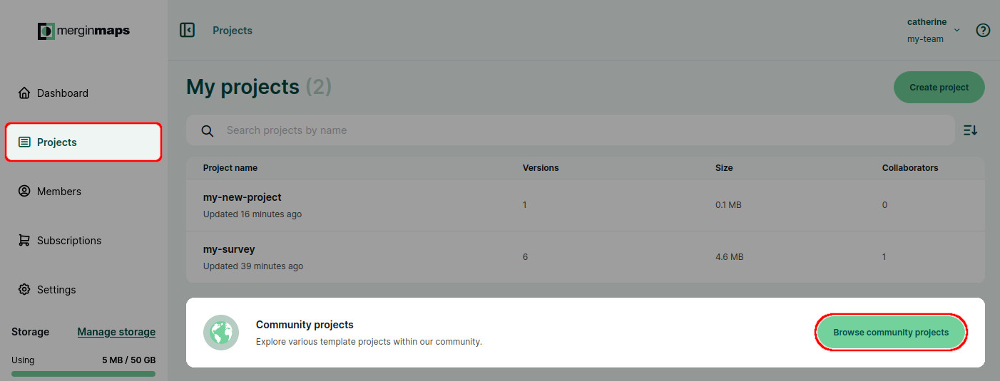
   
   If a project was shared with you via link, open the project link in your web browser.
   
2. You will see a list of public projects. Use the search bar to find a project you would like to clone and click on it.
   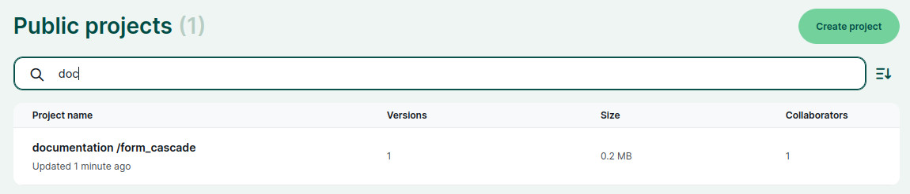

3. When the project's page opens, click on the **Clone** button to clone the project.
   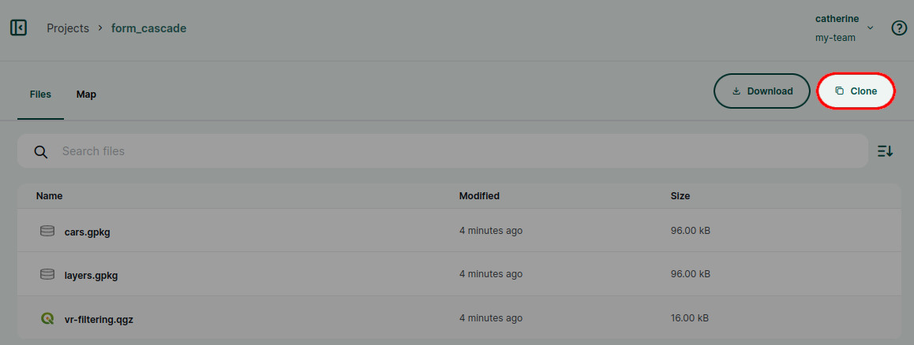
   
4. Now you can change the project's name and select the target workspace. Confirm by clicking **Clone project**.

   The cloned project will be saved to the workspace you have specified.
   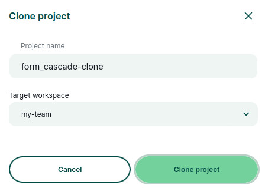
   
