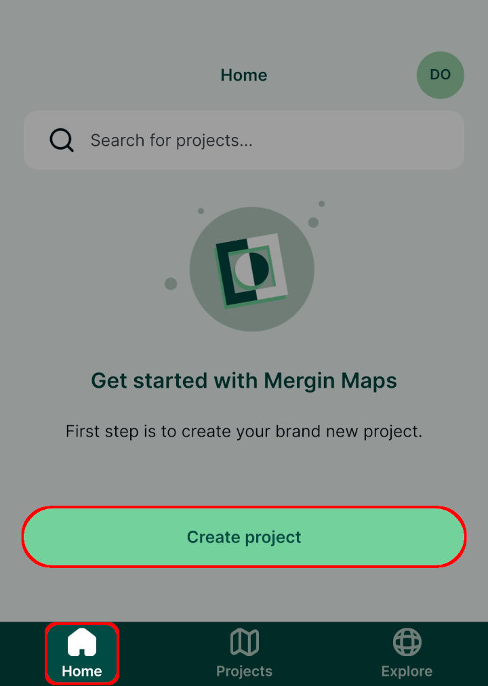

# How to Create a New Project
[[toc]]

:::warning
This content may differ from what you encounter when working with <MainPlatformNameLink />. It will be updated soon to include recent changes in <MainPlatformNameLink />, <MobileAppName /> and <QGISPluginName />.
:::

There are several methods of creating a new <MainPlatformName /> project:
- [<MobileAppName /> ](./index.md#create-a-project-in-mergin-maps-input) offers the quickest (albeit limited) way of creating a <MainPlatformName /> project.
- If you want to take full advantage of <MainPlatformNameLink />, use [QGIS](./index.md#create-a-project-in-qgis) to prepare new projects.
- You can also use [merginmaps.com](./index.md#create-a-project-through-merginmaps-com), especially if your project files are already fully prepared and only need uploading.

If you want to make a copy of your projects or the ones shared with you, you can clone them in [QGIS](./index.md#clone-an-existing-project-in-qgis) or [merginmaps.com](./index.md#clone-an-existing-project-through-merginmaps-com).

## Create a project in Mergin Maps Input
::: tip
[Capturing Your First Field Data](../../tutorials/capturing-first-data/index.md) tutorial will show you how to create a new project and capture field data in <MobileAppName />.
:::

1. Open <MobileAppName /> on your mobile device
2. Go to the **Home** tab of the **Projects** screen and press **Create project**
   

3. Give the project a name 
   

4. Press **Create project**
   
   
Your new project should now be visible on the **Home** tab of the **Projects** screen

## Create a project in QGIS
::: tip
[Creating a Project in QGIS](../../tutorials/creating-a-project-in-qgis/index.md) tutorial will show you how to create a new project in QGIS, add layers, configure attributes forms and save changes to <MainPlatformNameLink />. 
:::

To work with <MainPlatformName /> projects in QGIS, you will need to [install the <QGISPluginName />](../../setup/install-mergin-maps-plugin-for-qgis/index.md) first.

1. Open a blank or an existing project in QGIS.
2. Click on **Create Mergin Maps Project** from the toolbar.
   

3. There are three options available (the last two options are available only if you have an existing project open):
   

   - **New basic QGIS project**. If you are new to QGIS, this is a good starting point. The new basic QGIS project will contain a survey layer (a point layer) and a background map (OpenStreetMap).

   - **Package current QGIS project**. This option will create a copy of your project and all the files in a single folder. There are three options for handling layers: package, keep as is (the layer will be referenced as is in the new project) or ignore (the layer will not be included in the new project). For more details, see [<MainPlatformName /> project](../project/#packaging-qgis-project).
     

   - **Use current QGIS project as is**. This is for cases when you already have a stand-alone folder with your project packaged.

4. Name the project and select a path where your project folder and associated files will be generated. 
   
   
   :::danger WARNING
   Your project should be saved on a local drive. Using shared network drives and cloud storage (such as OneDrive or Google Drive) is **not supported**.
   :::

The new <MainPlatformName /> project will be created locally on your computer and also on the <MainPlatformNameLink /> server. 

### Clone an existing project in QGIS
Using <QGISPluginName />, you can make a copy of one of your existing projects or the ones shared with you. 

1. Navigate to **Mergin Maps** in the **Browser panel**
2. Find the project you want to clone, right-click on it and select **Clone**
   

3. Select the **Owner** from the drop-down menu and type your new **Project Name**.
   

## Create a project through merginmaps.com
1. Navigate to <AppDomainNameLink /> and sign in.
2. To create a new project, click on **Create** in the **Projects** section:
   

3. Give the project a **name**
   - in **Template project**, you can select a template from the list
   - **Project owner** is you (your username) or your organisation
   - the project is private by default, you can use the checkbox to make it **Public**
   

   After creating a new project, you will be directed to the project page. 

4. Add files to your project:
   - Click on **Drag & drop here to click and select file(s) to upload**
   - Select files or folders to upload
   - Once the files and folders are selected, press **Update** in the **Data Sync** window.
   

### Clone an existing project through merginmaps.com
You can also make a copy of your own existing project, a project that is shared with you or a public project in **Explore**.

1. Find the project you want to clone and click on it. 
   
   
   If a project was shared with you via link, open the project link in your web browser.
   
2. Click on the **Clone** button
   
   
3. In the new window, you can change the project name and set the project owner
   
