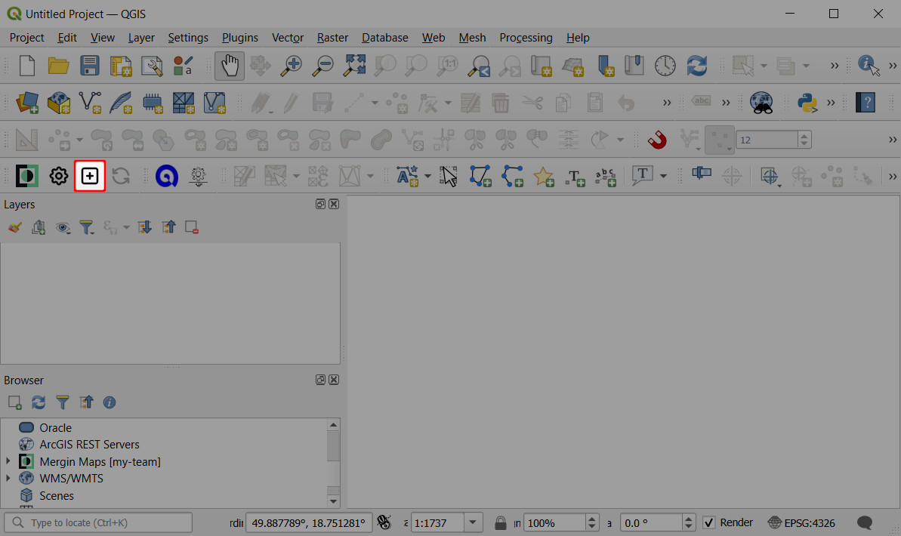
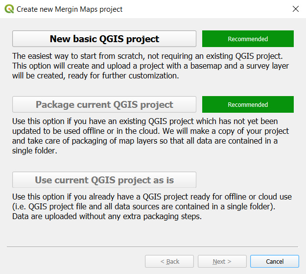
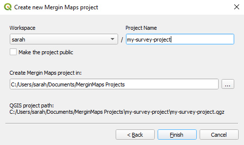
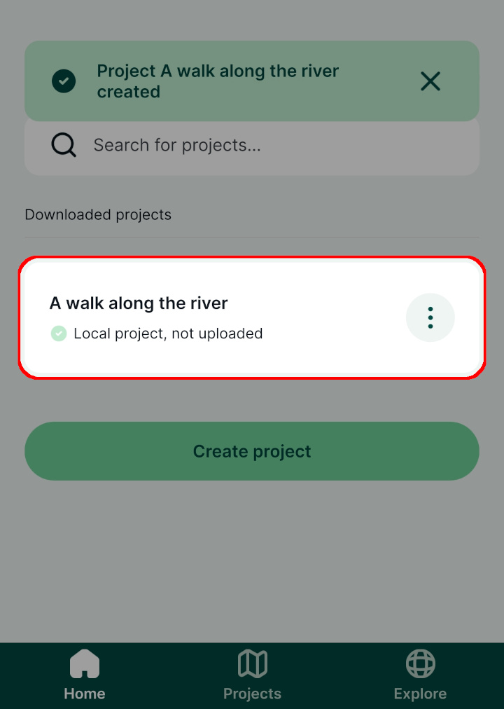

# How to Create a New Project
[[toc]]

There are several methods of creating a new <MainPlatformName /> project:
- If you want to take full advantage of <MainPlatformNameLink />, use [QGIS](#create-a-project-in-qgis) to prepare new projects.
- [<MobileAppName /> ](#create-a-project-in-mergin-maps-mobile-app) offers the quickest (albeit limited) way of creating a <MainPlatformName /> project.
- You can also use <AppDomainNameLink />, especially if your project files are already fully prepared and only need uploading.

If you want to make a copy of your projects or the ones shared with you, you can clone them in [QGIS](./index.md#clone-an-existing-project-in-qgis) or [merginmaps.com](./index.md#clone-an-existing-project-through-merginmaps-com).

:::warning
When creating a project, keep in mind that its name cannot be changed later.
:::

## Create a project in QGIS
::: tip
[Creating a Project in QGIS](../../tutorials/creating-a-project-in-qgis/index.md) tutorial will show you how to create a new project in QGIS, add layers, configure attributes forms and save changes to <MainPlatformNameLink />. 
:::

To work with <MainPlatformName /> projects in QGIS, you will need to [install the <QGISPluginName />](../../setup/install-mergin-maps-plugin-for-qgis/index.md) first.

1. Open a blank or an existing project in QGIS.
2. Click on **Create Mergin Maps Project** from the toolbar.
   

3. There are three options available (the last two options are available only if you have an existing project open):
   

   - **New basic QGIS project**. If you are new to QGIS, this is a good starting point. The new basic QGIS project will contain a survey layer (a point layer) and a background map (OpenStreetMap).

   - **Package current QGIS project**. This option will create a copy of your project and all the files in a single folder. There are three options for handling layers: package, keep as is (the layer will be referenced as is in the new project) or ignore (the layer will not be included in the new project). For more details, see [<MainPlatformName /> project](../project/#packaging-qgis-project).
     

   - **Use current QGIS project as is**. This is for cases when you already have a stand-alone folder with your project packaged.

4. Change the workspace (if needed), name the project and select a path where your project folder and associated files will be generated.

   Keep in mind that the project name cannot be changed later.
   
   
   
   :::danger WARNING
   Your project should be saved on a local drive. Using shared network drives and cloud storage (such as OneDrive or Google Drive) is **not supported**.
   :::

The new <MainPlatformName /> project will be created locally on your computer and also on the <MainPlatformNameLink /> server. 

### Clone an existing project in QGIS
Using <QGISPluginName />, you can make a copy of projects you have access to.

1. Navigate to **Mergin Maps** in the **Browser panel**.
2. Find the project you want to clone. Right-click on it and select **Clone**.

   You might need to [switch to another workspace](../workspaces/#switch-workspaces-in-qgis) to locate the project.
 
   

3. Select the **workspace** from the drop-down menu and enter your new **Project Name**. Click **OK**.
   

The project will be saved in the selected workspace.

## Create a project in Mergin Maps mobile app
::: tip
[Capturing Your First Field Data](../../tutorials/capturing-first-data/index.md) tutorial will show you how to create a new project and capture field data in <MobileAppName />.
:::

1. Open <MobileAppName /> on your mobile device
2. Go to the **Home** tab of the **Projects** screen and press **Create project**
   

3. Give the project a name. Keep in mind that it cannot be changed later.
   

4. Press **Create project**
   
   
Your new project should now be visible on the **Home** tab of the **Projects** screen

## Create a project through merginmaps.com
:::warning
The preferred way of creating a project is to use QGIS plugin or <MobileAppName />. This option is for advanced users composing their project manually.
:::

1. Navigate to <AppDomainNameLink /> and sign in.
2. To create a new project, click on **Create** in the **Projects** tab:
   

3. Give the project a **Name**
   

   After creating a new project, you will be directed to the project page. 

4. Add files to your project:
   - Click on **Drag & drop here to click and select file(s) to upload**
   - Select files or folders to upload
   - Once the files and folders are selected, press **Update** in the **Data Sync** window.
   

### Clone an existing project through merginmaps.com
You can also make a copy of projects you have access to or of a [public project](../permissions/#public-and-private-projects).

#### Clone a project from your workspace
1. In the **Projects** tab, find the project you want to clone, open it and click on **Clone**.

   If needed, [switch to another workspace](../workspaces/#switch-workspaces-in-qgis) to locate the project.
   
   

2. Enter the name of the cloned project and choose the workspace in which the project should be saved. Confirm by clicking **Clone**.
   

The new project will be saved to the workspace you have specified.

#### Clone a public project
You can also make a copy of a public project. 

1. In the **Projects** tab, click on the **Find Public Projects** button
   
   
   If a project was shared with you via link, open the project link in your web browser.
   
2. Using the search bar, find the project you would like to clone and click on it.
   

3. The project's page opens. Click on the **Clone** button to clone the project.
   
   
3. Now you can change the project's name and select a workspace from the list. The project will be saved to this workspace.
   
