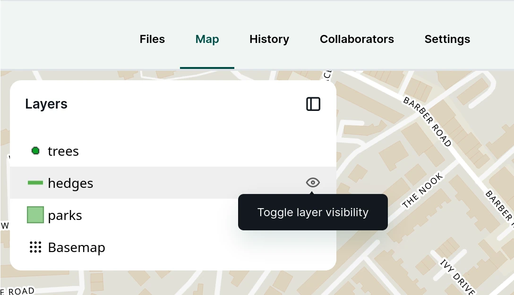
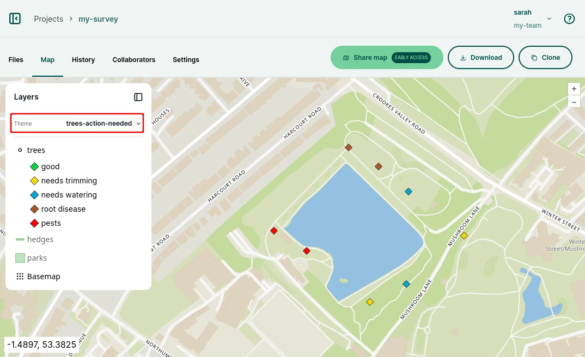

---
description: Webmaps display the map overview of your project's spatial data directly in your web browser, on Mergin Maps dashboard.
outline: deep
---

# Webmaps overview

The spatial data of your project can be displayed and explored in the **Map** tab of the project on the <DashboardShortLink />. As an early access feature, they can also be [shared via URL](#sharing-maps-via-url).

:::tip Usage details
Webmaps are available for <MainPlatformNameLink /> cloud and <EnterprisePlatformNameLink /> users.

Webmaps are **not** available for <CommunityPlatformNameLink /> at this point.
:::

## Project layers
On the webmaps, you will see your survey layers or raster layers that are [packaged](../project/#packaging-qgis-project) with the project. The default extent of maps is defined by the [extent set in the QGIS project](../../gis/features/#project-extent).

All maps on the <DashboardShortLink /> by default use [<MainPlatformName /> vector tile service](../../gis/settingup_background_map/#online-services-1) as a background map.

The webmap is refreshed automatically, you will see the latest version of your project all the time, even without refreshing web page.

The **Layers** panel lists all available layers displayed on the map, together with their legend as defined in QGIS. The eye button next to layer name controls the visibility of layers. If you have defined map themes in your project, these are visible on top of the layers panel.

You can also switch [Map themes](../../gis/setup_themes/) defined in the project:

Click on a feature on the map to display its attributes.

## Available layers
Webmaps by default show layers that are packaged with the project. These are layers that are loaded from project files. This is usually GeoPackage layers, shapefiles layers and background maps that are made available for offline use (e.g. mbtiles, geotiffs, ...).

Layers requiring network connection (e.g. Postgres layers or online background maps) are by default not included on the webmap due to potential performance and connectivity problems. However, certain network layers (such as satellite background map) can be added manually, read more in the [following section](#add-custom-background-maps).

### Add custom background maps
If you prefer different background maps than the offical one provided by default, there are currently two ways to add your custom one:

1. **Map-script** - Map-script allows you to programatically update and customize the webmap to your specific needs. Read more about `map-script` [here](../webmaps-applications/). 
2. **Package your background map** - Make your background map available offline in QGIS. This step packages the layer into a file and it will be visible on the webmap afterwards

:::warning Background maps licensing
Keep in mind that background maps services and data sources come with their own terms of use, especially if they are to be publicly shared. You should comply with any terms and conditions of the services of your choice.
:::
   
## Custom webmap applications <Badge text="Experimental 🧪" />
As descibed in the previous section, webmaps can be further programatically customised via `map-script` to build custom webmap application. Read more about it [here](../webmaps-applications/).

## Extent

The extent of webmaps is defined in QGIS in the **Project Properties**. 

When displaying maps on the <DashboardShortLink />, <MainPlatformName /> uses primarily the [project full extent](../../gis/features/#project-extent) defined in the **View Settings** tab.

If this parameter is not defined, the map extent will be set as the *Advertised extent* from the **QGIS Server** tab. 

If there are no extent settings in the QGIS project, <MainPlatformName /> will calculate the extent from layers in the project.

## Sharing maps via URL <Badge text="early access" type="warning"/>

Webmaps can be shared via URL or embedded on a website. You can find more details about this early access feature in [Sharing and Embedding Webmaps](../webmaps-sharing/).

## Troubleshooting
Troubleshooting tips for webmaps can be found [here](../webmaps-troubleshooting/).
