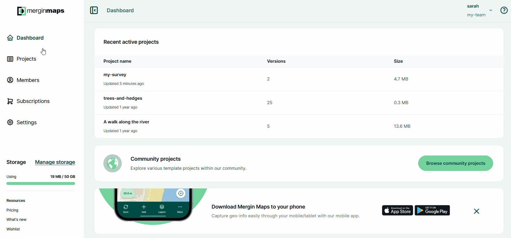
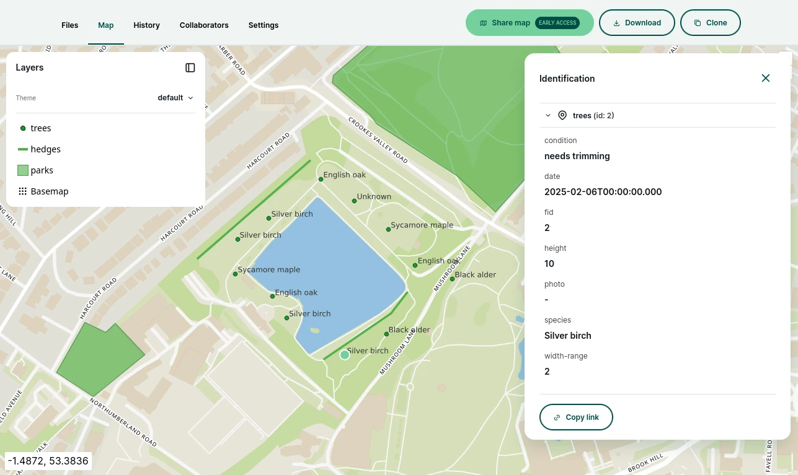
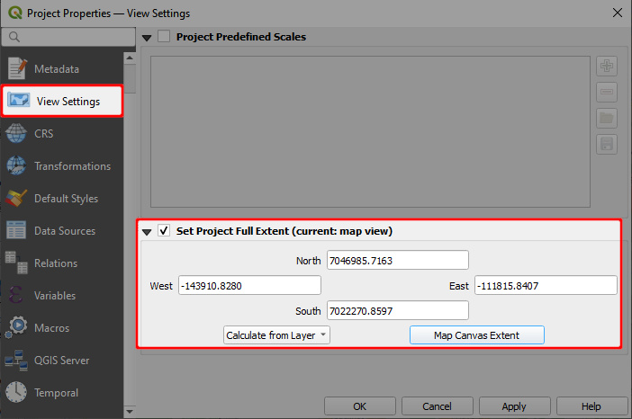
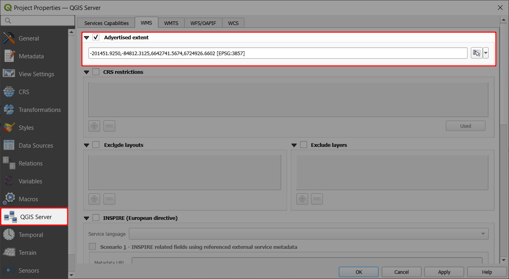

---
description: Webmaps display the map overview of your project's spatial data directly in your web browser, on Mergin Maps dashboard.
outline: deep
---

# Webmaps
[[toc]]

The spatial data of your project can be displayed and explored in the **Map** tab of the project on the <DashboardShortLink />. As an early access feature, they can also be [shared via URL](#sharing-maps-via-url).



:::tip Usage details
Webmaps are available for <MainPlatformNameLink /> cloud and <EnterprisePlatformNameLink /> users.

Webmaps are **not** available for <CommunityPlatformNameLink />.
:::

## Webmaps content

### Project layers
On the webmaps, you will see your survey layers or raster layers that are [packaged](../project/#packaging-qgis-project) with the project. Other layers, such as online [background maps](../../gis/settingup_background_map/#background-maps) or PostgreSQL layers are not displayed. The extent of maps is defined by the [extent set in the QGIS project](../../gis/features/#project-extent).

All maps on the <DashboardShortLink /> use [<MainPlatformName /> vector tile service](../../gis/settingup_background_map/#online-services-1) as a background map.

The content of the maps and of the **Layers** panel is refreshed after every synchronisation of the project. This means you should always see your current spatial data here.

The **Layers** panel lists all layers displayed on the map. The check button :white_check_mark: controls the visibility of layers.

Click on a feature on the map to display its properties.



### Adding background maps
By default, the online background maps from your project are not displayed on the webmaps. However, they can be added to your webmaps using a JavaScript file with the map definition to your project through  <DashboardLink />.

:::warning Background maps licensing
Keep in mind that background maps services and data sources come with their own terms of use, especially if they are to be publicly shared. You should comply with any terms and conditions of the services of your choice.
:::

1. Create a file named `map-script.js` with the following structure:
   
```import TileLayer from 'https://esm.sh/ol@10.8.0/layer/Tile'
import { fromLonLat } from 'https://esm.sh/ol@10.8.0/proj'
import XYZ from 'https://esm.sh/ol@10.8.0/source/XYZ'

const layer = new TileLayer({
  name: 'Map Name',
  source: new XYZ({
    url: 'https://server.my-maps.com/tile/{z}/{y}/{x}',
    attributions:
      'Tiles © copyright'
  })
})

MerginMaps.getMap().addLayer(layer)
```
   This is a JavaScript file that defines background maps that should be added to your webmap.

2. Add the `map-script.js` to your project through <AppDomainNameLink /> 

After syncing the project, the background map will be added to your webmap.
   
### Customisation
Webmaps can be further customised using JavaScript in the `map-script.js` file.

## Webmaps extent

The extent of webmaps is defined in QGIS in the **Project Properties**. 

When displaying maps on the <DashboardShortLink />, <MainPlatformName /> uses primarily the [project full extent](../../gis/features/#project-extent) defined in the **View Settings** tab.



If this parameter is not defined, the map extent will be set as the *Advertised extent* from the **QGIS Server** tab. 



If there are no extent settings in the QGIS project, <MainPlatformName /> will calculate the extent from layers in the project.

## Sharing maps via URL <Badge text="early access" type="warning"/>

Webmaps can be shared via URL or embedded on a website. You can find more details about this early access feature in [Sharing and Embedding Webmaps](../webmaps-sharing/).

## Troubleshooting
Troubleshooting tips for webmaps can be found [here](../webmaps-troubleshooting/).
