---
description: Webmaps display the map overview of your project's spatial data directly in your web browser, on Mergin Maps dashboard.
outline: deep
---

# Webmaps Overview

[[toc]]

The spatial data of your project can be displayed and explored on the <DashboardShortLink />. As an early access feature, webmaps can also be [shared via URL](#sharing-maps-via-url).

To open the webmap, navigate to your project and click the **Open map** button.

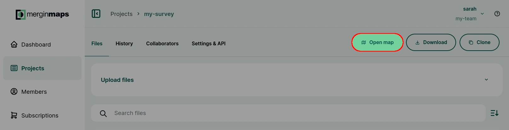

On the webmap, you can see your survey layers or raster layers that are [packaged](#project-layers) with the project. 

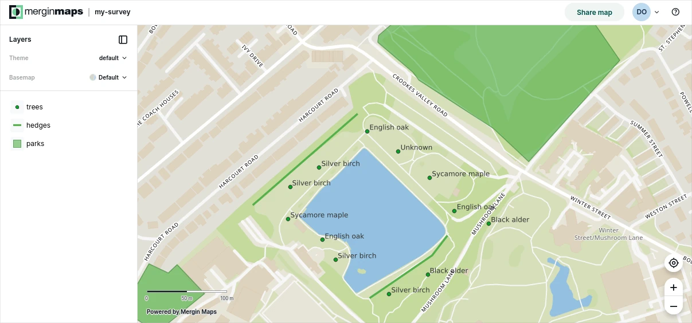

In the **Layers** panel, you can control the visibility of the [layers](#project-layers), switch [map themes](#map-themes) and [basemaps](#background-maps). The default extent of maps is defined by the [extent set in the QGIS project](#extent). 

The webmap is refreshed automatically, so you always see the latest version of your project without needing to reload the page.

Features can be explored on the map: click on a feature to display its attributes form.

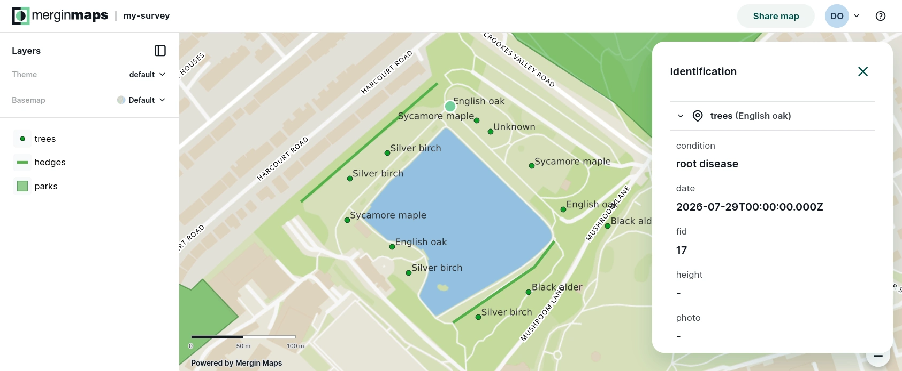

:::tip Usage requirements
Webmaps are available for <MainPlatformNameLink /> cloud and <EnterprisePlatformNameLink /> users.

Webmaps are **not** available for <CommunityPlatformNameLink />.
:::

## Layers {#project-layers}
Webmaps show layers that are packaged with the project (loaded from project files) by default. These are usually GeoPackage or Shapefile layers, as well as background maps made available for [offline use](../../gis/settingup_background_map/#generating-xyz-mbtiles-raster-tiles-for-offline-use) (e.g. mbtiles, GeoTIFF).

Layers requiring a network connection (e.g. PostgreSQL layers or online background maps) are excluded from the webmap by default due to potential performance and connectivity problems. However, certain network layers (such as satellite background map) can be added manually, read more in the [custom background maps](#add-custom-background-maps) section.

The **Layers** panel lists all available layers displayed on the map, together with their legend as defined in QGIS.

The eye icon next to a layer toggles its visibility. 

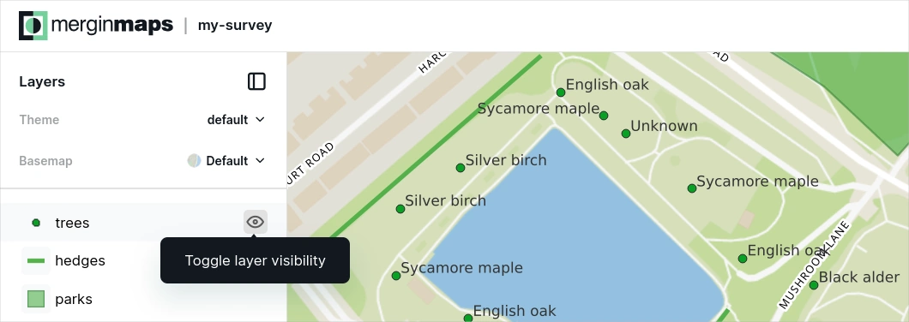

## Map themes
If you have defined [map themes](../../gis/setup_themes/) for your project, you can switch between them in the **Layers** panel.

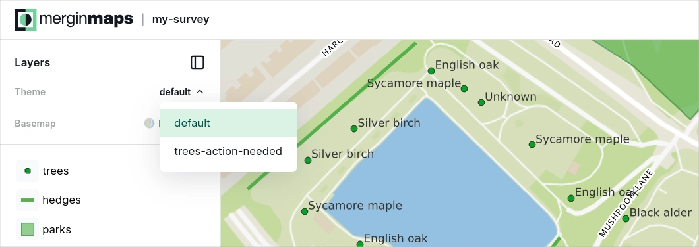

## Background maps

By default, all webmaps include the [<MainPlatformName /> vector tile service](../../gis/settingup_background_map/#online-services-1) as a background map.

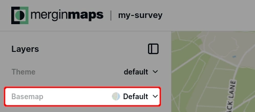

You can switch between three styles: default, light, and dark.
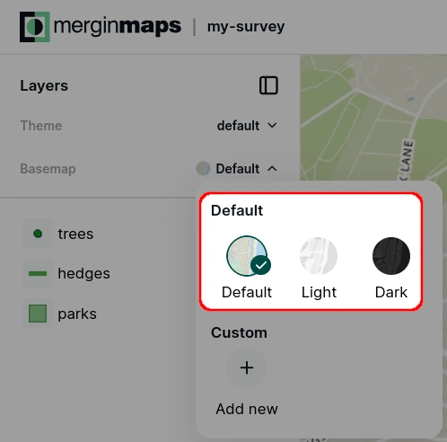

### Add custom background maps
If you prefer a different background map than the default options, you can add a custom one in the **basemap** selection.

1. In the **Layers** section, click on the top-left basemap selection item, then select **+ Add new**.

   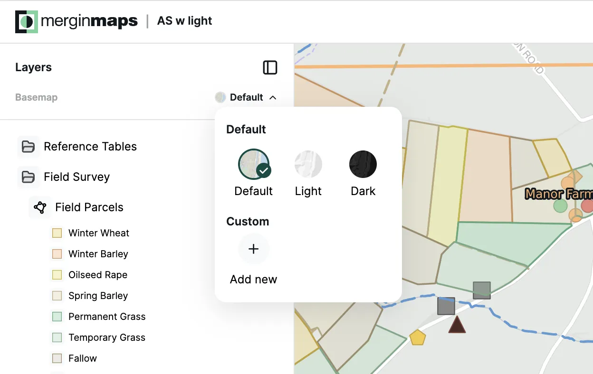

2. Enter the connection details for your background map and click **Add basemap** to confirm. 

   Please note that **raster tiles** and **vector tiles** are supported.

   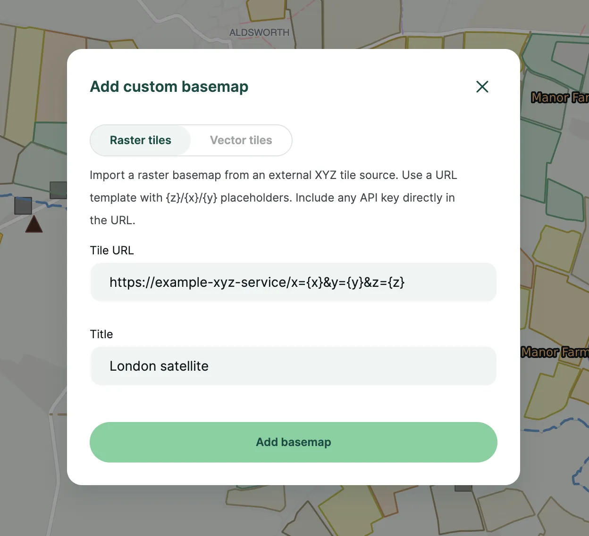

4. If available, your basemap will be enabled automatically.

   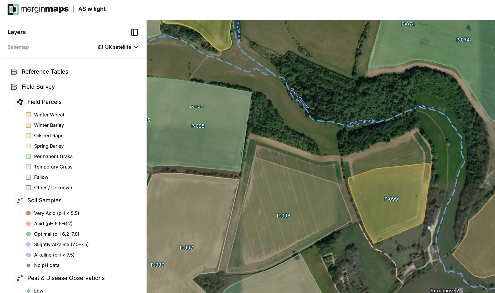

:::warning Background maps licensing
Keep in mind that background maps services and data sources come with their own terms of use, especially if they are to be publicly shared. You should comply with any terms and conditions of the services of your choice.
:::
   
## Extent

Webmap extent is defined in QGIS in the **Project Properties**. 

When displaying webmaps, <MainPlatformName /> primarily uses the [project full extent](../../gis/features/#project-extent) defined in the **View Settings** tab.

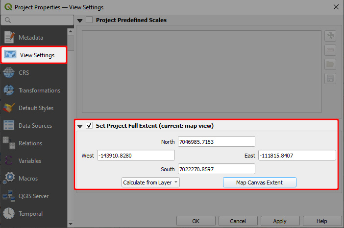

If this is not defined, the map extent defaults to the *Advertised extent* from the **QGIS Server** tab. 

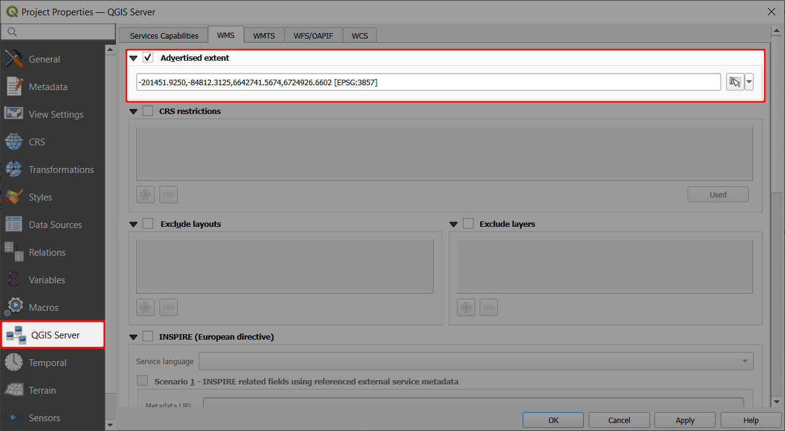

If there are no extent settings in the QGIS project, <MainPlatformName /> will calculate the extent from layers in the project.

## Sharing maps via URL <Badge text="early access" type="warning"/>

You can share webmaps via URL or embed them on a website. More details about this early access feature can be found in [Sharing and Embedding Webmaps](../webmaps-sharing/).

## Custom webmap applications <Badge text="Experimental 🧪" />
You can further customise webmaps programmatically using `map-script` to build custom webmap applications. This feature can be used to add layers, alter visual and functional elements, and more. Read more [here](../webmaps-applications/).

## Troubleshooting
Troubleshooting tips for webmaps are available [here](../webmaps-troubleshooting/).
