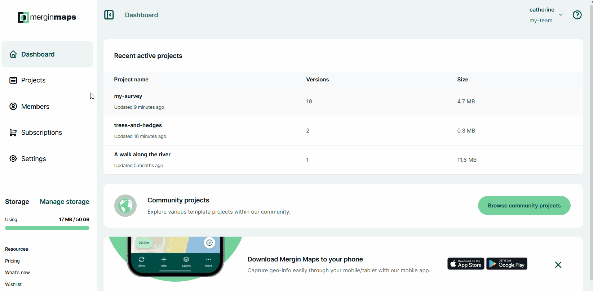
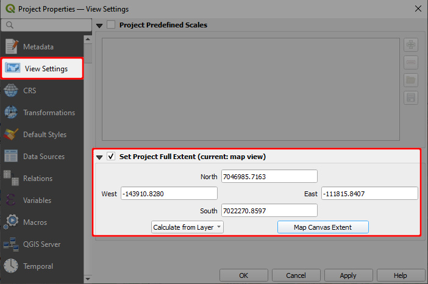

# Webmaps
[[toc]]

The spatial data of your project can be displayed in the **Map** tab of the project on the <DashboardShortLink />. You need to be logged in to see the maps.

:::tip Usage details
Webmaps are not available for <CommunityPlatformNameLink />.
:::

## Webmaps content

On the webmaps, you will see your survey layers or raster layers that are [packaged](../project/#packaging-qgis-project) with the project. Other layers, such as online [background maps](../../gis/settingup_background_map/#background-maps) or PostgreSQL layers are not displayed. The extent of maps is defined by the [extent set in the QGIS project](../../gis/features/#project-extent).

All maps on the <DashboardShortLink /> use [<MainPlatformName /> vector tile service](../../gis/settingup_background_map/#mergin-maps-vector-tile-service) as a background map.

The content of the maps and of the **Layers** panel is refreshed after every synchronisation of the project. This means you should always see your current spatial data here.

The **Layers** panel lists all layers displayed on the map. The check button :white_check_mark: controls the visibility of layers.

## Webmaps extent

The extent of webmaps is defined in QGIS in the **Project Properties**. 

When displaying maps on the <DashboardShortLink />, <MainPlatformName /> uses primarily the [project full extent](../../gis/features/#project-extent) defined in the **View Settings** tab.

If this parameter is not defined, the map extent will be set as the *Advertised extent* from the **QGIS Server** tab. 

If there are no extent settings in the QGIS project, <MainPlatformName /> will calculate the extent from layers in the project.

## Troubleshooting

### Map config does not exist
The **Map** tab of a project on the <DashboardShortLink /> may display this error message:
`Map config does not exist, please try update the project`

This usually happens when the map was not initiated. All you need to do is to create a new version of the project: synchronisation of the project will activate the map content.

