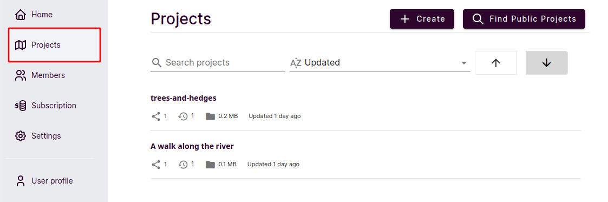
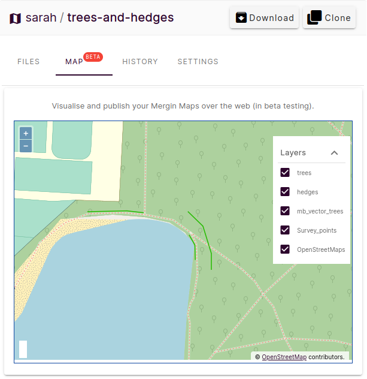
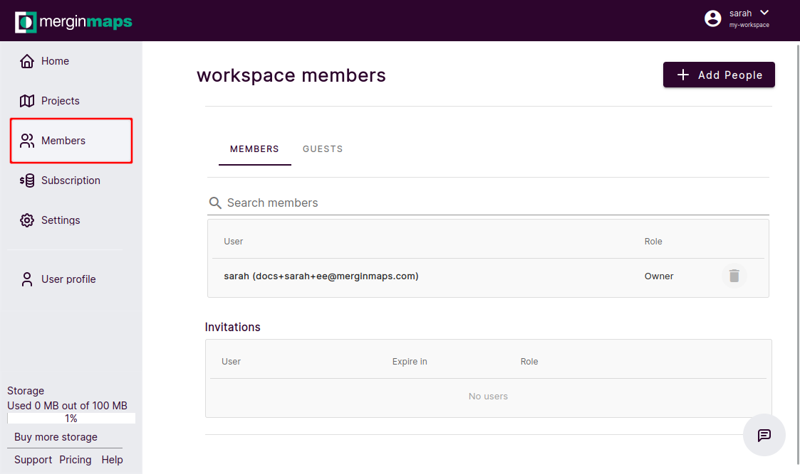
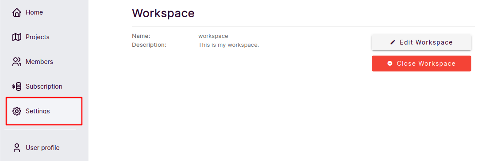
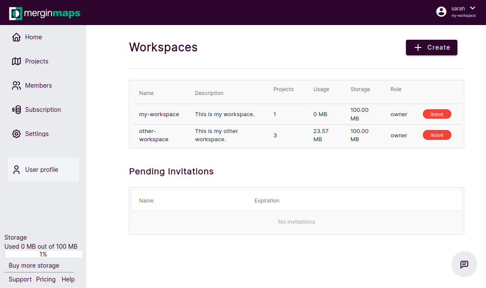

# Home Page and Dashboard
[[toc]]

When you log in to <AppDomainNameLink desc="Mergin Maps"/>, you will be presented with a dashboard for quick access to your recent active projects. Here, you can also manage your projects, [workspaces](./workspaces/), profile and [subscriptions](../manage/subscriptions/).

Current workspace and your username are displayed in the upper right corner of the screen.

Click **Home** in the left panel to go back to the homepage with the list of the most recent projects. 

## Projects
**Projects** tab in the left panel displays the list overview of the projects that are available to you in this workspace.

- click on **+ Create** to [create a new project](./create-project/#create-a-project-through-merginmaps-com), 
- use **Find Public Projects** to browse public projects
- select a project to see its details

When you open a project, there is an option to [share it](./project-advanced/), download it and [clone it](./create-project/#clone-an-existing-project-through-merginmaps-com).

- in **FILES** you will find all files associated with the project. Click on a file to see the details, download it or delete it.
- [MAP (beta)](#web-map) contains the map overview of the project. Available only in *Team* plan.
- **HISTORY** contains available [project versions](./project-details/). Here you can see what was changed by which user and download a previous version of the project to your computer.
- in **SETTINGS** you can manage [access](./project-advanced/) to the project 

### Web Map
**Web Map** feature is available for [Team subscription](https://merginmaps.com/pricing). It displays your <MainPlatformName /> project directly in <AppDomainNameLink />.

The content is updated when the project is synchronised. If you see the message "Map config does not exist, please try to update the project", sync the project and the web map should be generated.

## Members
The **Members** tab provides the overview of the [members and guests](./permissions/#workspace-members-and-guests) of the workspace. Here, you can [add users](./project-advanced/#add-users-to-a-workspace) to your workspace and manage their [permissions](./permissions/).

## Subscription
The **Subscription** tab contains information about your [subscription and invoicing](../manage/subscriptions/).
- **DETAIL** contains details about your current data usage and subscription. Here you can also change your plan and the frequency of your subscription billing.
- **HISTORY** includes the list of events related to your account, such as changing the plan or the payment history.
- **INVOICES** contains the list of your previous payments and invoices

## Settings
In the **Settings** tab, you will find information about the current workspace. 

- use **Edit Workspace** to change the description of the workspace
- use **Close Workspace** to [delete the workspace](./workspaces/#how-to-delete-a-workspace)

## User profile
The **User profile** tab contains information about your current profile.

Here you can change your password, verify your email or close your account. Use **Edit profile** to enter your name or turn on/off email notifications. 

 

## Manage workspaces
In the upper right corner of the screen, you can see the current workspace and your username. Click on it to [switch between workspaces](./workspaces/#how-to-switch-between-workspaces) and to **Manage workspaces**.

Click on **Manage workspaces** to see the overview of workspaces to which you have access as a guest, member or owner. Here you can [create a new workspace](./workspaces/#how-to-create-a-new-workspace), leave a workspace and accept/decline invitations to other users' workspaces.

