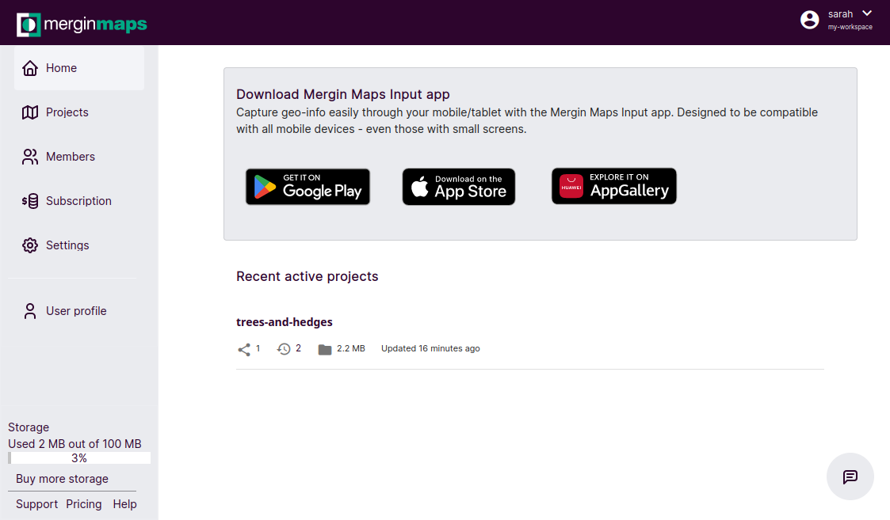
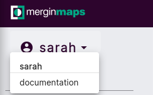
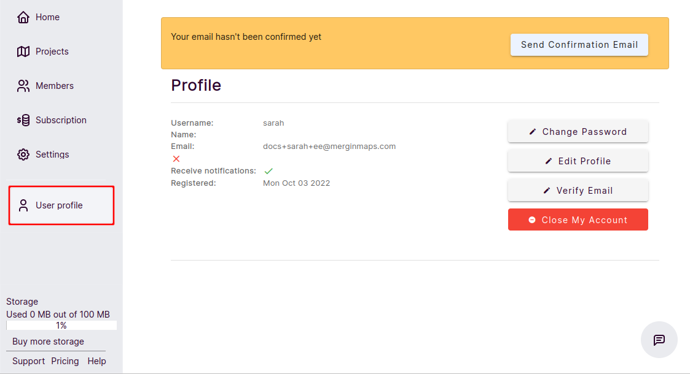
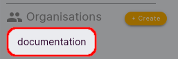
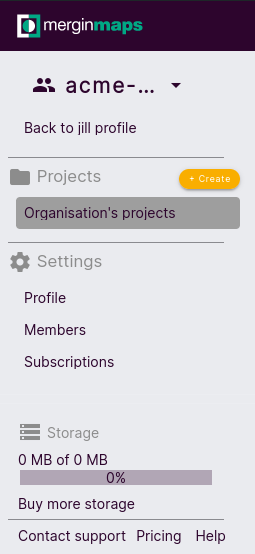
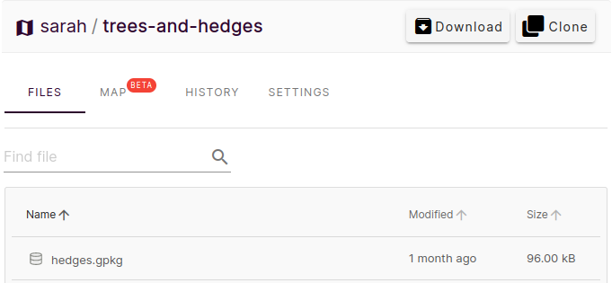
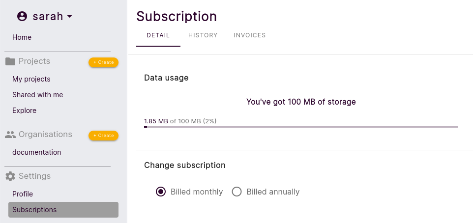

# Home Page and Dashboard
[[toc]]

When you log in to <AppDomainNameLink desc="Mergin Maps"/>, you will be presented with a dashboard for quick access to your recent active projects. Here, you can also manage your projects, organisations, profile and subscription plan.

**Home** takes you back to the homepage with the list of the most recent projects. 

## User profile
The left navigation panel shows the name of the current profile. Clicking on the name will open a drop-down menu, where you can switch between your profile and your organisation profile. 

You can access your account details in the **Settings** section under **Profile**. Here you can change your password, verify your email or close your account. Use **Edit profile** to enter your name or turn on/off email notifications. 

You will also see the list of organisations you belong to and pending invitations to join an organisation.

 

## Organisations
The organisation profile can be also accessed by clicking on the organisation name in the **Organisations** section.

The organisation profile contains the list of organisation's projects. The account details can be found under **Profile** in the **Setting** sections. The **Members** tab provides the overview of users and their permissions within the team.

:::tip
Visit [Working with organisations](../setup/working-with-organisations/index.md) to learn more about organisations.
:::
  
## Projects
- To create a new project, select **+ Create** in front of **Projects**
- **My projects** lists all projects you have created
- **Shared with me** lists other users' projects shared with you (including your organisation projects)
- **Explore** lists all the public projects

Click on a project to download it, [clone it](./create-project/#clone-an-existing-project-through-merginmaps-com) and to see its details.
- **FILES** lists files associated with the project
- **HISTORY** contains all project versions. Here you can see what was changed by which user and download a previous version of the project to your computer.
- in **SETTINGS** you can manage access to your project, e.g. if you want to [share it](./project-advanced/#share-a-project)

## Subscription
**Subscription** section contains information about your subscription and billing:
   - **DETAIL** contains details about your current subscription and data usage. Here you can also change your plan and the frequency of your subscription billing.
   - **HISTORY** includes the list of events related to your account, such as changing the plan or the payment history.
   - **INVOICES** contains the list of your previous payments and invoices
   
