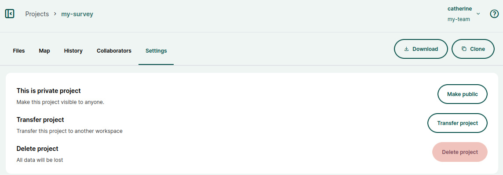

# Mergin Maps Dashboard
[[toc]]

When you log in to <DashboardLink />, you will be presented with a quick overview of requests and recent active projects in your current workspace. Here, you can also manage your projects, [workspaces](../workspaces/), profile and [subscriptions](../subscriptions/).

The current workspace and your username are displayed in the upper right corner of the screen.

Use **Dashboard** in the left panel to go back to the homepage

## Projects
The **Projects** tab in the left panel displays the overview of the projects that are available to you in this workspace.

Here, you can:
- use the **Create project** button to [create a new project](../create-project/#create-a-project-through-mergin-maps-dashboard)
- search for a project by name
- **Browse community projects** to explore public projects
- click on a project to see its details

When you click on a project, you will see the overview of its content. Files can simply be **uploaded** to the project using drag and drop. 

In the right upper corner, you will find buttons to **download** and [**clone**](../create-project/#clone-an-existing-project-through-mergin-maps-dashboard) the project.

### Project files
In **Files**, you can see the list of all files associated with the project. 

Click on a file to see when it was modified, its size, to download or delete it.

### Webmaps
On the **Map** tab, your project is displayed directly on the <DashboardShortLink /> without the need to open QGIS or the <MobileAppNameShort />.

More details about this functionality can be found in the [Webmaps](../dashboard-maps/) section.

### History
The **History** tab contains an overview of available project versions that can be also downloaded to your computer.

You can click on a specific version to see more details.

You can learn more about project history and how to revert to an older version in [Project History and Versions](../project-history/).

### Collaborators
The **Collaborators** tab provides the list of users who have access to the project as well as pending invitations. You can use the **Share** button to invite more people to contribute to your project. 

Here, the [**project permissions**](../permissions/#workspace-member-roles-and-project-permissions) of current collaborators can be changed.

### Settings
In **Settings**, you can:
- make the project [public or private](../project-advanced/#make-your-project-public-private)
- [Transfer project](../project-advanced/#transfer-a-project) to another workspace
- [Delete project](../project-advanced/#delete-a-project) 

## Members
The **Members** tab provides the overview of the [members and guests](../permissions/#workspace-members-and-guests) of the workspace, as well as pending invitations. You can use the [**invite**](../project-advanced/#add-users-to-a-workspace) option to add users to the workspace.

This tab is only available to [owners and admins](../permissions/#workspace-member-roles-and-project-permissions) of a workspace.

Here, you can:
- see the email addresses, usernames and names of your workspace users
- see and change the [roles](../permissions/#workspace-member-roles-and-project-permissions) of your workspace members
- see the **Member type**, whether the user is a [contributor](../subscriptions/#contributors) or a read-only guest. Only contributors are counting towards your [subscription](../subscriptions/).
- remove users from the workspace

## Subscriptions
The **Subscriptions** tab contains information about your [subscription plan](../subscriptions/). This tab is only available to [owners](../permissions/#workspace-member-roles-and-project-permissions) of a workspace.

Here, you can find the current usage of storage, number of users (members and guests) and number of projects in your workspace.

Click on **Manage subscription** to visit the subscription management portal where you can update the subscription plan, billing information, and see invoices and upcoming payments. 

The subscription management portal can also be accessed [using this link](../subscriptions/#accessing-subscription-management-portal-directly-without-mergin-maps-account).

::: tip
For details about different subscription plans visit our <MainDomainNameLink id="pricing" desc="pricing page"/>.
:::

## Settings
In the **Settings** tab, you will find information about the current workspace. 

Here, [admins and owners](../permissions/#workspace-member-roles-and-project-permissions) of a workspace can set up or manage [Single sign-on (SSO)](../sso/).

[Owners](../permissions/#workspace-member-roles-and-project-permissions) of a workspace can also:
- use **Edit Workspace** to add or change the description of the workspace
- use **Close Workspace** to [delete the workspace](../workspaces/#how-to-delete-a-workspace)

## User profile
**Your profile** can be accessed by clicking on the user name in the upper right corner.

 

Here you can edit your account details (such as name or e-mail address), change password, manage notifications about workspace activity and close your account.

## Manage workspaces
Click on the user name in the upper right corner and click on **Manage workspaces** to see the overview of workspaces to which you have access as a guest, member or owner. 

Here you can [**create a new workspace**](../workspaces/#how-to-create-a-new-workspace), leave a workspace and accept/decline invitations to other users' workspaces.

