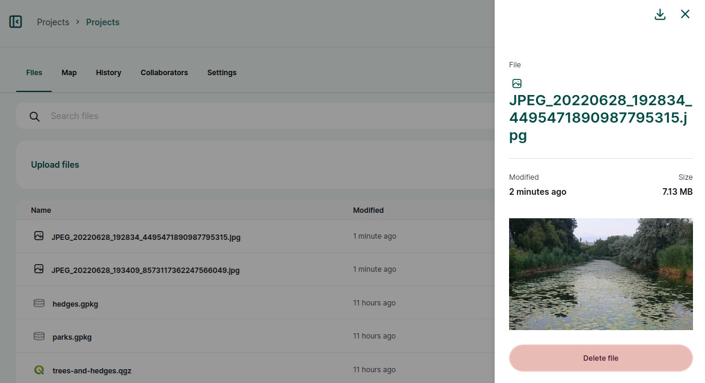
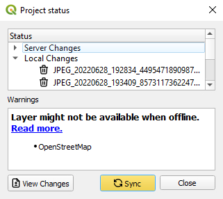

# How to Delete Files

Deleting files such as photos that are not needed anymore can help you free up storage on the <MainPlatformNameLink /> cloud and keep your project organised.

Files can be deleted through <DashboardLink /> one by one. Deleting multiple files at once is possible on your computer using <QGISPluginName />.
[[toc]]

:::warning
Download and archive the data before deleting them if they may be needed in the future.
:::

## Delete files through Mergin Maps dashboard
Deleting files through <MainDomainName /> is simple. However, you can only delete one file at the time.

1. Log in <AppDomainNameLink /> and navigate to your project.
2. In the **Files** tab you will see the list of files that are stored in the project's folder. 

   Select the file you would like to delete.
   

3. Review the details. If this is the file you want to remove, click on the **Delete file** button.
   
   
4. Use **Update Changes** in the **Data Sync** window to synchronise the changes.
   

## Delete multiple files at once
If you want to delete multiple files, the best way to do this is on your computer.

1. [Download the project](../plugin/#downloading-a-project-in-qgis) to your computer using <QGISPluginName />.
2. Navigate to the [project's folder](../project/#mergin-maps-project-folder) in your file browser and review the files inside the folder. There may be a [custom folder for photos](../../layer/settingup_forms_photo/#how-to-set-up-a-custom-folder-for-storing-photos) if it was set up before.

   Delete the files you do not want to keep anymore. 
   
3. [Synchronise the changes](../synchronisation/#synchronising-changes-in-qgis) in QGIS using <QGISPluginName />. 

   **Local changes** in **Project status** will show the list of deleted files. After synchronisation, the files will be also deleted from the cloud.

   
   
