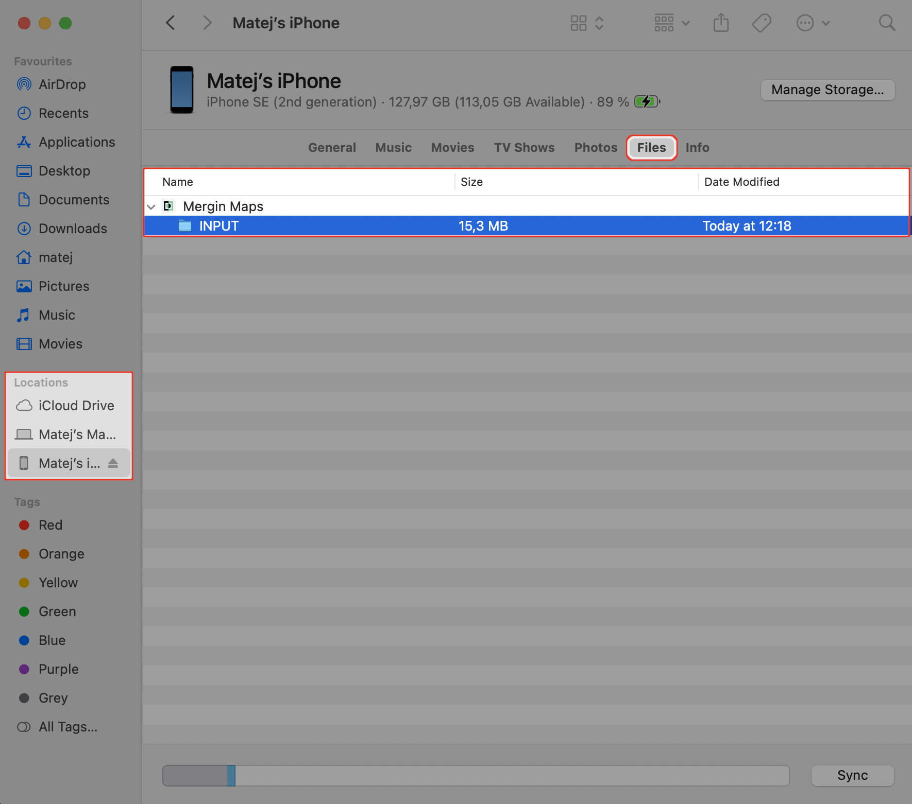

# How to Recover Missing Data

[[toc]]

Let's say you synchronise surveyed data from multiple devices (individual surveyors) and when you examine them, you find out there is something missing - new features that were captured in the field or changes made by one or more of your team members.

The reasons why you didn't get all the data can vary. For instance, the data could not be synchronised correctly because of multiple surveyors editing the same feature or synchronisation of projects with different data schema. You can read more about this topic in [Behind Data Synchronisation](../synchronisation/).

Here we will try to guide you through common techniques that can help you to retrieve your data.

::: warning Check internet connection and storage limit
If you cannot synchronise changes, make sure you are connected to the internet and that you have not exceeded your storage limit.
:::

## Inspect your folder for conflict files
- Navigate to your project folder
- See if there are any files that contain `conf` or `conflict` in their names. 

Depending on your data format, you can get something like `survey_polygon (edit conflict, sarah v4).json`, which is a conflict file for data from a user called `sarah`, project version 4.

## There are conflict files in the folder
Conflict files can appear in your project when <MainPlatformName /> could not synchronise changes automatically and they indicate there may be some issues that should be fixed.

You can add conflict files to your QGIS project and check whether they contain the data you are missing. Then you can resolve them manually or semi-automatically, depending on the scope of your issue.

### Resolving conflict files manually
If you can identify missing features visually, e.g. by finding out where the survey took place, you can copy and paste these features to the survey layer. Make sure the values have been transferred over correctly!

### Resolving conflict files semi-automatically
Change the schema of the table in the conflict file to match the new schema and run the *Detect dataset changes* algorithm from the *Processing toolbox*. You then need to go through the result and ensure the changes detected are the ones you expect for both attribute values and geometry.

## There are no conflict files in the folder
If you don't see any conflict files in your folder, try to download them manually from the mobile device. Surveyed data are stored in the device that was used to collect them. So, if you have access to this device, you can download data manually and process them on your computer.

### Manual data transfer (Android)
Manual data transfer from an Android device can be done by connecting your device to a computer and copying data files to/from the device. Once your Android phone or tablet is recognised by the operating system after connecting it using USB cable, you can use file browser to copy files. 

You can find the path to your <MainPlatformName /> project folder in the [Diagnostic Log](../../misc/troubleshoot/#diagnostic-log-on-mergin-maps-mobile-app). On Android devices, the path is something like `/Android/data/uk.co.lutraconsulting/files/projects`.

This folder is accessible only from a computer, so you might not see it in your mobile device.

### Manual data transfer (iOS)
The <MobileAppNameShort /> supports iTunes file sharing. Note that iTunes doesn't allow you to browse or edit data from the app data folder, only allows you to delete or copy the data folder to another location. 

Manual data transfer from an iOS device can be done by [connecting your iOS device](https://support.apple.com/en-gb/guide/iphone/iph42d9b3178/18.0/ios/18.0) to a Mac or a Windows computer. On Windows, data can be copied using [iTunes](#using-itunes-macos-windows). On Macs, you can use [iTunes](#using-itunes-macos-windows) or [Finder](#using-finder-macos), depending on your macOS version.

#### Using iTunes (MacOS, Windows)
Detailed steps for general data transfer using `iTunes` can be found on [Apple Support](https://support.apple.com/en-us/120403).

1. Connect the iOS device to your computer via USB cable
2. Open iTunes and click on the smartphone icon in the toolbar
   

3. Navigate to **File Sharing** in the left panel. As the <MobileAppName /> supports file sharing, it will be listed here.

4. In **Apps**, select **<MainPlatformName />**. In <MainPlatformName /> Documents, there will be a folder named `INPUT` that contains data from the <MobileAppNameShort />.

8. Press **Save...** or drag-and-drop the `INPUT` folder to a location on your computer to copy the data.
   

#### Using Finder (MacOS)
Detailed steps for general data transfer using `Finder` can be found on [Apple Support](https://support.apple.com/en-us/119585).

You can access your data using `Finder`:

1. Connect the iOS device to your computer via USB cable
2. Open `Finder` file browser
3. In **Locations**, select your device and click on the **Files** tab. As the <MobileAppName /> supports file sharing, it will be listed here.
4. Select **<MainPlatformName />** from the list. There will be a folder named `INPUT` that contains data from the <MobileAppNameShort />.

   Drag-and-drop the `INPUT` folder to a location on your computer to copy the data.
   
   

## Next steps
If you were not able to solve your problem, you can contact the [support](../../misc/troubleshoot/#support) or get [diagnostic logs](../../misc/troubleshoot/#diagnostic-logs) to inspect the issues thoroughly.

<CommunityJoin />
