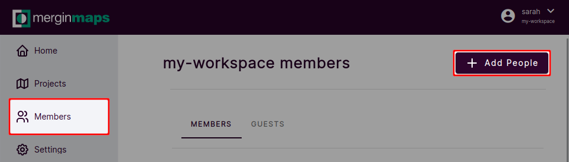

# Permissions
[[toc]]

Permissions control access to your <MainPlatformName /> projects. They can be defined for the whole workspace when inviting members and guests or for a specific project.

## Workspace members and guests
People invited to a workspace can be invited as **members** or as **guests**.

**Members** have access to all projects in a workspace. If a new project is created, they will be able to work with it automatically.

**Guests** have access only to projects they are invited to. If a new project is created in a workspace, they won't see it until they are granted access.

## Workspace and project permissions
**Members** of a workspace can be assigned these levels of permissions:
- **Read**: users with **read** permission are able to see the list of projects, projects data and [history](./project-details.md)
- **Write**: in addition to the **Read** access, users can also do changes in the projects (adding/removing/updating files and features). Users who are expected to actively contribute to the project need to have the **write** permission. 
- **Admin**: in addition to the **Write** access, users with this level of access can delete the project or transfer it to another workspace. Admins can also create new projects and manage workspace members.
- **Owner**: in addition to the **Admin** permission, owners have access to invoicing and subscription settings.

**Guests** of a workspace can have only **read** or **write** permissions.

:::tip
Permissions should be assigned according to the roles of the members of your team.

*Owners* should be those who are responsible for the subscription and invoicing. *Admins* can be the technical experts who [prepare projects](../gis/features/), manage data and deal with issues such as [missing data](./missing-data/). Editors with the *write* permissions are people who contribute to the project by collecting and editing data.
:::

### How to add users and manage workspace permissions
To add users to a workspace:
1. Log into <AppDomainNameLink />
2. Select **Members** from the left panel and click on **Add People**
   
3. Enter email addresses of people you want to invite. If they already have a <MainPlatformName /> account, you can enter their username.
   Select if you invite them as **members** or as **guests**:
   - for members, select their member role
   - for **guests**, you will need to specify projects to which they should gain access. Guests can have *read* or *write* permissions to these projects.
  
4. Click on **Invite** to send an invitation. An email with a link will be sent to the recipients. After they accept the invitation, they will become members or guests of your workspace.

To manage workspace permissions, you have to be the **admin** or **owner** of the workspace. Navigate to **Members** in the left panel in <AppDomainNameLink /> to see the list of members and guests. Here you can change their roles and permissions or remove them from the workspace.

### How to manage project permissions
Permissions to a specific project can be set also in the project's settings. 

1. Select **Projects** from the left panel and click on the project you want to manage
   

2. Go to **Settings**. Here you will find an overview of users who have access to the project and their permissions.
   

## Public and private projects

A **private project** is a project that only you and those who you choose to [share](./project-advanced/) the project with will have access to the files, history and settings. Projects are private by default. 

A **public project** is a project that everyone (including those who are not registered with <MainPlatformName />) can see, including data and project history. Other users cannot contribute to your public project unless you give them writing permissions.

:::tip
You can [make your project public or private](./project-advanced/#making-your-project-public-private) in the project's settings.
:::

