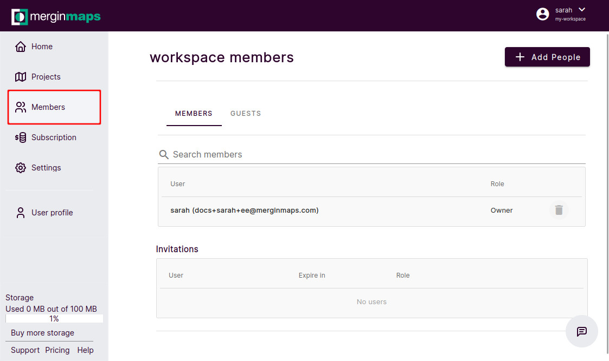
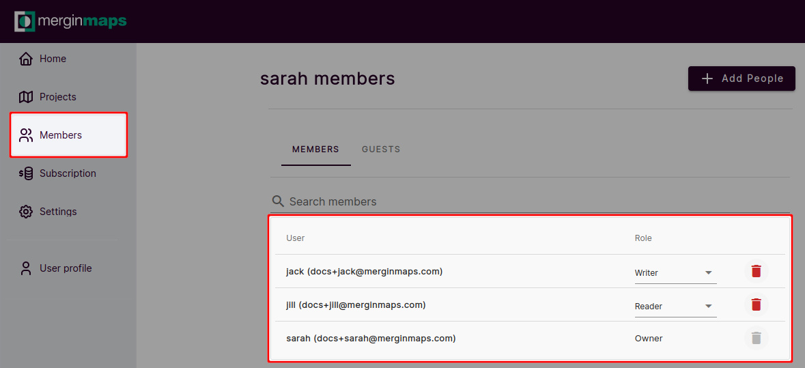
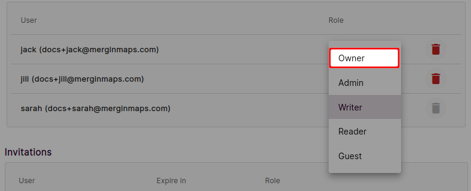
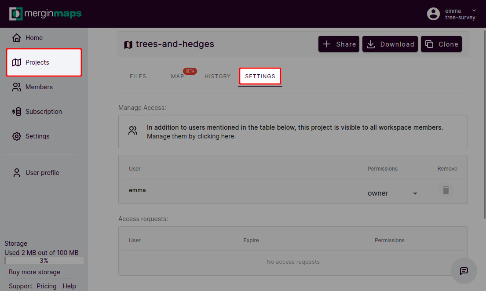

# Member Roles and Permissions
[[toc]]

Permissions control access to your <MainPlatformName /> projects. They can be defined for the whole workspace when inviting workspace members or for a specific project.

## Workspace members and guests
People invited to a workspace can be invited as **members** or as **guests**.

**Members** have access to all projects in a workspace. If a new project is created, they will be able to access it immediately.

**Guests** have access only to projects they are invited to. If a new project is created in a workspace, they won't see it until they are granted access.

:::tip
Do you want to invite members or guests to your workspace? Visit [How to share projects and manage user access](./project-advanced/) for detailed steps.
:::

## Workspace member roles
**Members** of a workspace have access to all projects in a workspace. The level of access to the project is defined by their member roles:
- **Reader**: users with **read** permission are able to see the list of projects, projects data and [history](./project-details.md)
- **Writer**: in addition to the **Read** access, users can also do changes in the projects: [adding/removing/updating features](../field/input_features/), change [layer settings and project properties](../gis/features/). Users who are expected to actively contribute to the project need to have the **write** permission. 
- **Admin**: in addition to the **Write** access, users with this level of access can [delete the project](./project-advanced/#delete-a-project) or [transfer](./project-advanced/#transfer-a-project) it to another workspace. Admins can also create new projects and manage workspace members.
- **Owner**: in addition to the **Admin** role, owners have access to [invoicing and subscription](./subscriptions/) settings.

| | Reader  | Writer | Admin  | Owner  |
|:---:|:---:|:---:|:---:|:---:|
|see the list of projects in the workspace| :white_check_mark:  | :white_check_mark: | :white_check_mark: | :white_check_mark: |
|see project data| :white_check_mark:  | :white_check_mark: | :white_check_mark: | :white_check_mark: |
|see project history| :white_check_mark:  | :white_check_mark: | :white_check_mark: | :white_check_mark: |
|add/edit/delete features in projects| :no_entry_sign: | :white_check_mark: | :white_check_mark: | :white_check_mark: |
|add/remove layers in projects| :no_entry_sign: | :white_check_mark: | :white_check_mark: | :white_check_mark: |
|change layer settings and project properties in QGIS| :no_entry_sign: | :white_check_mark: | :white_check_mark: | :white_check_mark: |
|create new projects| :no_entry_sign: | :no_entry_sign: | :white_check_mark: | :white_check_mark: |
|delete and transfer projects| :no_entry_sign: | :no_entry_sign:  | :white_check_mark: | :white_check_mark: |
|manage access to projects| :no_entry_sign: | :no_entry_sign:  | :white_check_mark: | :white_check_mark: |
|manage workspace members| :no_entry_sign: | :no_entry_sign: | :white_check_mark: | :white_check_mark: |
|access to invoicing and subscription settings| :no_entry_sign: | :no_entry_sign: | :no_entry_sign: | :white_check_mark: |

Members and their roles can be managed through <AppDomainNameLink /> in the [Members](./dashboard/#members) tab:

### How to transfer ownership of a workspace
Ownership of a workspace can be transferred to another [workspace member](#workspace-member-roles). 

Users with the **owner** member role have access to the **Subscriptions** in <AppDomainNameLink />. Every workspace has to have at least one owner, however, there can be multiple owners of one workspace.

::: warning
When transferring ownership of a workspace, you might also need to [update billing information](./subscriptions/#billing-information-and-payment-method).
:::

To transfer the ownership of a workspace to a user that is not yet a member of your workspace, follow the steps in [How to add users to a workspace](./project-advanced/#add-users-to-a-workspace) and select the **Owner** as the the **member role**. The new owner has to accept the invitation.

To transfer the ownership of a workspace to a user that is already a member of your workspace, you have to change their member role to **Owner**:
1. Log in to <AppDomainNameLink />
2. Navigate to the **Members** tab. Here, you will see the list of current workspace members and their roles. 
   

3. Change the **member role** of the user who should become the new owner
   
   
4. Now the member role of the original owner can be changed (if needed) or they can be removed from the workspace completely.

:::warning
Be careful when downgrading your own member role! 

Only owners and admins can manage user roles so if you assign yourself the writer or reader role, you will not be able to change it back.
:::

## Project permissions
Permissions to specific projects can be defined for workspace guests as well as for workspace members in addition to their member roles. There are three permission levels: **reader**, **writer** and **owner**. 

| | Reader  | Writer | Owner  |
|:---:|:---:|:---:|:---:|
|see the project in the workspace| :white_check_mark:  | :white_check_mark: | :white_check_mark: | 
|see project data| :white_check_mark:  | :white_check_mark: | :white_check_mark: |
|see project history| :white_check_mark:  | :white_check_mark: | :white_check_mark: | 
|add/edit/delete features in the project| :no_entry_sign: | :white_check_mark: | :white_check_mark: | 
|add/remove layers in the project| :no_entry_sign: | :white_check_mark: | :white_check_mark: | 
|change layer settings and project properties in QGIS| :no_entry_sign: | :white_check_mark: | :white_check_mark: | 
|delete and transfer projects| :no_entry_sign: | :no_entry_sign:  | :white_check_mark: | 
|manage access to the project| :no_entry_sign: | :no_entry_sign:  | :white_check_mark: |

Although the roles of workspace members define the level of access to projects in a workspace in general, it is possible to grant them *higher* permissions to specific projects. For instance, a workspace member with a *Reader* role can be a *Writer* or *Owner* of a project.

:::tip
[How to add users to a project](./project-advanced/#add-users-to-a-project) will guide you through inviting a guest to a project. These steps can be also followed to change workspace member's permission to a project.
:::

Project permissions are managed in project **Settings** when logged in to <AppDomainNameLink />. From here, you can [invite a guest](./project-advanced/#add-users-to-a-project) to contribute to your project or 

## Public and private projects

A **private project** is a project that is accessible only to workspace members and to guests that were invited to this project. Projects are private by default. 

A **public project** is a project that everyone (including those who are not registered with <MainPlatformName />) can see, including data and project history. Other users cannot contribute to your public project unless you give them writing permissions.

:::tip
You can [make your project public or private](./project-advanced/#make-your-project-public-private) in the project's settings.
:::

