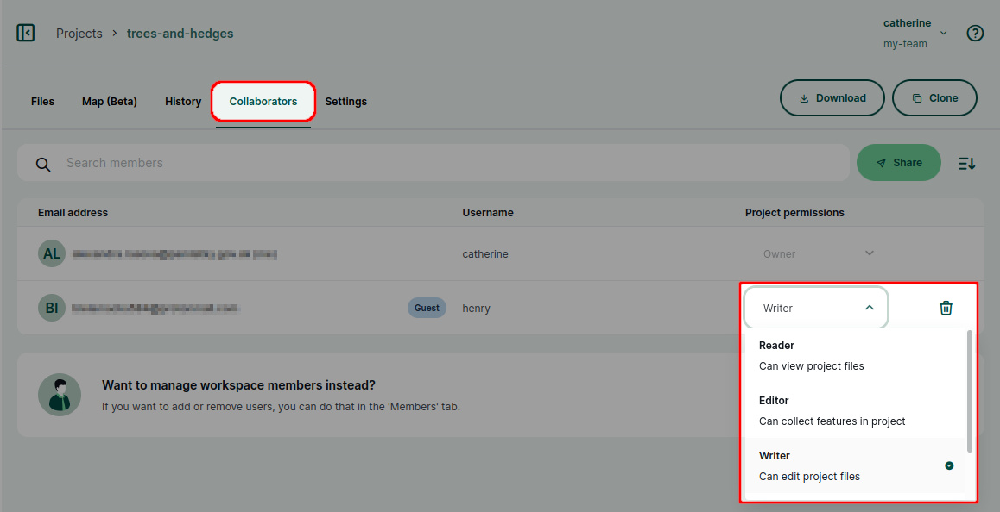
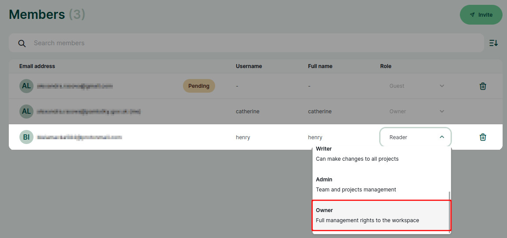

# Member Roles and Permissions
[[toc]]

Permissions control access to your <MainPlatformName /> projects. They can be defined for the whole workspace or for a specific project.

## Workspace members and guests
People invited to a workspace can be invited as **members** or as **guests**.

**Members** have access to *all* projects in a workspace. If a new project is created, they will be able to access it immediately. This means you do not have to grant them permissions to new projects manually. The level of access to the workspace is defined by their member roles. There are 5 [member roles](#workspace-member-roles-and-project-permissions) available: *reader*, *editor*, *writer*, *admin* and *owner*.

**Guests** have access only to projects they are invited to. If you want to only share specific projects with someone, you should invite them to your workspace as a guest.  The level of access to a project is defined by project permissions. There are 4 [permission](#workspace-member-roles-and-project-permissions) levels: *reader*, *editor*, *writer*, and *owner*.

:::tip
You can find detailed steps on how to invite users to your workspace in [How to share projects and manage user access](./project-advanced/#share-projects-and-manage-user-access).
:::

## Workspace member roles and project permissions
Member roles and project permissions present similar options in terms of what a user can or cannot do. The difference is whether these options are defined on a workspace or on a project level. Compare the overview of [workspace member roles](#workspace-member-roles-overview) and of [project permissions](#project-permissions-overview) for more details.

- **Reader**: Users with **Read** permission are able to see projects, projects data and [history](../project-history/), but can not make any changes.
- **Editor** (available on <MainPlatformNameLink /> Cloud and <EnterprisePlatformNameLink />): In addition to the **Read** access, users can [add/remove/update features](../field/mobile-features/). They *cannot* make changes in the project properties, add/remove fields in GeoPackage layers or remove GeoPackage files from the project. Editors can:
	- *add* files such as photos, shapefiles, GeoPackage files - any file except for `*.qgs`, `*.qgz`, `mergin-config.json`
	- *edit* files except for `*.qgs`, `*.qgz`, `mergin-config.json` and non-diff based `*.gpkg` changes
	- *remove* files except for `*.qgs`, `*.qgz`, `mergin-config.json` and `*.gpkg`
- **Writer**: In addition to the **Editor** access, users can also change [layer settings and project properties](../gis/features/).
- **Admin**: This role is only available for workspace members. In addition to the **Write** access, admins can [delete the project](./project-advanced/#delete-a-project) or [transfer](./project-advanced/#transfer-a-project) it to another workspace. They can also create new projects and manage workspace members.
- **Owner**: In addition to the **Admin** access, owners can also access [invoicing and subscription](./subscriptions/) settings. **Owner** has full access to the project or workspace.

:::tip
Invoices can be made accessible also to a person that is not a workspace member, such as someone from your accounting department. They can [access the subscription management portal using a link](./subscriptions/#accessing-subscription-management-portal-directly-without-mergin-maps-account).
:::

### Workspace member roles overview

This is the overview of workspace member roles that are related to the whole workspace:

| | Reader  | Editor | Writer  | Admin  | Owner  |
|:---:|:---:|:---:|:---:|:---:|:---:|
|see the list of all projects in the workspace| :white_check_mark:  |:white_check_mark: | :white_check_mark: | :white_check_mark: | :white_check_mark: |
|see project data| :white_check_mark:  | :white_check_mark:  | :white_check_mark: | :white_check_mark: | :white_check_mark: |
|see project history| :white_check_mark:  | :white_check_mark:   | :white_check_mark: | :white_check_mark: | :white_check_mark: |
|add/edit/delete features in all projects| :no_entry_sign: | :white_check_mark:   | :white_check_mark: | :white_check_mark: | :white_check_mark: |
|add/remove layers in all projects| :no_entry_sign: |  :no_entry_sign: | :white_check_mark: | :white_check_mark: | :white_check_mark: |
|change layer settings and project properties in QGIS| :no_entry_sign: | :no_entry_sign: | :white_check_mark: | :white_check_mark: | :white_check_mark: |
|create new projects| :no_entry_sign: | :no_entry_sign: | :no_entry_sign: | :white_check_mark: | :white_check_mark: |
|delete and transfer projects| :no_entry_sign: | :no_entry_sign:  | :no_entry_sign:  | :white_check_mark: | :white_check_mark: |
|manage access to projects| :no_entry_sign: | :no_entry_sign: | :no_entry_sign:  | :white_check_mark: | :white_check_mark: |
|manage workspace members| :no_entry_sign: | :no_entry_sign: | :no_entry_sign: | :white_check_mark: | :white_check_mark: |
|access to invoicing and subscription settings| :no_entry_sign: | :no_entry_sign: | :no_entry_sign: | :no_entry_sign: | :white_check_mark: |

### Project permissions overview
Permissions to specific projects can be defined for workspace guests as well as for workspace members in addition to their member roles.

This is the overview of <MainPlatformName /> project permissions:

| | Reader  | Editor | Writer | Owner  |
|:---:|:---:|:---:|:---:|:---:|
|see the project in the workspace| :white_check_mark: | :white_check_mark: | :white_check_mark: | :white_check_mark: | 
|see project data| :white_check_mark:  | :white_check_mark: | :white_check_mark: | :white_check_mark: |
|see project history| :white_check_mark:  | :white_check_mark: | :white_check_mark: | :white_check_mark: | 
|add/edit/delete features in the project| :no_entry_sign: | :white_check_mark: |  :white_check_mark: | :white_check_mark: | 
|add/remove layers in the project| :no_entry_sign: |:no_entry_sign:  | :white_check_mark: | :white_check_mark: | 
|change layer settings and project properties in QGIS| :no_entry_sign: | :no_entry_sign: | :white_check_mark: | :white_check_mark: | 
|delete and transfer projects| :no_entry_sign:  |:no_entry_sign: | :no_entry_sign:  | :white_check_mark: | 
|manage access to the project| :no_entry_sign:  |:no_entry_sign: | :no_entry_sign:  | :white_check_mark: |

Although the roles of workspace members define the level of access to projects in a workspace in general, it is possible to grant them *higher* permissions to specific projects. For instance, a workspace member with a *Reader* role can be a *Writer* or *Owner* of a project.

:::tip
[How to add users to a project](./project-advanced/#add-users-to-a-project) will guide you through inviting a guest to a project. These steps can be also followed to change workspace member's permission to a project.
:::

### Managing member roles and project permissions
Users can be [added to a workspace](./project-advanced/#add-users-to-a-workspace) as guests and members through the [Members](./dashboard/#members) tab on the <DashboardShortLink />.

Here, you can also manage the member roles:

Project permissions can be reviewed in the details of a project in the **Collaborators** tab where you can find the list of users who can access the project and their project permissions. 

If needed, the project permissions can be changed here:

## How to transfer ownership of a workspace
Ownership of a workspace can be transferred to another **workspace member**. 

Users with the **owner** member role have access to the **Subscriptions** page in the <DashboardShortLink />.

Every workspace has to have at least one owner, however, there can be multiple owners of one workspace.

::: warning
When transferring ownership of a workspace, you might also need to [update billing information](./subscriptions/#billing-information-and-payment-method).
:::

To transfer the ownership of a workspace to a user that is not yet a member of your workspace, follow the steps in [How to add users to a workspace](./project-advanced/#add-users-to-a-workspace) and set the **member role** to **Owner**. The new owner has to accept the invitation.

To transfer the ownership of a workspace to a user that is already a member of your workspace, you have to change their member role to **Owner**:
1. Log in to <AppDomainNameLink />
2. Navigate to the **Members** tab. Here, you will see the list of current workspace members and their roles. 
   

3. Change the **member role** of the user who should become the new owner to **Owner**
   
   
4. Now the member role of the original owner can be changed (if needed) or they can be removed from the workspace completely.

:::warning
Be careful when downgrading your own member role! 

Only owners and admins can manage user roles so if you assign yourself the writer or reader role, you will not be able to change it back.
:::

## Public and private projects

A **private project** is a project that is accessible only to workspace members and to guests that were invited to this project. Projects are private by default. 

A **public project** is a project that everyone (including those who are not registered with <MainPlatformName />) can see, including data and project history. Other users cannot contribute to your public project unless you give them writing permissions.

You can [make your project public or private](./project-advanced/#make-your-project-public-private) in the project's settings.

