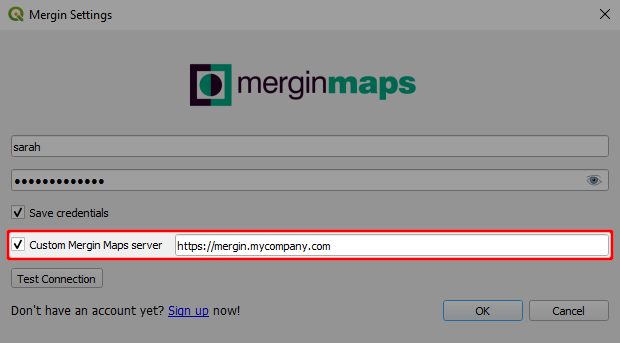
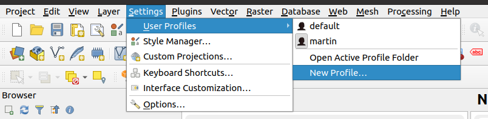

# How to Use QGIS Plugin with Multiple Servers

There is a default server <AppDomainNameLink /> which is configured in <QGISPluginName />. But there might be some cases you will want to use some custom server (e.g. you host it yourself). We will cover two typical use cases

- migration from one server to another
- using multiple servers simultaneously

## Non-standard configuration

Let's start with setting of custom <MainPlatformName /> server. It can be done in a configuration dialog

What happens is that server URL is saved in current QGIS profile settings. So whenever you open QGIS with that profile, the <MainPlatformName /> server is associated. 

## Migration between Mergin Maps servers

You might have started working on one server (e.g. staging server, official cloud) and then you decided to migrate to different <MainPlatformName />  server. If you change a server URL as in the config above, you will be connected to different server and this option will hold in subsequent QGIS sessions until you change it again. This way you can switch between servers for a single QGIS profile. All projects for all your servers that you downloaded to your computer are still remembered. 

::: warning
 Plugin will not allow you to migrate projects from one server to another. Your local copies are already associated to server they were downloaded from. If you really need to upload your local project from one server to another you will need to create copy of that folder elsewhere (without hidden folder `.mergin`).
:::

## Using multiple servers simultaneously

If you need to handle two different servers at the same time, e.g. two open QGIS sessions, you will first need to create two user profiles in QGIS (and download plugin for both). 

Then you can configure plugin as above for each of them. Each session for given user profile will be connected to its own <MainPlatformName />  server.

The limitation for transferring projects between servers still holds.
