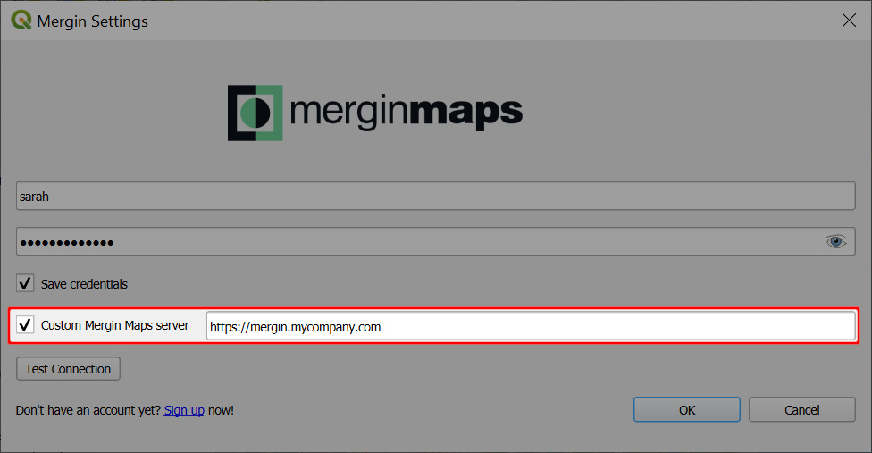
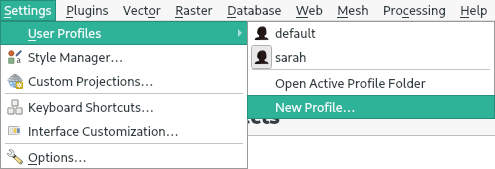
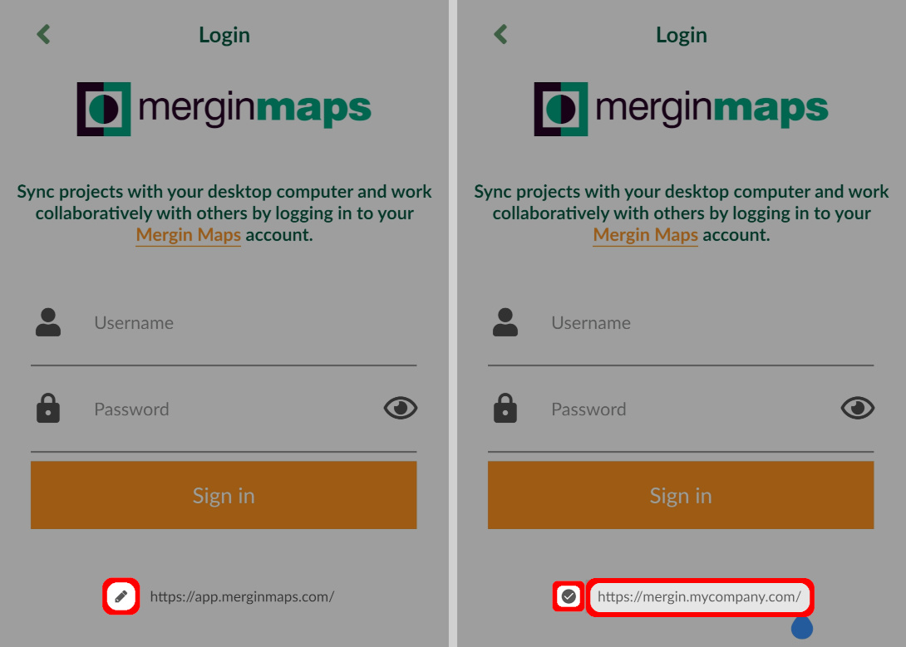
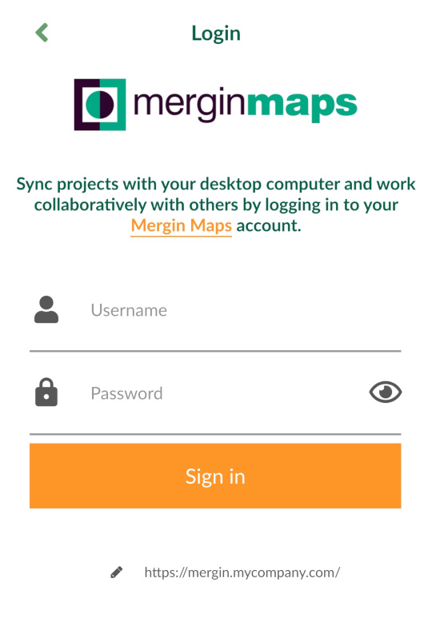

# How to Use Mergin Maps with a Custom Server
[[toc]]

There is a default server <AppDomainNameLink /> which is configured in <QGISPluginName /> and in the <MobileAppNameShort />. However, you might want to use some custom server, e.g. when using [<MainPlatformName /> Community Edition](../../dev/mergince/) or [<MainPlatformName /> Enterprise Edition](../../dev/merginmaps-ee/).

To do this, we need to set up the custom server in the [plugin](#custom-server-configuration-in-mergin-maps-qgis-plugin) as well as in the [mobile app](#custom-server-configuration-in-mergin-maps-mobile-app).

:::tip
The <MainPlatformName /> Community and Enterprise editions are private hosting solutions for those who would like to run their own deployment of <MainPlatformNameLink />. 

See the [overview and pricing](https://merginmaps.com/pricing-for-ce-and-ee) for more details.
:::

## Custom server configuration in Mergin Maps QGIS plugin
To configure a custom <MainPlatformName /> server in the <QGISPluginNameShort />:

1. Click on the **Configure <MainPlatformName /> plugin** icon to open the configuration dialog

2. Check the **Custom <MainPlatformName /> server** option and enter your custom server URL.

Now, the server URL is saved in current QGIS profile settings. So whenever you open QGIS with this profile, the <MainPlatformName /> server is associated with this URL. 

### Migration between Mergin Maps servers

You might have started working on one server (e.g. staging server, official cloud) and then you decided to migrate to a different <MainPlatformName />  server. If you change a server URL as in the config above, you will be connected to a different server and this option will hold in subsequent QGIS sessions until you change it again. This way you can switch between servers for a single QGIS profile. All projects for all your servers that you downloaded to your computer are still remembered. 

::: warning
 Plugin will not allow you to migrate projects from one server to another. Your local copies are already associated with the server they were downloaded from. If you really need to upload your local project from one server to another you will need to create a copy of that folder elsewhere (without hidden folder `.mergin`).
:::

### Using multiple servers simultaneously

If you need to handle two different servers at the same time, you will first need to create two user profiles in QGIS and download <QGISPluginName /> for both.

Then you can configure <QGISPluginName /> for each of them using different server URL. Each session for given user profile will be connected to its own <MainPlatformName /> server as specified in the plugin configuration.

The limitation for transferring projects between servers still holds.

## Custom server configuration in Mergin Maps mobile app
To configure a custom <MainPlatformName /> server in <MobileAppName />:

1. Open <MobileAppName /> and navigate to the login page. Make sure to sign out.
 
   

2. Tap on the edit button next to the current server URL.

   Now you can change the <MainPlatformName /> server. Enter the URL of your custom server and tap the check button to confirm your setup.

   

3. Use the username and password that is associated with this custom server and **Sign in**.
   

Now you are all set to use <MobileAppName /> with the custom server!
