# Mergin Maps Plugin for QGIS Overview
[[toc]]

:::danger WARNING
This content may differ from what you encounter when working with <MainPlatformNameLink />. It will be updated soon to include recent changes in <MainPlatformNameLink />, <MobileAppName /> and <QGISPluginName />.
:::

The <QGISPluginName /> allows you to work with your <MainPlatformNameLink /> projects in QGIS, whether it's downloading the project to your computer, making changes in the project, seeing the project's status or synchronising changes to the cloud. 

To get started, you will need to [install and configure the plugin](../setup/install-mergin-maps-plugin-for-qgis/index.md).

Once you have configured the plugin with your <MainPlatformNameLink /> credentials, you should be able to see the following sections under the **<MainPlatformName />** in your QGIS Browser panel:
- **My projects** lists all projects you have created
- **Shared with me** lists the projects that are shared with you (including your organisation projects)
- **Explore** lists all the public projects

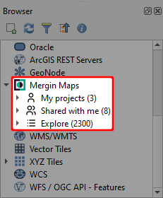
:::tip
To ensure you can use the latest improvements, don't forget to [upgrade the plugin](../setup/install-mergin-maps-plugin-for-qgis/#plugin-upgrade) periodically!
:::

## Downloading a project in QGIS
1. Right-click on the project and select **Download**
   

2. Browse to the folder, where you want to save the project and click **Select folder**
   

   :::danger WARNING
   Do not use shared network drives or cloud storage (such as OneDrive or Google Drive) to store your <MainPlatformName /> projects. It is not supported and can cause errors.
   :::

3. Once the download is completed, you will have the option to open the project in QGIS.
   

## Local changes
<SinceBadge type="Plugin" version="2022.4" />
The changes that you make in the project can be synchronised to the cloud and shared with your coworkers. Now these changes can also be visualised which is helpful when reviewing local changes to see what was actually modified and also to avoid unwanted edits.

:::tip
Visit our blog [View and track changes in QGIS](https://www.lutraconsulting.co.uk/blog/2022/11/08/mergin-maps-local-changes/) to read more about local changes.
:::

To see local changes:
1. Right-click on a layer and select **Show Local Changes** 
   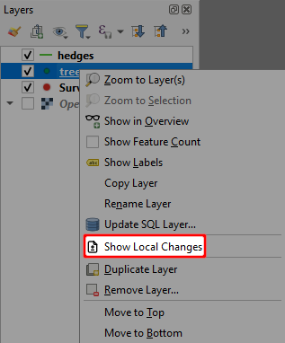

2. **Changes Viewer** opens. The colour-coded changes are listed in the table and shown in the map. Inserts are green, edits orange and deletions red.

   If you want to zoom to specific changes, select them in the table and use **Zoom to Selection**.
   
   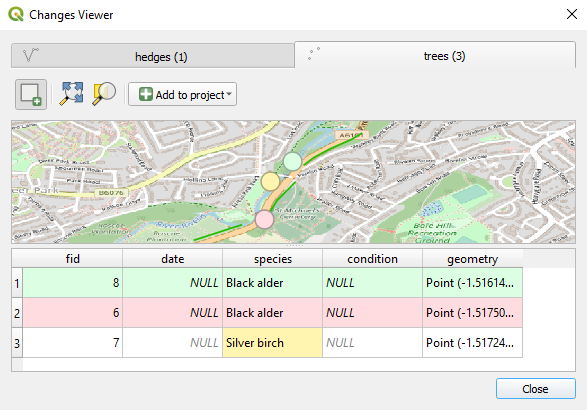

3. Changes can be added to the QGIS project as a new layer. Click **Add to project** and choose one of the options:
   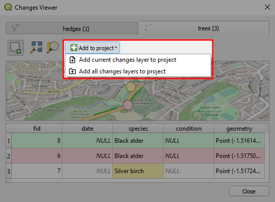
   
4. A temporary layer will be added to the **Layers** panel with colour-coded symbology
   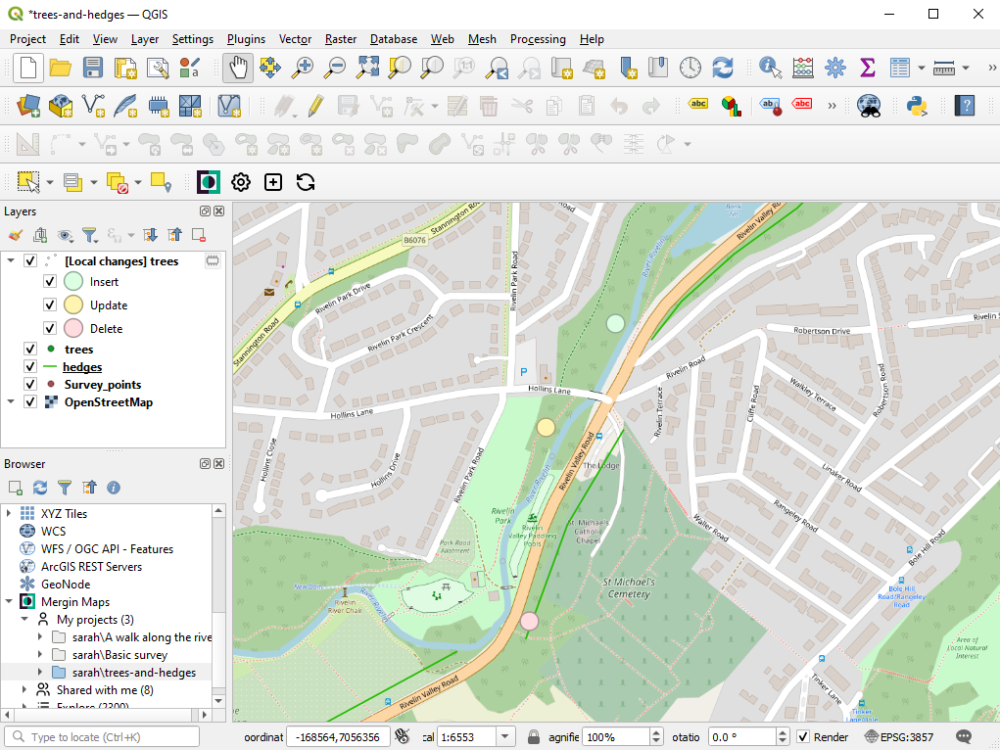
   
:::tip
Unless you want to use these layers in your <MainPlatformName /> project, remove them from the project before synchronisation.
:::

### Extract local changes (Processing toolbox)
Local changes of a specific layer can also be extracted using the **Extract local changes** tool in the **Processing toolbox**.

1. Navigate to **Mergin Maps** tools in the **Processing toolbox**
   

2. Double click the **Extract local changes** tool. In the dialog window, enter your project directory and select the input layer. The output local changes layer can be saved as a file or as a temporary file. Click **Run**.
   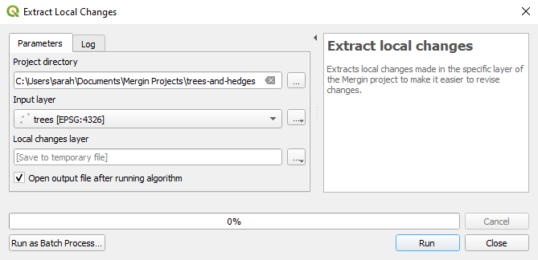

3. The local changes layer is added to the **Layers** panel
   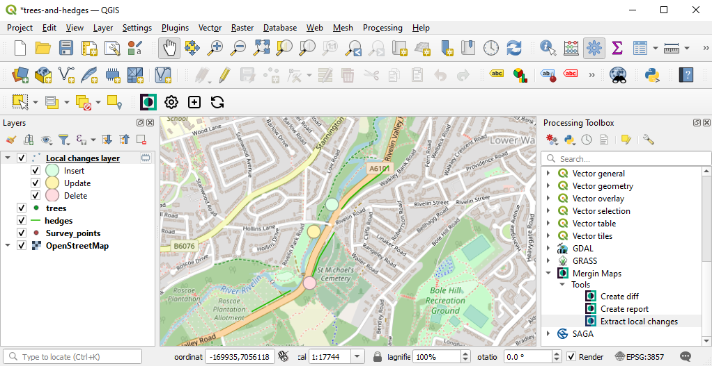

## Synchronisation in QGIS
Once you are happy with the changes to be uploaded/downloaded, you can synchronise your project and data. 

1. Click on the **Synchronise Mergin Maps project** icon from the <QGISPluginName /> toolbar or right-click on the project in the Browser panel and select **Synchronise**
   
   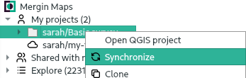

2. This will show the project status: a list of pending changes, warnings, and validation results of your project.
   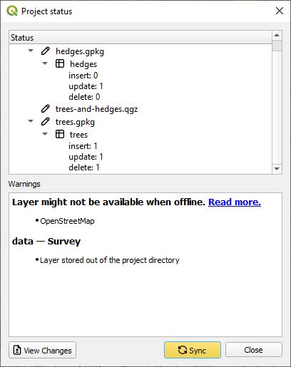

   Warnings are related to restructuring of a GeoPackage layer (adding/removing a field, adding/removing a layer in a GeoPackage database). Validations can point out missing layers or availability of a layer when working offline.

3. If you want to inspect the pending changes more thoroughly, you can click on the **View changes** button to see the [local changes](#local-changes).
   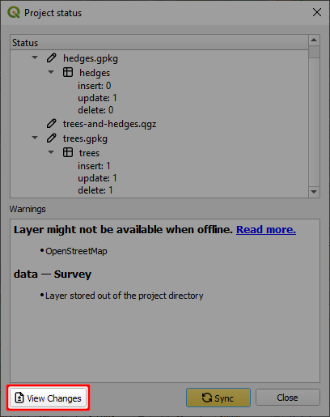

4. If you want to proceed, click on the **Sync** button to synchronise your project and data.
  
::: warning
Project and data synchronisation works in both ways.

All your changes will be uploaded to the server and any pending changes from the server edition of your files will be downloaded and appended to your local files.
:::

When the synchronisation process is completed, your local files and the copy of files on the server will be identical.

## Create diff (Processing toolbox)
**Create diff** is a tool that extracts changes made between two versions of a layer in your <MainPlatformName /> project to make it easier to revise changes.

1. Navigate to **Mergin Maps** tools in the **Processing toolbox**
   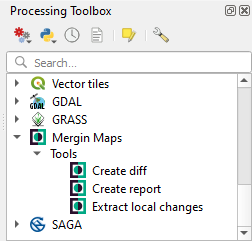

2. Double click the **Create diff** tool and fill in the parameters in the dialog window. Click **Run**.
   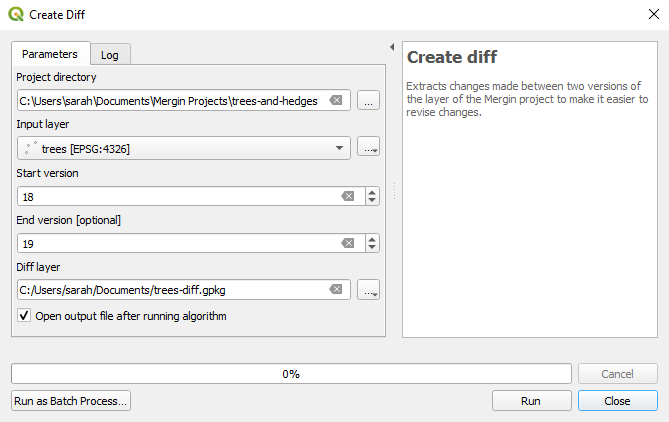

3. The diff layer is added to the **Layers** panel. Changes are visualised on the map and also in the attribute table of the layer.
   

## Create report (Processing toolbox)
**Create report** tool provides an overview of changes in your <MainPlatformName /> project for a range of project versions. The output is a <NoSpellcheck id="CSV" /> file, which can be opened in QGIS and also in common text and spreadsheets programs.

1. Navigate to **Mergin Maps** tools in the **Processing toolbox**
   

2. Double click the **Create report** tool. 
   
   Fill in the parameters in the dialog window. If you want to get the report for a specified range of [versions](./project-details/), define also the start and end version. 

   Click **Run**.
   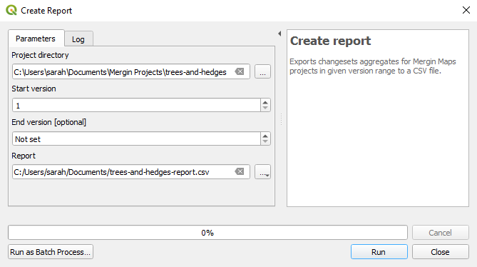

3. The report is added to the **Layers** panel.
   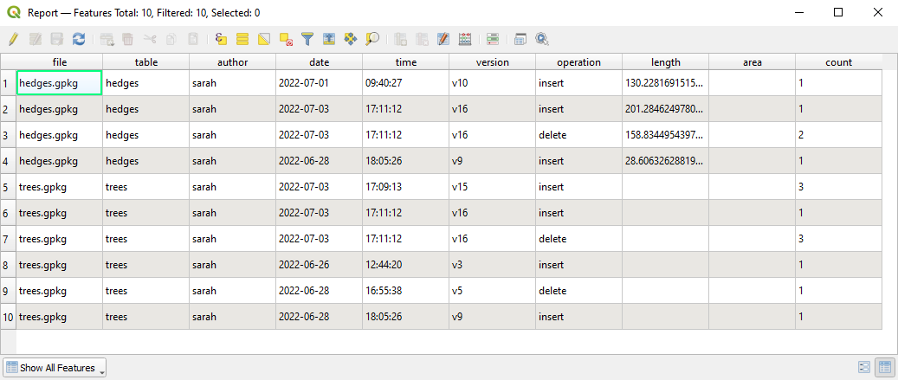

