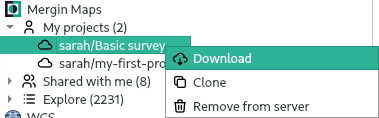
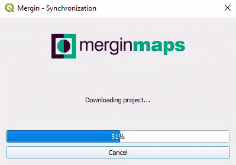
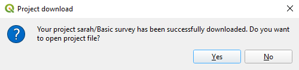
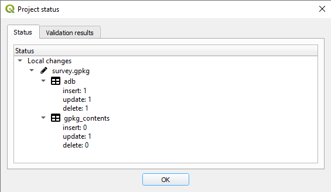

# Synchronise project

## Initial Download 

Once you have configured the plugin with your Mergin credentials, you should be able to see the following sections under the Mergin in your QGIS Browser panel:

- **My projects** lists all projects you have created
- **Shared with me** lists the projects of others shared you (including your organisation projects)
- **Explore** lists all the public projects

You can select one of the categories and see the listed projects. To download a project:

1. Right-click on the project and select **Download**

2. A new window will appear to save the project under a folder on your PC. Browse to the folder you want to download your project to and click **Select folder**

3. Once the download is completed, you will be presented with an option to open the project in QGIS:

Selecting **Yes** will open the project and all the associated layers.

## Status

It is recommended to run the project status after changing your layers and project.

To see the status of your project and data:

From the Mergin plugin, click on **Status** :

This will help getting a list of pending changes and also see any warnings or validations of your project. The warnings are related to restructuring of a GeoPackage layer (adding/removing a field or adding/removing a layer in a GeoPackage database). Validations can be linked to missing layer or availability of a layer when working offline:

## Synchronisation

Once you are happy with the changes to be uploaded/downloaded, you can synchronise your project and data:

Click on the **Synchronise** icon from the Mergin toolbar to sync your project and data.

You can select the status and synchronisation options by right-clicking on the Mergin project from the Browser panel too.

::: warning
Synchronising data and project will work in both ways
:::

All your changes will be uploaded to the server and any pending changes from the server edition of your files will be downloaded and appended to your local files. Therefore, when synchronisation process is completed, your local files and the copy of files on the server will be identical.