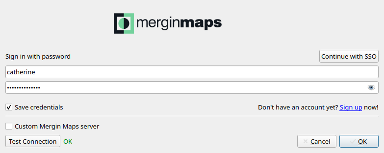
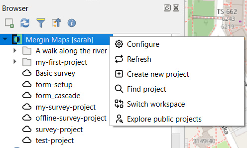
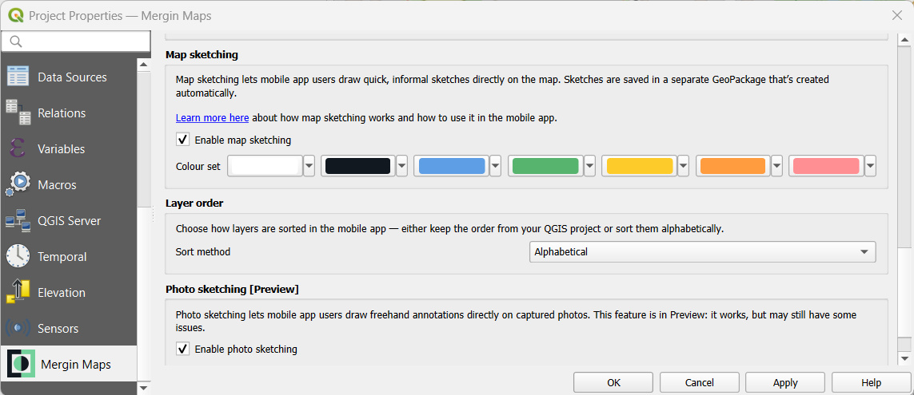

# Mergin Maps QGIS Plugin Overview
[[toc]]

The <QGISPluginName /> allows you to work with your <MainPlatformNameLink /> projects in QGIS, whether it's downloading the project to your computer, making changes in the project, seeing the project's status or synchronising changes to the cloud. 

To get started, you will need to [install and configure the plugin](../../setup/install-mergin-maps-plugin-for-qgis/). 

Once installed, plugin's entries will be added to the QGIS toolbar panel, Browser panel, Project properties and to the Processing toolbox.

:::tip Upgrade the plugin regularly
To ensure you can use the latest improvements, don't forget to [upgrade the plugin](../../setup/install-mergin-maps-plugin-for-qgis/#plugin-upgrade) whenever there is an update available!
:::

## Mergin Maps toolbar in QGIS
The <MainPlatformName /> toolbar is added to the QGIS toolbars panel after installation.

If you don't see <MainPlatformName /> toolbar, make sure it is enabled in QGIS toolbars panel

The toolbar contains following buttons:
- the <MainPlatformName />  logo is a shortcut to <AppDomainNameLink />
  
  
- **Configure <MainPlatformName /> plugin** to [configure plugin](../../setup/install-mergin-maps-plugin-for-qgis/#plugin-configuration) to connect to <MainPlatformName /> or [a custom server](../../server/plugin-mobile-app/)
  
  
  
- **Create <MainPlatformName /> project** to [create or package a QGIS project](../create-project/#create-a-project-in-qgis)
  
  
    
- **Synchronise <MainPlatformName /> project** to inspect and [synchronise](../synchronisation/#synchronising-changes-in-qgis) or reset changes made in the current project
  
  

- **Project history** to inspect [project history and versions](../project-history/)
  
  

## Mergin Maps plugin in QGIS Browser

Once you have installed the <QGISPluginNameShort /> and configured it with your <MainPlatformNameLink /> credentials, you should be able to see it in your QGIS Browser panel. 

The name of the current [workspace](../workspaces/) is displayed in the square brackets (here: `sarah`) and available projects are listed underneath.

Right-click on the workspace name to easily access options to [configure the plugin](../../setup/install-mergin-maps-plugin-for-qgis/#plugin-configuration), refresh, [create new project](../create-project/#create-a-project-in-qgis), find a project in your workspace, [switch workspace](../workspaces/#switch-workspaces-in-qgis) or [explore public projects](#exploring-public-projects).

### Downloading a project in QGIS

:::tip
Detailed steps on how to download and open your <MainPlatformNameLink /> project are included in the [Opening Surveyed Data on Your Computer](../../tutorials/opening-surveyed-data-on-your-computer/#locating-and-opening-your-project) tutorial.
:::

1. Right-click on a project in the Browser panel and select **Download**
   

2. Browse to the folder, where you want to save the project and click **Select folder**. The project will be downloaded here.

   :::danger WARNING
   Do not use shared network drives or cloud storage (such as OneDrive or Google Drive) to store your <MainPlatformName /> projects. It is not supported and can cause errors.
   :::

3. Once the download is completed, you will have the option to open the project in QGIS.

### Exploring public projects

1. Right-click on the <MainPlatformName /> entry in the QGIS Browser and select the **Explore public projects** option
   

2. Find the project you are interested in. Use the search bar to limit the choices.
   

3. Select the project and click **Open project**. Browse to the folder where you want to save the project. The project will be downloaded here.

::: tip
You can package this downloaded project using <QGISPluginName /> as described in [Create a project in QGIS](../create-project/#create-a-project-in-qgis) using the **Package current QGIS project** option and use it as your own <MainPlatformNameLink /> project.
:::

## Mergin Maps Project Properties
Some settings of your [<MainPlatformName /> project](../project/) can be done through <QGISHelp ver="latest" link="user_manual/introduction/qgis_configuration.html#project-properties" text="Project Properties" />, such as:
- [**Selective sync**](../selective_sync/) to avoid synchronisation of unnecessary or large files
- [**Photo quality**](../../gis/features/#photo-quality) of pictures added to the project
- Enable [**snapping**](../../field/mobile-features/#snapping-features) in the <MobileAppNameShort />
- [**Photo name format**](../../gis/photo-names/) for photo attachments fields
- Enable [**position tracking**](../../field/tracking/) and choose its precision level
- Enable [**Map sketching**](../../field/map-sketching/)
- Set [**Layer order**](../../field/layers/#layer-order) for the <MobileAppNameShort />
- Enable [**Photo sketching**](../../field/photo-sketching/) to annotate pictures in the <MobileAppNameShort />

## Mergin Maps Tools in QGIS Processing Toolbox
Processing is a core plugin of QGIS. By installing <QGISPluginName />, <MainPlatformName /> tools are added to the  <QGISHelp ver="latest" link="user_manual//processing/intro.html" text="Processing Toolbox" />.

Use the **Toolbox** icon in the toolbar panel to display **Processing Toolbox** in QGIS.

### Create diff (Processing toolbox)
**Create diff** is a tool that extracts changes made between two versions of a layer in your <MainPlatformName /> project to make it easier to revise changes.

1. [Navigate to **Mergin Maps** tools](#mergin-maps-tools-in-qgis-processing-toolbox) in the **Processing toolbox** in QGIS

2. Double click the **Create diff** tool and fill in the parameters in the dialog window. Click **Run**.
   

3. The diff layer is added to the **Layers** panel. Changes are visualised on the map and also in the attribute table of the layer.
   

### Create report (Processing toolbox)
**Create report** tool provides an overview of changes in your <MainPlatformName /> project for a range of project versions. The output is a <NoSpellcheck id="CSV" /> file, which can be opened in QGIS and also in common text and spreadsheets programs.

1. [Navigate to **Mergin Maps** tools](#mergin-maps-tools-in-qgis-processing-toolbox) in the **Processing toolbox** in QGIS

2. Double click the **Create report** tool. 
   
   Fill in the parameters in the dialog window. If you want to get the report for a specified range of [versions](../project-history/), define also the start and end version. 

   Click **Run**.
   

3. The report is added to the **Layers** panel.
   

### Download vector tiles (Processing toolbox)
This tool can be used to easily download vector tiles for offline use. Go to [Downloading vector tiles using <QGISPluginName />](../../gis/settingup_background_map/#downloading-vector-tiles-using-mergin-maps-qgis-plugin) to see how it works.

### Extract local changes (Processing toolbox)
Local changes of a specific layer can also be extracted using the **Extract local changes** tool in the **Processing toolbox**.

1. [Navigate to **Mergin Maps** tools](#mergin-maps-tools-in-qgis-processing-toolbox)  in the **Processing toolbox** in QGIS

2. Double click the **Extract local changes** tool. In the dialog window, enter your project directory and select the input layer. The output local changes layer can be saved as a file or as a temporary file. Click **Run**.
   

3. The local changes layer is added to the **Layers** panel
   

   
## Mergin Maps in QGIS Plugins menu bar
**Plugins** menu bar in QGIS contains also <MainPlatformName /> options:
- **<MainPlatformName />** is a shortcut to <AppDomainNameLink />
- **Configure <MainPlatformName /> plugin** can be used to [configure plugin](../../setup/install-mergin-maps-plugin-for-qgis/#plugin-configuration) to connect to <MainPlatformName /> or [a custom server](../../server/plugin-mobile-app/)
- **Configure DB sync** can help you generate a initial configuration file for [DB sync](../../dev/dbsync/)

