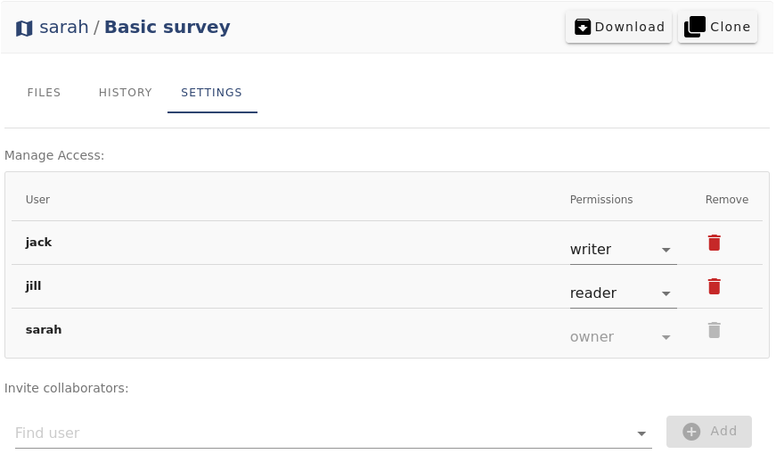

# How to Share, Transfer or Delete Project
[[toc]]

## Share a project

Through <AppDomainNameLink />, you can share your project with other <MainPlatformName /> users. You can add your coworkers manually or send them a link and manage their permissions in your private project. You can also make your project accessible to everyone by making it public.

::: tip
You can follow our [Working collaboratively](../tutorials/working-collaboratively/) tutorial to see detailed instructions on how to share your project.
:::

### Adding users to the project

1. Choose the project you want to share and go to the **Settings**. 
2. In the **Invite collaborators** section, enter the Mergin Maps usernames of the user(s) you want to invite to collaborate and click **Add**.
3. Assign them permissions according to their role in **Manage Access** section. There are three types of [permissions](./permissions/):
   - **Owner** can read, write, delete the whole project and also share it further.
   - **Writer** can read and write; they can see the project and data and also make edits.
   - **Reader** can only see the project and data (including project history).

### Sending a link to your project

Another method which is more suitable for sharing with a large number of users is to send them a link (e.g. <MerginMapsProject id="sarah/Basic survey/tree" />) to your project.

1. Go to the project you want to share
2. Copy the link from your web browser
3. Share the link with user(s) you want to invite to collaborate

Users can use the **Request access** button to request access to your project after logging into <AppDomainNameLink />.

Once the user requests access, you (or another project owner) can open the project settings and grant them the appropriate [permission](./permissions/):

### Making your project public/private
Your projects are private by default. If you make it [public](./permissions/#public-and-private-projects), everyone can see your data and project history. However, they cannot contribute to your public project unless you grant them the write permission.

1. Choose the project you want to make public
2. Go to **Settings** and click on **Make public**

If you change your mind, you can similarly make your project private by clicking **Make private**.

## Transfer a project

There is an option to transfer the ownership of a project to another user or organisation. 

1. Make sure to correctly synchronise all changes from your collaborators and devices. If you fail to do that, their local changes will be lost!
2. After the synchronisation, all collaborators have to **remove** the project from their devices
3. Log in to <AppDomainNameLink /> and choose the project you want to transfer
4. Go to **Settings** and click on **Transfer project**
   
5. Enter the name of a user/organisation and **Request transfer**
   
   
   The user/organisation will be notified to accept or reject the transfer request. The request is valid for 6 days. After that period, if the user or organisation does not accept the request, you will remain the owner of the project.

6. After the project transfer, the collaborators have to **download the transferred project** once again from the new owner.

## Delete a project
If you want to delete a project, you can do so through <AppDomainNameLink /> or using the <QGISPluginName />.

### Delete a project through merginmaps.com

1. Log in <AppDomainNameLink /> and choose the project you want to delete
2. Go to **Settings** and click on **Delete project**

::: danger
This operation cannot be undone and the project data are permanently deleted.
:::

### Delete a project using the Mergin Maps plugin 
Using the <QGISPluginName />, you can delete a Mergin Maps project either locally on your PC or on the Mergin Maps server. To be able to delete the project on the server, you need to first delete the files locally.

1. In QGIS, go to the **Mergin Maps** in the Browser panel
2. Right-click on the project name and select **Remove locally**. This will remove the project from your PC. The project will be still available on the Mergin Maps server. You will be able to download the project again.
   

3. Right-click on the project name again and select **Remove from server** option. This will remove the Mergin Maps project completely. 
   

::: danger
This operation cannot be undone and the project data are permanently deleted.
:::
