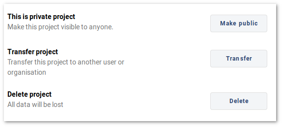

# How to share, transfer or delete a project
[[toc]]

## Share a project

Through <MainDomainNameLink />, you can share your project with other Mergin users to view or contribute to it. There are two methods of sharing projects: adding users manually or sending them a link.

::: tip
You can follow our [Working collaboratively](../tutorials/working-collaboratively/) tutorial to see detailed instructions on how to share your project.
:::

### Adding users to the project

1. Choose the project you want to share and go the **Settings**. 
2. In **Invite collaborators** section, enter the Mergin Maps usernames of user(s) you want to invite to collaborate and click **Add**.
3. Assign them permissions according to their role in **Manage Access** section. There are three types of permissions:
   - *Owner* can read, write, delete the whole project and also share it further.
   - *Writer* can read and write; they can see the project and data and also make edits.
   - *Reader* can only see the project and data (including project history).

### Sending a link to your project

Another method which is more suitable for sharing with a large number of users is to send them a link (e.g. <MerginMapsProject id="sarah/Basic survey/tree" />) to your private project. 

1. Choose the project you want to share 
If a user does not have access to the project, there will be a button to request access. 

Note that user has to be logged into the Mergin to be able to see the request button:

Once the user requests access, the project owner(s) can open the project settings and grant them the appropriate permission:

## Transfer or delete a project

To access the advanced project settings:

- Select **SETTINGS** from above the project files
- At the bottom of the page, you have three options:
  - Public/private setting: to make your project public or private. See [permissions page](./permissions.md) for more details.
  - **Transfer project**: this option transfers the ownership of your project to another Mergin user or organisation. An email notification will be sent to user (provided that the notification is active under the user's profile). A notification will be also displayed on the user/organisation dashboard page to accept or reject the project transfer request. The request is valid for 6 days. After that period, if user or organisation does not accept the request, you will remain the owner of the project..
  - **Delete project**: to delete the project and all the data. Once the project and data are deleted, this action cannot be undone.

