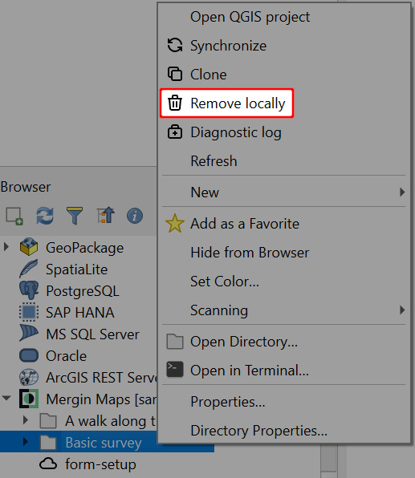

# How to Share, Transfer or Delete Projects
[[toc]]

## Share projects and manage user access

You can share your <MainPlatformName /> project with others by inviting them to be [a member or a guest](./permissions/#workspace-members-and-guests) in your workspace. You can also make your <MainPlatformName /> project accessible to everyone by making it [public](#make-your-project-public-private).

:::warning
When granting access to workspaces and projects, it is important to set appropriate [**permissions**](./permissions/) to your team members to avoid unwanted modifications of projects.
:::

::: tip
You can follow our [Working collaboratively](../tutorials/working-collaboratively/) tutorial to see detailed instructions on how to share your project by inviting a user to your workspace as a guest or by sharing a link to your project with your teammates.
:::

### Add users to a workspace
If you want to share all projects in your workspace with a group of users, you can invite them to be a **member** of a workspace. It is also possible to invite people as **guests** and share only selected projects with them.

You have to be the **admin** or **owner** of the workspace to manage access to the workspace. See [Member Roles and Permissions](./permissions/#workspace-member-roles) for more details.

To add users to a workspace:
1. Log into <AppDomainNameLink />
2. Select **Members** from the left panel and click on **Add People**
   
3. In the invite form, enter the email addresses of people you want to invite. 
   Select if you invite them as **members** or as **guests**:
   - for **members**, select their [member role](./permissions/#workspace-member-roles). Members have access to all projects in the workspace.
   - for **guests**, specify the projects to which they should have access. When inviting guests, you can give them [*read* or *write* permissions](./permissions/#project-permissions) to these projects.
  

4. Click on **Invite** to send an invitation. An email with a link will be sent to the recipients. After they accept the invitation, they will become members or guests of your workspace.

### Add users to a project
Access to a specific project can be also managed in the project's settings. From here, you can also invite users to become guests in the workspace and gain access to this project.

::: tip
Similarly, you can also update the member's role for this project. For example, you may grant a *write* access to a member that has only a *Reader* role in the workspace. Go to [Member Roles and Permissions](./permissions/) to learn more about this topic.
:::

1. Log into <AppDomainNameLink />
2. Select **Projects** from the left panel and click on the project you want to manage
   

3. Go to **Settings**. Here you can manage the permissions of users who have access to the project or remove them from the project.
   

4. Click on **Share**
   
   
5. Enter the email addresses of the users you want to invite as guests. Click **Next**
   
   
   :::tip
   If you want to modify permissions for a workspace member, enter their <MainPlatformNameLink /> username to the **Share with** prompt. After clicking **Next**, they will be added to the **Manage Access** table in **Settings** where you can change their permissions to this project.
   :::
      
4. In the invite form, it is possible to add more projects to share and set the permissions. 
   Click **Next**.
   

5. Click on **Share** to send an email with a link to the recipients. After accepting the invitation, they will become a guest in your workspace.
   

### Send a link to your project
Another method that is suitable for sharing a project with a large number of users is to send them a link to your project, such as <MerginMapsProject id="sarah/Basic survey/tree" />.

1. Log into <AppDomainNameLink />
2. Go to the project you want to share
3. Copy the link from your web browser and share it with your colleagues

If you send a link to a [private](#make-your-project-public-private) project, users can **request access** after logging into <AppDomainNameLink />.

Once the user requests access, you (or another project owner) can open the project settings and grant them appropriate [permissions](./permissions/) and accept their request.

### Make your project public/private
Your projects are private by default. If you make it [public](./permissions/#public-and-private-projects), everyone can see your data and project history. However, they cannot contribute to your public project unless you grant them the write permission.

1. Choose the project you want to make public
2. Go to **Settings** and click on **Make public**

If you change your mind, you can make your project private by clicking **Make private**.

## Transfer a project
A <MainPlatformName /> project can be transferred to another workspace. This can be useful when there are personal changes in your team or if you have multiple workspaces and want to manage the storage between them.

1. Make sure to correctly synchronise all changes from your collaborators and devices. If you fail to do that, their local changes will be lost!
2. After synchronisation, all collaborators have to **remove** the project from their devices
3. Log in to <AppDomainNameLink /> and choose the project you want to transfer
4. Go to **Settings** and click on **Transfer project**
   
5. Enter the name of the workspace to which the project should be transferred and click on **Request transfer**
   
   
   The owner of the new workspace will be notified and will be able to accept or deny the request through <AppDomainNameLink />.
   
   
   The request is valid for 6 days. If the request is not accepted after this period, the project will remain in the original workspace.

6. If the same team wants to continue contributing to the project, they need to **download the transferred project** from the new workspace.

## Delete a project
If you want to delete a project, you can do so through <AppDomainNameLink /> or using the <QGISPluginName />. 

After deleting a project, it is kept on <MainPlatformNameLink /> servers for 14 days before it is deleted permanently. During this period, it can be restored if you contact <MerginMapsEmail id="support" />.

If you want to create a new project with the same name sooner, you can contact <MerginMapsEmail id="support" />.

:::warning
If you reuse the name of a deleted project, make sure to coordinate your team to follow the steps described in [How to Deploy Revised Projects](./deploy-new-project/). 

To avoid synchronisation issues, everyone should delete the old project from all devices and then download the new project. 
:::

### Delete a project through merginmaps.com

1. Log in <AppDomainNameLink /> and choose the project you want to delete
2. Go to **Settings** and click on **Delete project**

### Delete a project using the Mergin Maps plugin 
Using the <QGISPluginName />, you can delete a <MainPlatformName /> project either locally on your PC or on the <MainPlatformName /> server. To be able to delete the project on the server, you need to first delete the files locally.

1. In QGIS, go to the **<MainPlatformName />** in the Browser panel
2. Right-click on the project name and select **Remove locally**. This will remove the project from your PC. The project will be still available on the <MainPlatformName /> server. You will be able to download the project again.
   

3. Right-click on the project name again and select **Remove from server** option. This will remove the <MainPlatformName /> project completely. 
   

