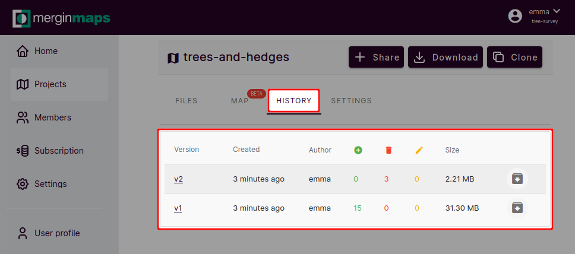
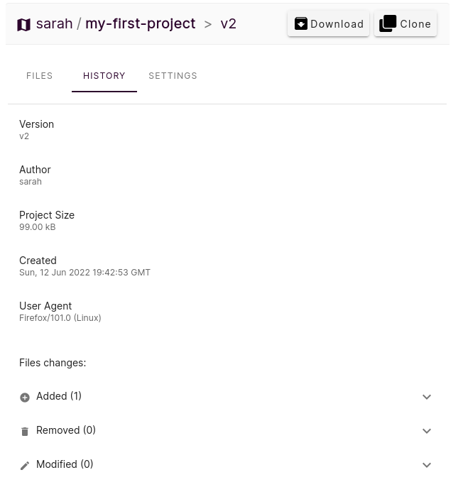
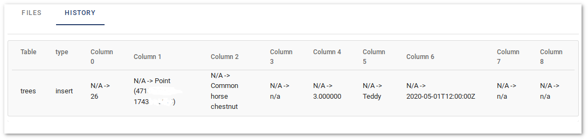

# Project History and Versions

In Mergin, you can see the details of the changes made to the project from different devices or users. Each time you sync the project from your mobile device or from QGIS through the plugin, a new version will be created.

On <MainDomainNameLink />, you can view what files have been added or removed. If you use GeoPackage for your survey, you can also see the list the features which have been added, deleted or updated.

To view the project history:

- On your project page, select **HISTORY** tab from above the project files
- In the new tab, you will see:
  - **Version**: version of project based on number of synchronisations
  - **Created**: time when the version was created
  - **Author**: Mergin username who created the version
  - The next three columns: Number of files added, deleted and updated respectively
  - **Size**: Size of the project
  - In the last column, you can download the version of project

## Advanced changelog

To see more details of a specific version:
- Under the **Version** column, click on the version number you'd like to view the details
- A new window will appear. In addition to version and author, you can see:
  - The exact time stamp under **Created**
  - **User Agent** indicates device, operating system and tool used to create the version
  - If you use GeoPackage for your survey, you can see a summary of features added, deleted or updated for each table (map layer):

  

You can see more information about the feature details under **Show Advanced**:

  
