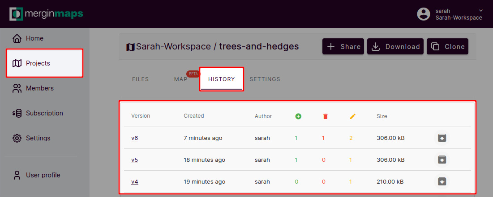
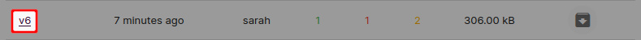
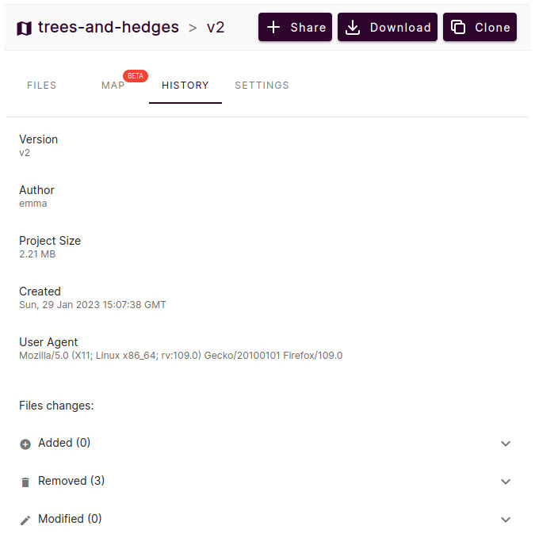
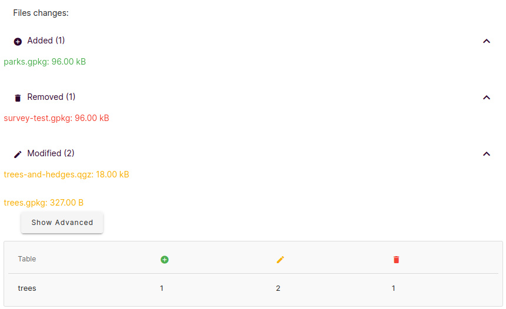
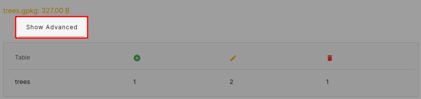
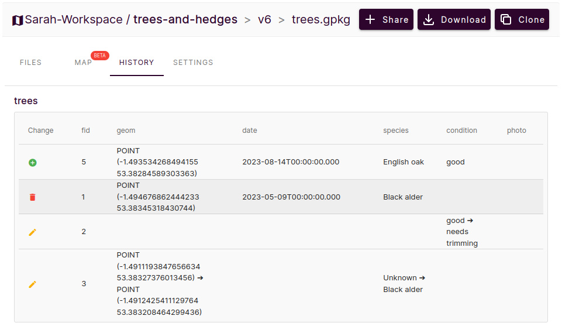

# Project History and Versions
[[toc]]

Each time someone synchronises the project from a mobile device or from QGIS through <QGISPluginName />, a new project version will be created. Thus, it is possible to see the details of the changes made in <MainPlatformNameLink /> project by different users or devices. 

On <AppDomainNameLink />, you can view what files have been added or removed. If you use GeoPackage for your survey, you can also see the list of the features which have been added, deleted or updated.

:::tip
Great tools to inspect the project history and compare changes between project versions can be found in the <QGISPluginNameShort />:
- use [Create report](./plugin/#create-report-processing-toolbox) to get an overview of changes for a range of project versions.
- use [Create diff](./plugin/#create-diff-processing-toolbox) to extract changes made between two versions of a layer
:::

## Project history
To see the project history:
1. Log in <AppDomainNameLink /> and open your project
2. Navigate to the **HISTORY** tab
3. Here, you can find:
  - the **version** of the project based on the number of synchronisations. Click on the version to see the [changelog](#advanced-changelog).
  - the time when was the version **created**
  - the **Author** of this version (who made the changes)
  - overview of the number of files that were **added, deleted and updated**
  - **Size** of the project
  - option to **download** this version of the project
  

:::tip
Our blog [Downloading a previous version of your project](https://merginmaps.com/blog/support-tip-downloading-a-previous-version-of-your-project) contains detailed steps on how to download projects that are too large to be downloaded from the <DashboardShortLink />.
:::

### How to revert to an older version
You may find yourself in a situation where you want to revert to an older version of the project.

Local changes made in QGIS (changes that were not synchronised yet) can be reverted by using the **Reset changes** option in [Project status](./synchronisation/#synchronising-changes-in-qgis).

To revert to an older version of a project (already synchronised to the cloud), you need to download it to your computer from the <DashboardShortLink />. Navigate to the [project history](#project-history) and find the version you want to use. [Advanced changelogs](#advanced-changelog) may be helpful. 

**Download** the project version to your computer. Open the project in QGIS to make sure it is the version you want to restore.

Now you have multiple options:
- [Package the downloaded project version](./project/#packaging-qgis-project) as a new <MainPlatformName /> project. You can keep both projects if needed or [delete](./project-advanced/#delete-a-project) the one you don't need anymore.

- Replace the specific files in your <MainPlatformName /> project folder:
   1. Close QGIS
   2. Copy the QGIS project (`.qgz`), the data (`.gpkg`) or both from the downloaded older version and paste them to your current [<MainPlatformName /> project folder](./project/#mergin-maps-project-folder). 
   
      Be careful when doing this! If you changed the data schema between your versions, this might be a bit tricky. By replacing the QGIS project file, you will revert the project settings, such as symbology, forms settings, relations, etc. By replacing the data files, you will get the content that was saved in the downloaded version of the project.
   
   3. Open the project in QGIS and check if you restored your project successfully. If needed, modify the project settings so that everything works as intended.
   
   4. If you are happy with the result, synchronise the changes. The restored version is now the current version of your project.
   

## Advanced changelog
To see more details of a specific version:
1. Click on the version number you'd like to view the details
   

2. In addition to the **Version** and **Author**, you can also see:
     - **Created** displays the exact date and time of when was the change synchronised 
     - **User Agent** indicates device, operating system and tool used to create the version
     - **Files changes** contain the summary of changes
  

       **Files changes** can be expanded to include even more details. If you use GeoPackage for your layers, you can see a summary of features added, deleted or updated for each table (layer).
       
       Here, one layer `parks.gpkg` was **added** to the project, one layer `survey-test` was **removed** from the project, the project file `trees-and-hedges.qgz` was modified and there are some changes in the `trees` layer.
       
       

3. Let's see what was changed in more detail by clicking on the **Show Advanced** button.
   

4. Now we can see the changes in detail. 

   - **Change** denotes the type of change: added, removed or modified feature
   - `geom` includes changes in the feature's geometry
   
   In this case, there are multiple changes in the `trees` layer. One feature (`fid: 5`) was added, one feature (`fid: 1`) was deleted and the attributes of two features (`fid: 2` and `fid: 3`) were modified. In addition, one of them (`fid: 3`) has also changed in geometry: the point was moved to a new position.
      
   
