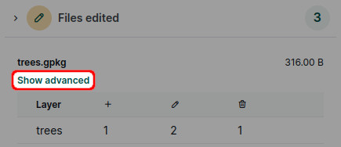

# Project History and Versions
[[toc]]

Each time someone synchronises the project from a mobile device or from QGIS through <QGISPluginName />, a new project version will be created. Thus, it is possible to see the details of the changes made in <MainPlatformNameLink /> project by different users or devices. 

On <AppDomainNameLink />, you can view what files have been added or removed. If you use GeoPackage for your survey, you can also see the list of the features which have been added, deleted or updated.

:::tip
Great tools to inspect the project history and compare changes between project versions can be found in the <QGISPluginNameShort />:
- use [Create report](./plugin/#create-report-processing-toolbox) to get an overview of changes for a range of project versions.
- use [Create diff](./plugin/#create-diff-processing-toolbox) to extract changes made between two versions of a layer
:::

## Project history and advanced changelog
To see the project history:
1. Log in <AppDomainNameLink /> and go to your project
2. Navigate to the **History** tab. 

   Here you can find all available versions of the project. These versions can be downloaded to your computer which can be helpful if you need to create a backup or [restore previous version](#how-to-revert-to-an-older-version) of the project.
   
   

3. Click on a version to see more details about what was changed.
   
   You can inspect the list of **added**, **edited** and **removed** files.
   
   

4. For GeoPackage layers, there is an option to see even more. Click on **Show advanced** 

   

5. Now you can see the overview of feature changes in a specific layer across all attributes.
   
   Here, there are multiple changes in the `trees` layer. One feature (`fid: 9`) was added, one feature (`fid: 6`) was deleted.
   
   There are two modified features: 
   - `fid: 2` was moved to a new position
   - For `fid: 8`, the value of attribute `species` was changed

   

### How to revert to an older version
You may find yourself in a situation where you want to revert to an older version of the project.

Local changes made in QGIS (changes that were not synchronised yet) can be reverted by using the **Reset changes** option in [Project status](./synchronisation/#synchronising-changes-in-qgis).

To revert to an older version of a project (already synchronised to the cloud), follow these steps:
1. Log in <AppDomainNameLink /> and go to your project
2. Navigate to the [**project history**](#project-history-and-advanced-changelog) and find the version you want to use
3. **Download** the project version to your computer. Open the project in QGIS to make sure it is the version you want to restore.
   :::tip
   Our blog [Downloading a previous version of your project](https://merginmaps.com/blog/support-tip-downloading-a-previous-version-of-your-project) contains detailed steps on how to download projects that are too large to be downloaded from the <DashboardShortLink />.
   :::

Now you have multiple options:
- [Package the downloaded project version](./project/#packaging-qgis-project) as a new <MainPlatformName /> project. You can keep both projects if needed or [delete](./project-advanced/#delete-a-project) the one you don't need anymore.

- Replace the specific files in your <MainPlatformName /> project folder:
   1. Close QGIS
   2. Copy the QGIS project (`.qgz`), the data (`.gpkg`) or both from the downloaded older version and paste them to your current [<MainPlatformName /> project folder](./project/#mergin-maps-project-folder). 
   
   
      :::warning Be careful when doing this! 
      If you changed the data schema between your versions, this might be a bit tricky. By replacing the QGIS project file, you will revert the project settings, such as symbology, forms settings, relations, etc. By replacing the data files, you will get the content that was saved in the downloaded version of the project.
      :::
   
   3. Open the project in QGIS and check if you restored your project successfully. If needed, modify the project settings so that everything works as intended.
   
   4. If you are happy with the result, synchronise the changes. The restored version is now the current version of your project.
   
   
