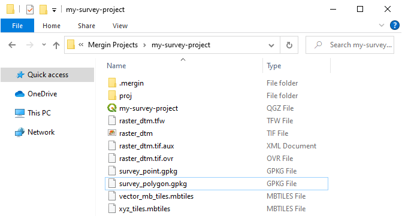
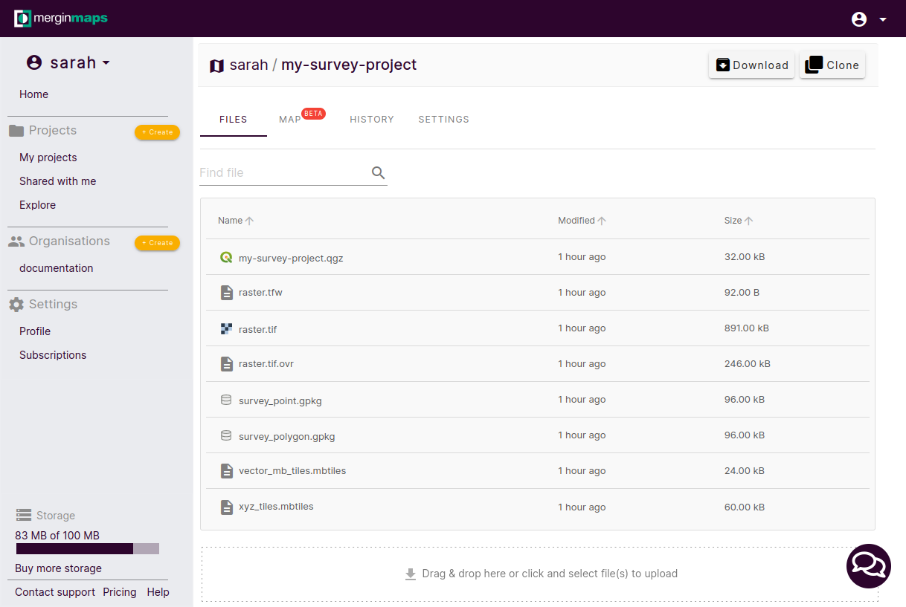

# Mergin Maps Project
[[toc]]

<MainPlatformName /> project can be [created](../create-project/) in 

is basically a folder that contains:
- data such as vector layers, tables, rasters or photos
- a [QGIS project](../../gis/features/) that defines how you can work with the data - layers and their setup (symbology, forms), background maps, and much more
- 

## Packaging layers

The new <MainPlatformName /> project will be created locally on your computer and also on the <MainPlatformName /> server. All packaged layers will be exported to this folder. Changes 

The project folder on your computer will contain all packaged layers. 

And this is what you will see when you open your project in <AppDomainNameLink />.

