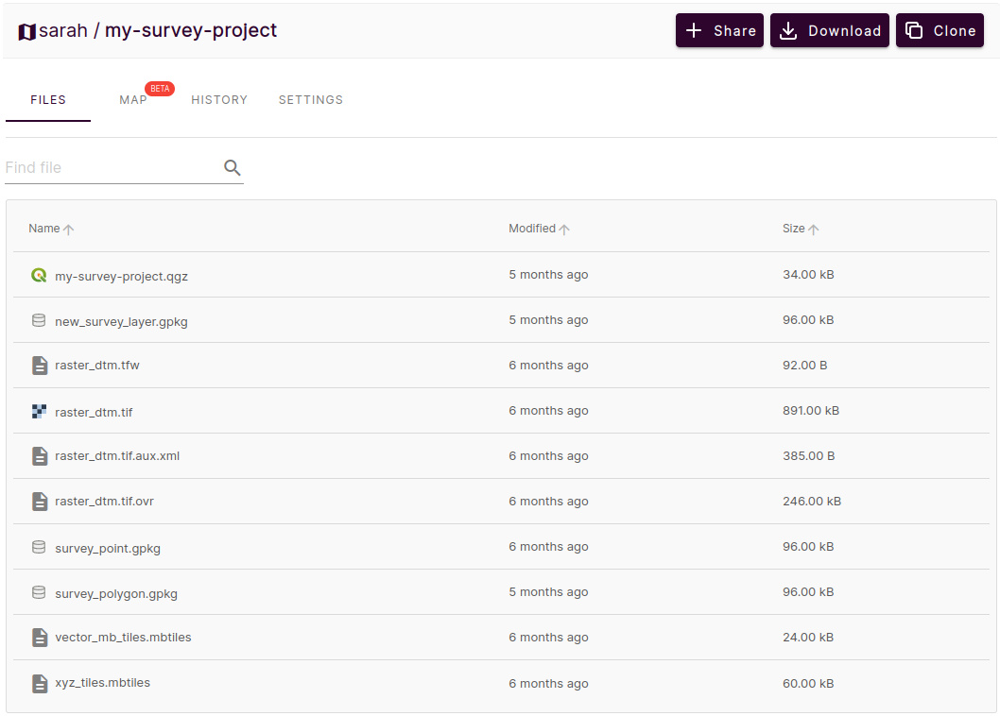

# Mergin Maps Project
[[toc]]

What is a <MainPlatformName /> project? 

It is basically a folder that contains data (such as vector layers, tables, rasters or photos), a [QGIS project](../../gis/features/), and some extra <MainPlatformName /> files needed to ensure everything works.

When <MainPlatformName /> project is created, it is saved to <ServerCloudNameLink />. From the cloud, it can be downloaded to various devices, used by different team members in both QGIS and the <MobileAppNameShort />. Changes they made are tracked and synchronised back to the cloud.

## Creating project
:::tip
Different ways of how a <MainPlatformName /> project can be created are described in [How to Create a New Project](../create-project/) 
:::

In general, projects are prepared and managed in [QGIS](../../setup/install-qgis/), where you can get the most of the functionality, such as set up survey layers and their properties (symbology, forms, etc.), background maps, or other project settings. 

Typically, especially if your project is rather complex, you would:
1. Create a QGIS project with all necessary datasets and settings to fit your needs
2. Package it using <QGISPluginName /> to create a <MainPlatformName /> project that is saved to the cloud
3. Check that everything works as expected in the <MobileAppNameShort />. If not, fix the issues in QGIS. Don't forget to save and sync the project. Repeat this step as necessary.
4. [Share the project](../project-advanced/) with your team members. Now you can collaborate safely and effectively.

:::tip
[QGIS Project Preparation](../../gis/features/) will guide you the project preparation steps. We also recommend following our [Best Practice Tips for Layers and Forms](../../layer/best-practice/).

If you need to make changes in the data schema of survey layers, please follow [How to Deploy Revised Projects](../deploy-new-project/) to avoid synchronisation issues.
:::

## Packaging QGIS project
When using the <QGISPluginNameShort /> to [create a <MainPlatformName /> project](../create-project/#create-a-project-in-qgis), there is an option to **Package current project**. This is what you will choose if you want to transform your QGIS project into <MainPlatformName /> project.

There are three options for handling layers:
   - **package** - layers will be copied and saved in the new <MainPlatformName /> project folder: by default, each vector layer will be saved as a GeoPackage, rasters (if possible) will be saved as GeoTIFF and local vector and raster MBTiles will be copied to the folder.
   - **keep as is** - the layer will be referenced "as is" in the new project. The location of the file will stay the same, it will **not** be copied to the new <MainPlatformName /> project folder. This is the default for some rasters and web services (e.g. WMS/WMTS, WFS, online vector and XYZ tiles).
   - **ignore** - the layer will **not** be included in the new project.
   
    

After the layers for the new project are selected, you just need to enter the project's name and choose where to save it on your computer. It will also be saved on the <MainPlatformNameLink /> server in the selected workspace.

   
:::danger WARNING
Your project should be saved on a local drive. Using shared network drives and cloud storage (such as OneDrive or Google Drive) is **not supported**.
:::

### Mergin Maps project folder
The project folder on your computer will contain the **QGIS project** and all layers that were selected to be **packaged**. These are the files that are referenced in the project - and only they will be updated when the project is synchronised! The original data can be archived as they will not be used or needed by <MainPlatformName /> project anymore.

Layers that were **kept as is** are not stored in the project folder.

There are also some extra folders and files:
- **`.mergin`** folder contains the `Geodiff` files that are used to keep the [project history and versions](../project-history/) and [diagnostic log](../../misc/troubleshoot/#diagnostic-logs) in a file named `client-log.txt`
- **`proj`** folder contains, if needed, [custom projections](../../gis/proj/) files
- [conflict files](../missing-data/#there-are-conflict-files-in-the-folder) may appear if changes could not be properly synchronised

And this is how the same project looks in <AppDomainNameLink />

## Adding a layer to the project
If you want to add an additional layer to your existing <MainPlatformName /> project:
- a new layer: create a new GeoPackage layer and save it to the project's folder 
- an existing layer: copy the layer to the project's folder and **then** add it to the project

Save and sync the project. When syncing, you will see in the **Project status** that a new layer was added.

If you used **keep as is** option when [packaging the project](#packaging-qgis-project) or add a layer that is not stored in the project's folder, the project will reference the relative path to its location. When opening the project on another computer, QGIS will try to load the file using the relative path. If this folder doesn't exist or is located elsewhere, the project will not be able to load the layer. The same applies for <MobileAppName />. 

Only the content in the project's folder is synchronised!

It is best to store all survey layers and relevant datasets in the project's folder to avoid issues with synchronisation or availability of the layers.

:::tip
It is possible to use files that are stored in other folders in <MobileAppName />. However, these folders have to be [manually transferred](../missing-data/#manual-data-transfer-android).

This can be useful when working with [very large datasets](../../gis/settingup_background_map/#how-to-work-with-very-large-files-android) such as large rasters or background maps.
:::
