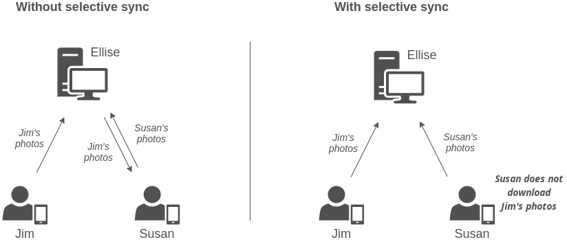

# Selective Synchronisation

<Badge text="Since Input 1.0.0" type="info"/>

Selective sync feature adds a possibility to alter the synchronisation process to not download specified files on other devices. These files are only stored on creator's device and server and can be accessed on Mergin web or QGIS desktop. Other colleagues on different devices will not receive these files during synchronisation.

Selective sync is useful mainly when a project contains a lot of data (for example photos) and these data do not necessarily need to be stored on all devices. 

Practical example can be seen in the picture below. Two surveyors Jim and Susan are capturing features on a field. When it comes to synchronisation, Jim first hits the [arrow icon](../data_sync.md) synchronise his changes. Features together with photos are now stored on the server. When Susan synchronises the project, synchronisation first downloads Jim's changes (including photos) and after that uploads Susan's changes to the server. However, selective sync can alter this behaviour and exclude photos from being downloaded.

:::tip
Features and other data are still being downloaded and you will see them, only photos will miss.
:::



Another advantage is a significant reduction of synchronisation time.

## How to set up selective sync

Selective sync is not allowed by default on new projects. Project needs to contain a specific file called `mergin-config.json` that describes the behaviour. If you are not interested in customising the behaviour, skip to [get started](#get-started).

The config file is of type `JSON` and contains following keys:

 - `input-selective-sync` specifies if selective sync should be allowed for this project. Keep this one as `true` in order to have selective sync enabled

 - `input-selective-sync-dir` specifies a subfolder that should be considered for selective sync. Only files that are located inside this directory (or any of its subdirectories) will be considered. To use selective sync on all project files, leave this value as an empty _string_ `""`


Example config setup to use selective sync on all project files:

```json
{
  "input-selective-sync": true,
  "input-selective-sync-dir": "" 
}
```

Example config setup to use selective sync only on files (photos) in subdirectory `images`:
```json
{
  "input-selective-sync": true,
  "input-selective-sync-dir": "images" 
}
```

::: tip
  You can also use subdirectories (or any depth really) like `"resources/images"`. The path is relative to project's root directory.
:::

## Get started 

Projects with file `mergin-config.json` are set to use selective synchronisation. You can either create the file on your own and copy content from previous section to it or download prepared file and add it to your project.

You can find <PublicAsset src="mergin-config.json" /> file and add it to your project via [Mergin website](https://public.cloudmergin.com/). 

:::tip
If download does not work, ZIP archive is available for download <PublicAsset src="mergin-config.zip" />, decompress it and use as mentioned in the previous step.
:::

The config file needs to be placed in the root project directory where your `*.qgz` QGIS project is. These files are by default set to consider entire project directory and needs to be edited in text editor to use specific subdirectory.

---

In the future, we plan to add an option to set up selective sync conveniently in Mergin QGIS plugin.

