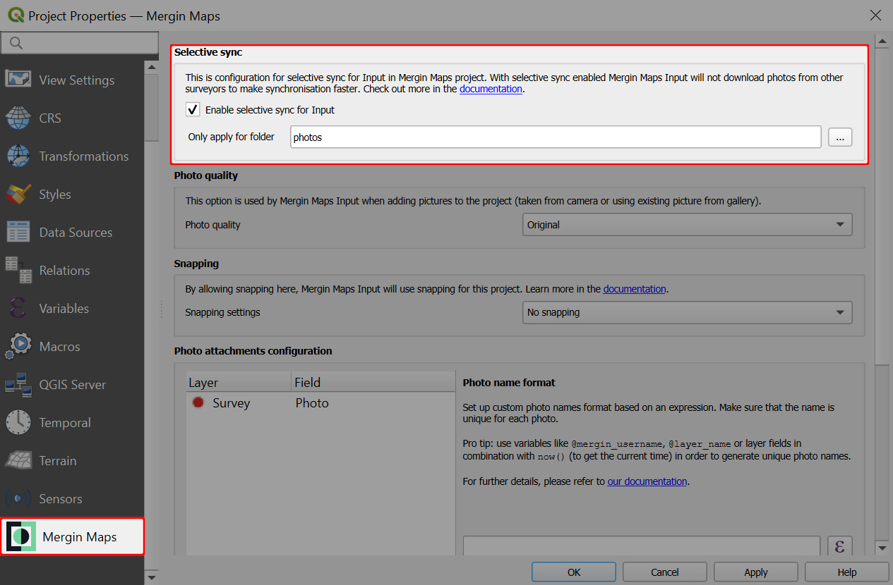

# Selective Synchronisation

Selective sync feature adds a possibility to not download specified files on other devices in the synchronisation process. These files are only stored on the creator's device and server and can be accessed on <MainPlatformNameLink /> web or QGIS desktop. Other collaborators on different devices will not receive these files during synchronisation.

Selective sync is useful mainly when a project contains a lot of data (for example photos) and these data do not necessarily need to be stored on all devices. Another advantage is a significant reduction of synchronisation time.

:::tip
If you want to use large files (e.g. background maps) in your <MainPlatformName /> project without synchronisation, see [How to work with very large files](../../gis/settingup_background_map/#how-to-work-with-very-large-files-android).
:::

See the example in the picture below. Two surveyors Jim and Susan are capturing features in the field. When it comes to synchronisation, Jim hits the [arrow icon](../plugin/) to synchronise his changes. Features together with photos are now stored on the server. When Susan synchronises the project, synchronisation first downloads Jim's changes (including photos) and after that uploads Susan's changes to the server. However, selective sync can exclude photos from being downloaded.

:::tip
Features and other data are still being downloaded and both Jim and Susan will see them, only photos will be missing.
:::

## How to set up selective sync

Selective sync can be set using <QGISPluginName />. 

1. Open your project in QGIS and go to **Project** > **Properties**
2. In **<MainPlatformName />** tab check the **Enable selective sync for Input**
3. Optionally, you can fill out **Only apply for folder**, if you want to use selective sync on a subfolder.
   
   :::tip
   Do you want to set up a folder like this? Go to [How to set up a custom folder for storing photos](../../layer/photos/#how-to-set-up-a-custom-folder-for-storing-photos).
   :::
   

:::tip
If **Selective sync** option is inactive in project properties, make sure you are working with a Mergin Maps project.
:::
