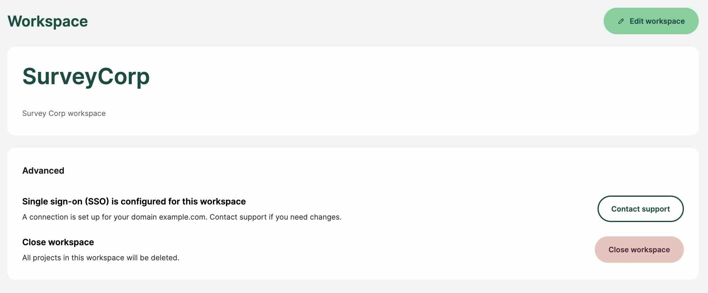

# Single Sign-On (SSO)
[[toc]]

Single sign-on (SSO) is an authentication method that allows you to sign in to <MainPlatformName /> using the same credentials as you use in your organisation. SSO is available on the <DashboardNameShort />, the <MobileAppNameShort /> and the <QGISPluginNameShort />.

This means you don't have to create a new <MainPlatformName /> account with a specific password: you can simply use your work email. The identity provider (e.g. Microsoft Entra ID or Auth0) used by your organisation will check your credential and redirect you back to <MainPlatformName />.

<MainPlatformName /> account will be created automatically after the first sign in via SSO.

When a user signs in to <MainPlatformName /> using SSO, they will stay signed in for a time period before they are asked to enter their credentials again. By default, this period is set to 14 days. If you use <EnterprisePlatformNameLink />, you can set it to a different value.

::: warning Removing workspace users
If you remove a user from your Identity provider (you remove their account in your organisation), they will still be able to log into the <MainPlatformName /> workspace for 14 days. 

To cancel their access to the workspace immediately, you have to remove them manually through the [Members tab](../dashboard/#members) on the <DashboardShortLink />.
:::

### Connection setup
If you are the admin or owner of a workspace and you want to set up SSO, please contact our <MainDomainNameLink id="contact-sales" desc="sales team"/>.

You will receive a link with a step-by-step guide for your identity provider. Currently, we support **SAML** and **OIDC** SSO protocols. Directory sync is not supported.

::: tip SSO for self-hosted servers <ServerType type="EE" />
If you want to use SSO on your <EnterprisePlatformNameLink /> server, you can do so from the admin panel. See [Single Sign-On Deployment](../../server/sso-deployment/) for more details.

SSO is not available for <CommunityPlatformName />.
:::

Once SSO is configured for your workspace, you will see the relevant information in the <DashboardLink id="settings" desc="workspace settings page"/>, under the *advanced* section. If you need to make any changes to your SSO connection, please <MerginMapsEmail id="support" desc="contact our support team"/>.

