# Subscriptions and Invoicing
[[toc]]

After signing up to <MainPlatformNameLink />, you can use your workspace for free during the **28 day trial**. After the trial, you can choose from our <MainDomainNameLink id="pricing" desc="subscription plans"/> depending on the storage size, size of your team, support level and other features that you need for your [workspace](../../manage/workspaces/). 

There are three paid plans: *Individual*, *Professional*, and *Team* plan. Students and educators can use our free *Academia* plan and there is also a *Non-profit* plan available to charities and non-profit organisations. Subscriptions are billed monthly or annually.

::: tip
For details about different subscription plans visit our <MainDomainNameLink id="pricing" desc="pricing page"/>.

If you are interested in <MainDomainNameLink id="pricing-for-ce-and-ee" desc="On-Premise deployment"/>  or looking for other options, please <MerginMapsEmail id="sales" desc="contact us" /> directly.
:::

## Subscriptions management
The **Subscription** tab in <DashboardLink /> contains the overview of your current subscription plan and usage of storage, number of projects and number of users in your workspace.

The **Manage Subscription** button will redirect you to our subscription management portal. Here, you can [update](#how-to-change-a-subscription) or [cancel](#how-to-cancel-a-subscription) your subscription, see upcoming charges, review your [billing and payment information](#billing-information-and-payment-method) and access [payment history and invoices](#invoices-and-payment-history).

   
   
## How to upgrade a subscription from the trial plan
1. Log into <AppDomainNameLink />
2. Navigate to the **Subscription** tab. The overview of available plans is listed in the **Change subscription** section. 
   
   Specify if you want to pay yearly or monthly and click on the **Upgrade** button under the plan of your choice.
   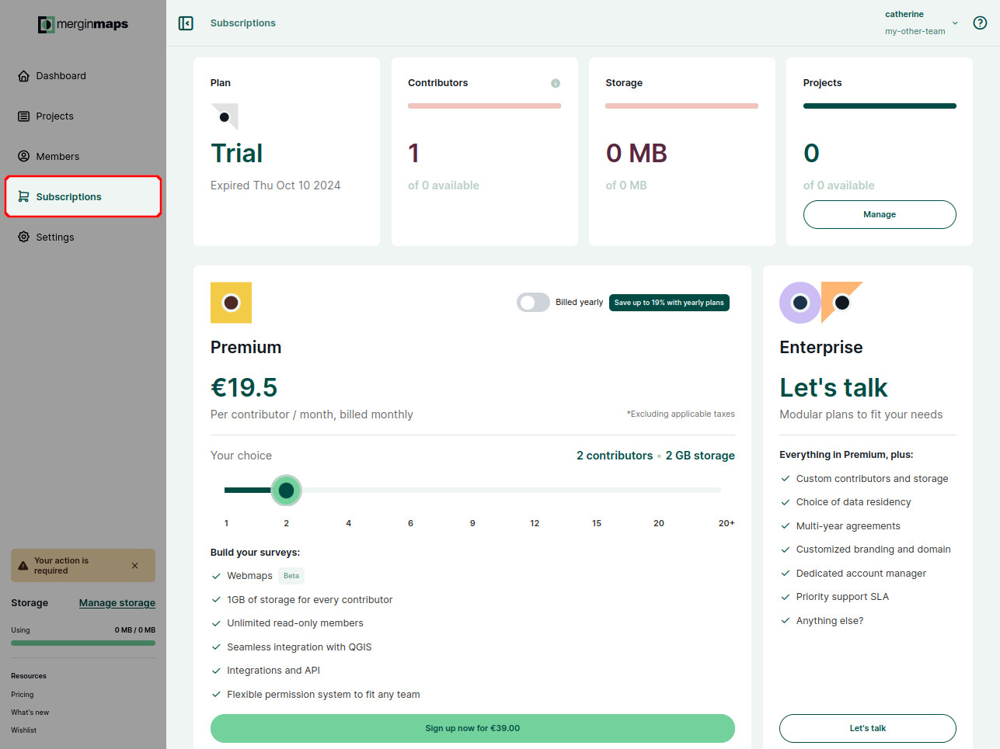

3. You will be redirected to a checkout page. Here, fill out the billing information.

   The email you enter here will receive all billing-related information such as invoices or failed payments notifications.

   If you are a business, check the **I'm purchasing as a business** option and fill out your business name and VAT number.
   - the VAT number has to be associated with the entered (VAT registered) address
   - the address you enter has to match the address registered with your payment method
   
   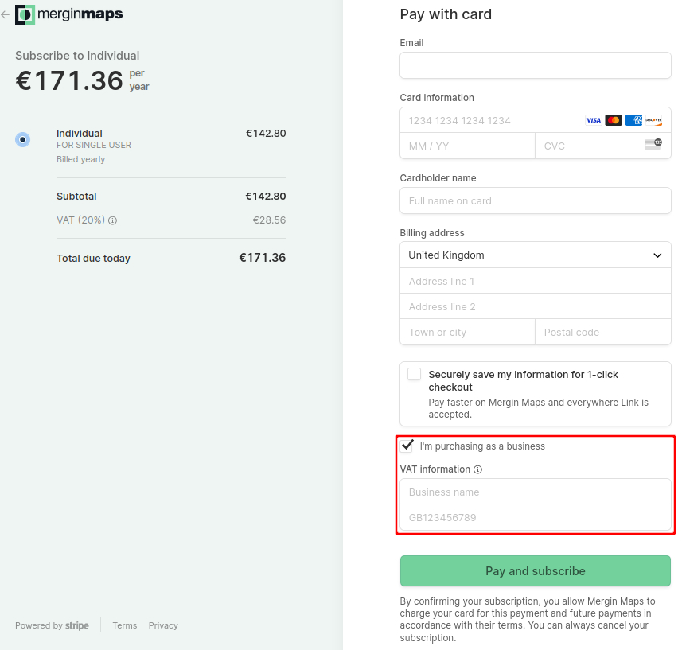
  
4. Click on **Pay and subscribe**
   
After the payment goes through, you will be redirected back to <DashboardLink /> where you can review the details of your new subscription

### How to request Academia or Non-profit plan
We support students, educators and registered non-profit organisations.

Visit <MainDomainNameLink id="pricing" desc="Mergin Maps pricing page"/>, where you can request free *Academia* plan or *Non-profit* plan.

Click on the **Sign Up Now** button and fill out the form. We will review your application and if you meet our conditions, your workspace will get the Academia or Non-profit plan.

## How to change a subscription
1. Log into <AppDomainNameLink /> and navigate to the **Subscription** tab
2. Click on the **Manage Subscription** button to get to the subscription management portal
   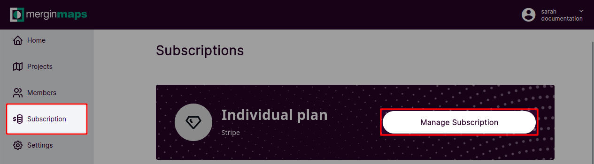

3. In the *Current plan* section, click on the **Update plan** button
   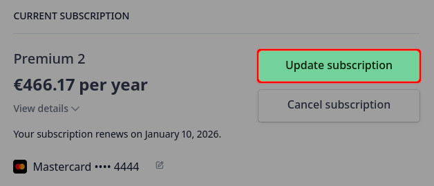
   
4. Choose *Monthly* or *Yearly* payment, **Select** your new plan and **Continue**
   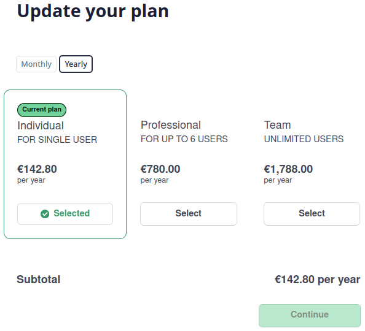
   
5. Review the details of your updates and **Confirm** the subscription update
   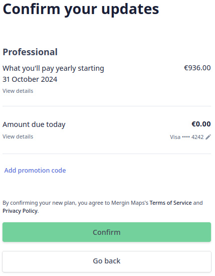

### How to cancel a subscription
1. Log into <AppDomainNameLink /> and navigate to the **Subscription** tab
2. Click on the **Manage Subscription** button to get to the subscription management portal
   

3. In the *Current plan* section, click on **Cancel plan**
   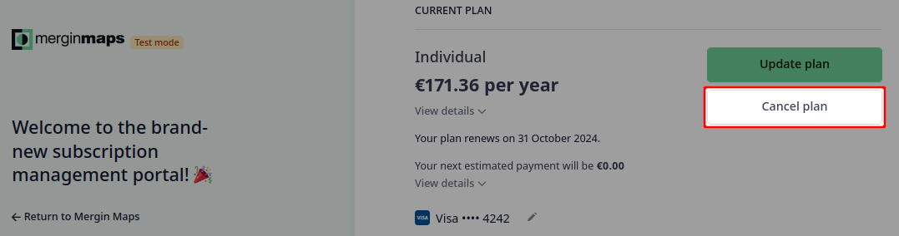
   
4. Review the details of your subscription plan and confirm that you want to cancel the plan by clicking **Cancel plan** again
   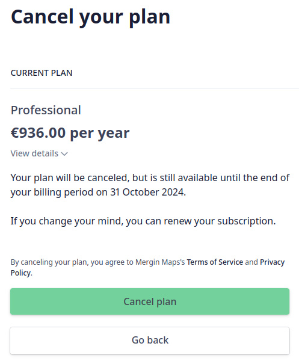

## Billing information and payment method
1. Log into <AppDomainNameLink /> and navigate to the **Subscription** tab
2. Click on the **Manage Subscription** button
   

3. You will be redirected to the subscription management portal where you can see current billing information and payment method.

   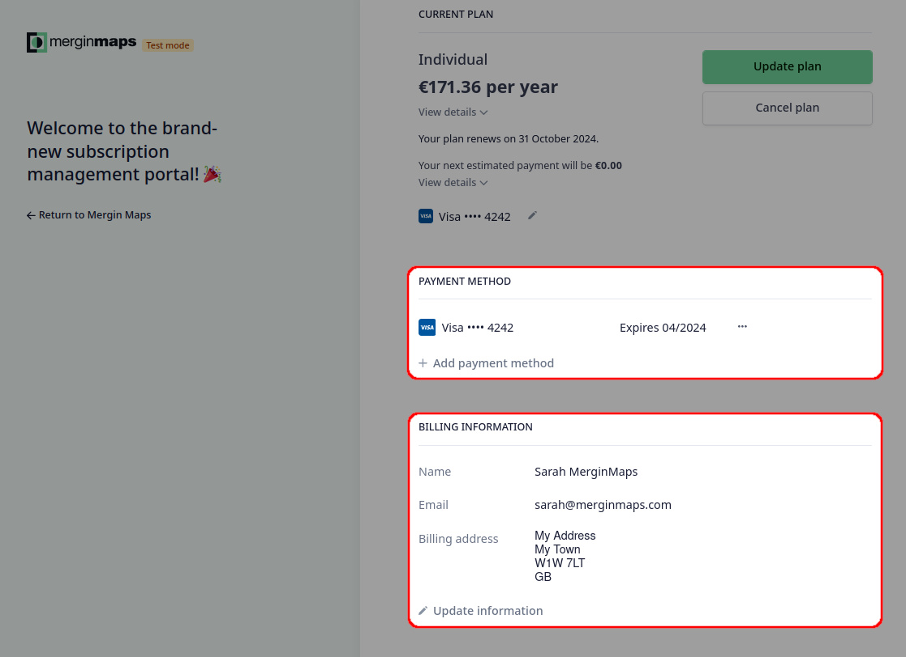

All billing-related information such as invoices or failed payments notifications will be sent to the email that is entered in the billing information.

Billing information will be displayed in invoices or receipts, so make sure they are entered correctly.

### Updating billing information
The billing details associated with your subscription can be changed through the subscription management platform. You might need to do this e.g. when [transferring ownership of a workspace](,/permissions/#how-to-transfer-ownership-of-a-workspace).

1. Log into <AppDomainNameLink /> and navigate to the **Subscription** tab
2. Click on the **Manage Subscription** button to get to the subscription management portal 
   

3. Here, you can see your current billing details. 
   
   Click on **Update information** to change it.
   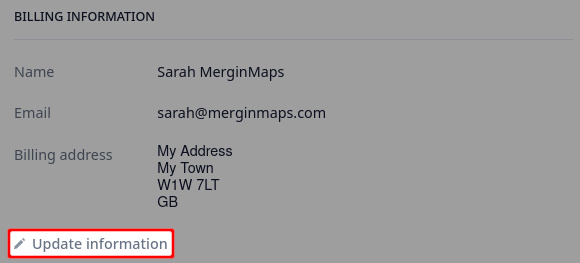

### Adding and removing the payment method
When purchasing a subscription plan, you were asked to fill out your card information. 

You might want to change it later, e.g. to use a different card or when [transferring the ownership of a workspace](,/permissions/#how-to-transfer-ownership-of-a-workspace). To add or remove a payment method associated with your <MainPlatformNameLink /> subscription:

1. Log into <AppDomainNameLink /> and navigate to the **Subscription** tab
2. Click on the **Manage Subscription** button to get to the subscription management portal 
   

3. Here, you can see your current [payment methods](#billing-information-and-payment-method). 
   - to add a new card, click on **Add payment method** and fill out the details
   - to remove a card from your profile, click on the button next to the card and click **Delete**
   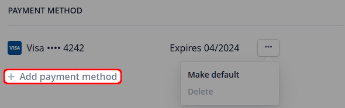

:::warning
Any active subscription requires a payment method. 

A card can be deleted only if there is another payment methods available. To replace a card, you have to add a new card before removing the old one.
:::

## Invoices and payment history
1. Log into <AppDomainNameLink /> and navigate to the **Subscription** tab
2. Click on the **Manage Subscription** button to visit the subscription management portal
   

3. The subscription management portal provides the overview of payment history and invoices at the bottom of the page
   

4. Click on a payment to download your invoice or receipt.
   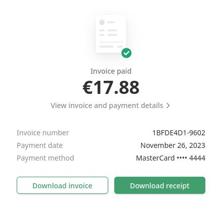

