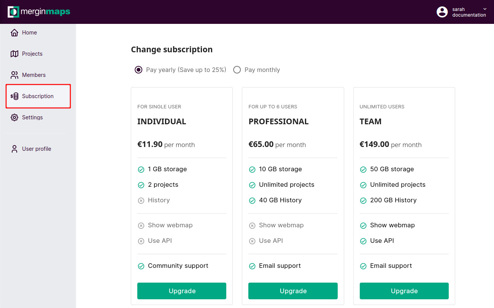
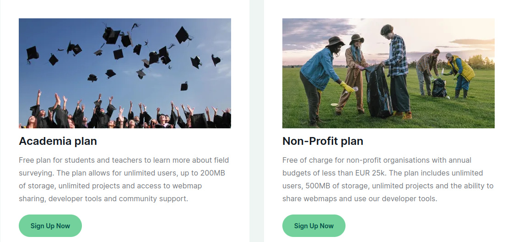
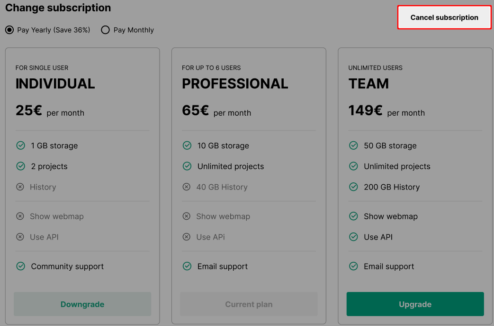
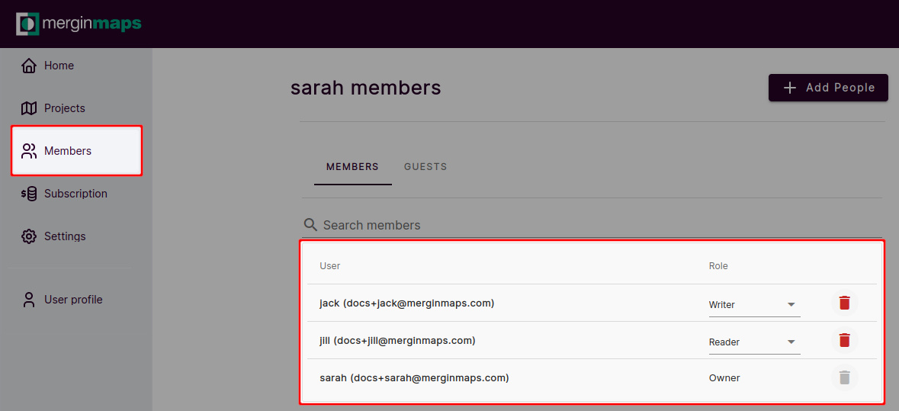
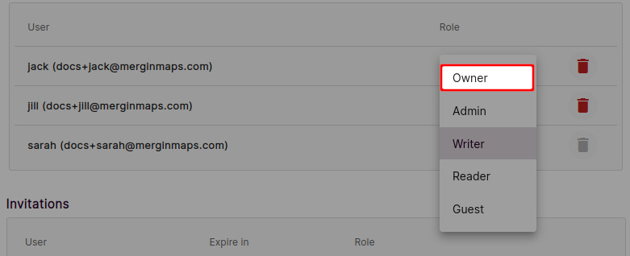
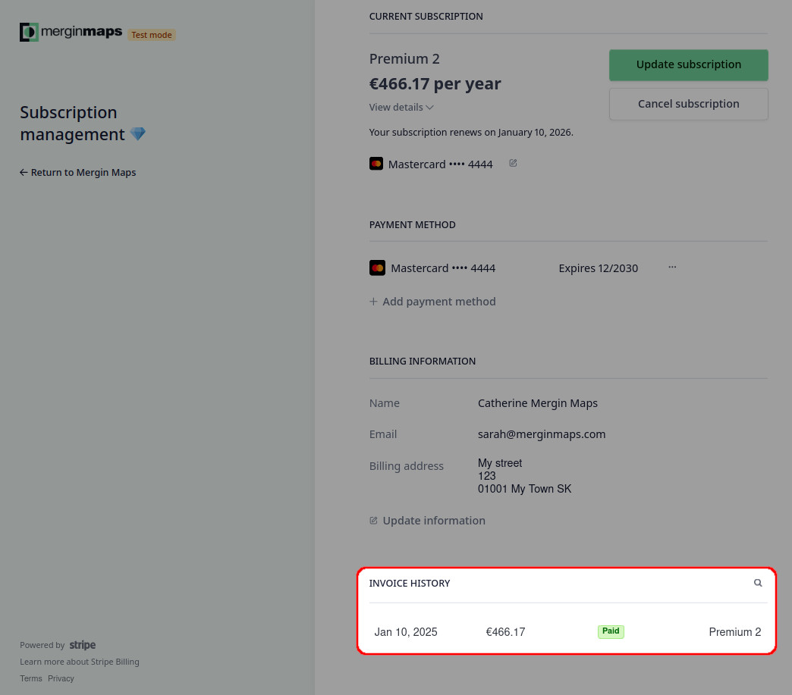

# Subscriptions and Invoicing
[[toc]]

## Subscriptions

::: tip
For details about different subscription plans visit the <MainDomainNameLink id="pricing" desc="pricing"/> page.
:::

After signing up, you can use your workspace for free during the **28 day trial**. After the trial, you can choose from our <MainDomainNameLink id="pricing" desc="subscription plans"/> depending on the storage size, size of your team, support level and other features that you need for your [workspace](../../manage/workspaces/). 

There are three paid plans: *Individual*, *Professional*, and *Team* plan. Students and educators can use our free *Academia* plan and there is also a *Non-profit* plan available to charities and non-profit organisations.

:::tip
If you are interested in <MainDomainNameLink id="pricing-for-ce-and-ee" desc="On-Premise deployment"/>  or looking for other options, please <MerginMapsEmail id="sales" desc="contact us" /> directly.
:::

Subscriptions are automatically billed monthly or annually. You can cancel or change your subscription any time, with Apple Manage Subscriptions App or through <AppDomainNameLink />.

## Changing a subscription from web
Information about the current subscription can be found in <AppDomainNameLink />. Here, you can also switch to another subscription plan and manage the billing.

1. Log into <AppDomainNameLink />
2. Navigate to **Subscriptions**
   

3. Here, choose if you want to **Pay monthly** or **Pay Yearly**. Click on **Upgrade** under the plan of your choice.
4. Fill in the form with your details. 
   When registering a business organisation, you can enter the VAT number (if you want to use reverse charge VAT payments).
5. Click on **Complete Purchase**

Notes:
- If a VAT number is entered, this must be associated with the address you enter below.
- The address you enter must match the address registered with your payment method (e.g. credit card)
- The address entered needs to match the VAT registered address

If you'd like to purchase the *Team* plan on annual basis and would like to make bank transfer payments, please <MerginMapsEmail id="sales" desc="contact us" /> for manual invoicing.

### How to request Academia or Non-profit plan
We support students, educators and registered non-profit organisations. If you want to request free *Academia* plan or *Non-profit* plan:
1. Log into <AppDomainNameLink />
2. In the **Subscriptions** tab, you will find more information about these plan. If you fit one of these categories, click on the **Request** button. 

3. Fill in the form and **Submit** your request. We will review your application and if you meet our conditions, your workspace will get the Academia or Non-profit plan.

### How to cancel subscription
1. Log into <AppDomainNameLink />
2. Navigate to **Subscriptions**. If you have an active subscription, you can cancel it by clicking **Cancel subscription**.

### How to transfer ownership and billing for workspaces
Ownership of a workspace can be transferred to another [workspace member](../permissions/#workspace-member-roles). Users with the **owner** member role have access to the subscriptions and invoicing settings and can change the billing details in the **Subscriptions** tab in <AppDomainNameLink />. Every workspace has to have at least one owner, however, there can be multiple owners of one workspace.

To transfer the ownership of a workspace to a user that is not yet a member of your workspace, follow the steps in [How to add users to a workspace](../project-advanced/#add-users-to-a-workspace) and select the **Owner** as the the **member role**. The new owner has to accept the invitation.

To transfer the ownership of a workspace to a user that is already a member of your workspace, you have to change their member role to **Owner**:
1. Log in to <AppDomainNameLink />
2. Navigate to the **Members** tab. Here, you will see the list of current workspace members and their roles. 
   

3. Change the **member role** of the user who should become the new owner
   
   
4. Now the member role of the original owner can be changed (if needed) or they can be removed from the workspace completely.

:::warning
Be careful when downgrading your own member role! 

Only owners and admins can manage user roles so if you assign yourself the writer or reader role, you will not be able to change it back.
:::

## Changing a subscription from Mergin Maps Input
Subscriptions can be also managed from <MobileAppName /> (on Apple devices via in-app purchases).

## Invoices and payment history
To download your invoices and see your payment history:

1. Log into <AppDomainNameLink /> 
2. Navigate to the **Subscription** in the left panel
2. In the **Subscription** window, go to:
   - **HISTORY** to see your payment history
   - **INVOICES** to access your invoices

