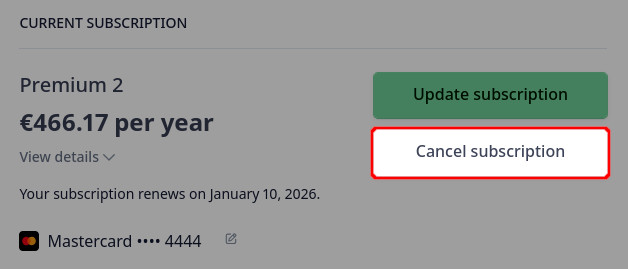

# Subscriptions and Invoicing
[[toc]]

After signing up to <MainPlatformNameLink />, you can use your workspace for free during the **28 day trial**. After the trial, you can choose from our <MainDomainNameLink id="pricing" desc="subscription plans"/> depending on the storage size, size of your team, support level and other features that you need for your [workspace](../../manage/workspaces/). 

There are three paid plans: *Individual*, *Professional*, and *Team* plan. Students and educators can use our free *Academia* plan and there is also a *Non-profit* plan available to charities and non-profit organisations. Subscriptions are billed monthly or annually.

::: tip
For details about different subscription plans visit our <MainDomainNameLink id="pricing" desc="pricing page"/>.

If you are interested in <MainDomainNameLink id="pricing-for-ce-and-ee" desc="On-Premise deployment"/>  or looking for other options, please <MerginMapsEmail id="sales" desc="contact us" /> directly.
:::

## Subscriptions management

Subscriptions can be managed, changed or cancelled through <DashboardLink />. 

Here, you can review your current subscription plan and your usage of storage, number of projects and number of users in your workspace.

The subscription plan can be easily [updated](#how-to-change-a-subscription) or [cancelled](#how-to-cancel-a-subscription). 

## How to change a subscription
To upgrade or change a subscription:
1. Log into <AppDomainNameLink />
2. Navigate to the **Subscription** tab. 

   Choose a subscription plan in the **Change subscription** section, specify if you want to pay yearly or monthly and click on the **Upgrade** button
   

3. You will be redirected to a checkout page. Here, fill out your information.

   If you are a business, check the **I'm purchasing as a business** option and fill out your business name and VAT number.
   
   
4. Click **Pay and subscribe** to finish your transaction

4. Click on **Update plan**
   

5. Choose if you want to pay **Monthly** or **Yearly** and **Select** your new plan. Click on **Continue**
   
   
4. Review the details of your updates and click on **Confirm**.
   

### How to request Academia or Non-profit plan
We support students, educators and registered non-profit organisations.

Visit <MainDomainNameLink id="pricing" desc="Mergin Maps pricing page"/>, where you can request free *Academia* plan or *Non-profit* plan.

Click on the **Sign Up Now** button and fill out the form. We will review your application and if you meet our conditions, your workspace will get the Academia or Non-profit plan.

## Billing information and payment method
When logged in to the [billing and subscription page](https://payments.merginmaps.com), you can fill out or change your billing information and payment method. 

Notes:
- If a VAT number is entered, this must be associated with the address you enter below.
- The address you enter must match the address registered with your payment method (e.g. credit card)
- The address entered needs to match the VAT registered address

### Updating billing details

### Adding and removing the payment method
When purchasing a subscription plan, you will be asked to fill out your card information.

If you want to change your payment method, e.g. when [transferring ownership and billing for a workspace](#how-to-transfer-ownership-and-billing-for-workspaces), you have to add a new card first (any active subscription requires a payment method).

To add a new card, click on **Add payment method** and fill out the details.

To remove a card from your profile, click on the button next to the card and **Delete** it.

## How to cancel a subscription
1. Log into <AppDomainNameLink /> and go to [billing and subscription page](https://payments.merginmaps.com)
2. Click on **Cancel plan**
   
   
3. Review the details of your subscription plan and confirm that you want to cancel the plan by clicking **Cancel plan** again
   

## Invoices and payment history
Our [billing and subscription page](https://payments.merginmaps.com) provides also the overview of payment history and invoices.

When logged in, the invoice history is displayed at the bottom of the page.

Click on a payment to download your invoice or receipt.

